```{r setup, include=FALSE}
knitr::opts_chunk$set(echo = FALSE)
```

<div id="summary">
- This workshop summarises how to use reference management software to:
  - Build a reference library
  - Insert references into a Word document
  - Change the output style (formatting of the citations and bibliography)
  - Correct some commonly encountered errors
</div>

We have covered the [basics of reference management](/02a-reference_management.html), including the factors that influence your choice of reference management software, what references  you should be citing, and what referencing style you should use. This part of the workshop is a practical guide on how to use reference management software to organize your references and insert citations and a bibliography into your thesis, using Endnote and Mendeley as examples.

The reference library and Word file we are using are (provide links here)

# How to obtain a citation file (any software)

## From PubMed 

You can get citation files directly from PubMed. This will likely be an option for most of the articles you wish to cite.

### Option 1: the "Cite" action

We have found a reference that we want to add to our Endnote library via a PubMed search. To add this reference, we will click the blue button on the right-hand side labelled "Cite".

```{r Endnote1, echo=FALSE, fig.cap="A PubMed page for a journal article, with a blue arrow indicating the Cite button"}
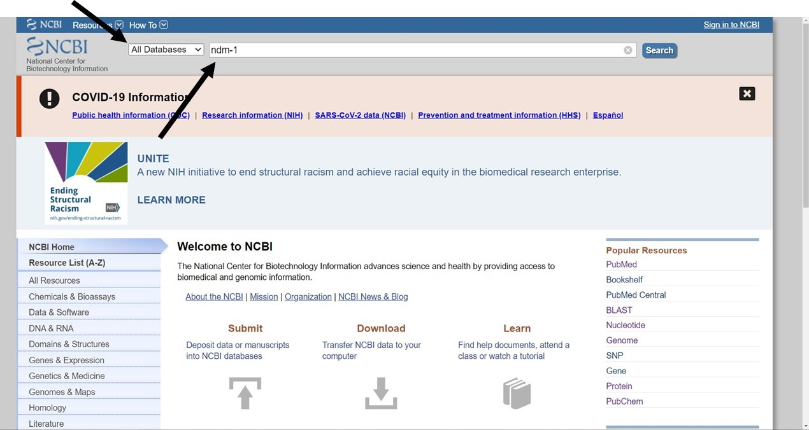
```

This brings up a pop-up window, which by default gives the reference in APA format (you could copy the reference from this box, if you wished to.) We will download the reference by clicking on "Download .nbib".

```{r Endnote2, echo=FALSE, fig.cap="The pop-up Cite menu for our journal article, with a blue arrow indicating the Download .nbib option"}
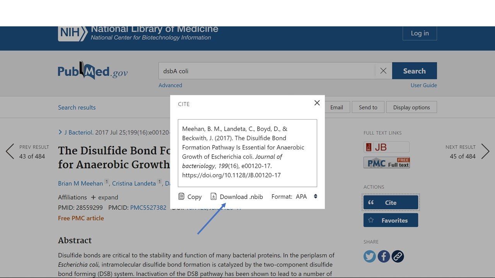
```

### Option 2: Use "Send to"

We can also download the reference by clicking on "Send to" in the bar above the reference, and then clicking on "Citation manager".

```{r Endnote3, echo=FALSE, fig.cap="Using Send to: Citation manager to obtain the reference for our journal article, with a blue arrow indicating the Citation manager option that should be clicked"}
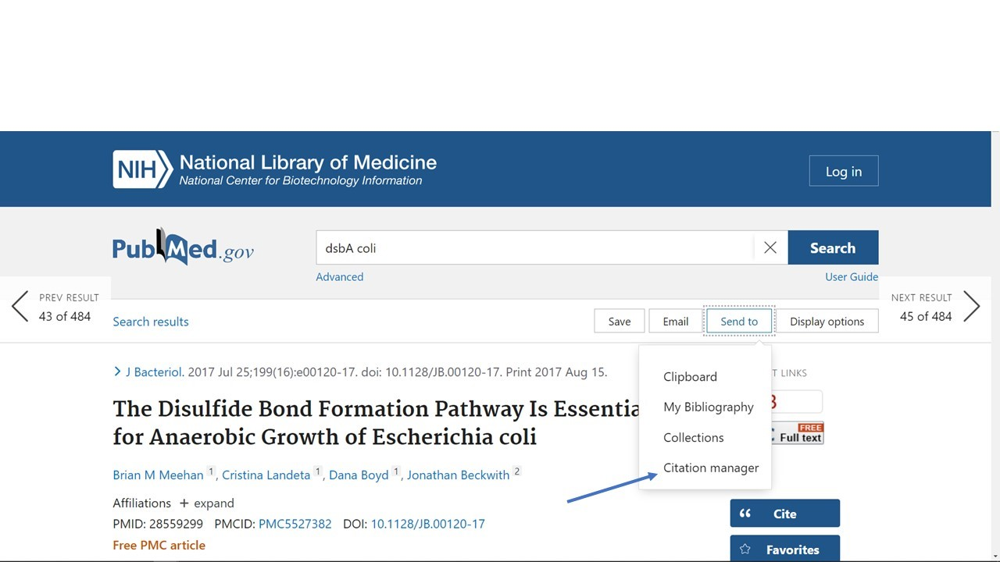
```

## From the journal website

Many/most journals will also allow you to download a citation file for an article (the details of how this works vary from one journal to another).

To give just one example, clicking on "Citation tools" from a journal article published in PNAS, brings up a menu that gives you the option of downloading the citation file in a variety of formats. 

```{r citation-tools, echo=FALSE, fig.cap="PNAS citation tools menu"}
knitr::include_graphics("./images/PNAS-citation-tools.JPG")
```

## Manually 

In some instances, you may need to create a citation file manually (if no citation file exists, e.g. if you are citing a personal communication). In these cases, your only option is to create the file manually and populate it with the correct details yourself. 

# Endnote 

Please see the [Strathclyde Library guide to using Endnote](https://guides.lib.strath.ac.uk/c.php?g=653772&p=4589573) for more information about how to download Endnote for Windows or Mac, and how to use it.

Worked examples here are using Endnote X8.2 on a Windows machine - some of the details may vary if you are using a different system. 

## How to import a reference into your Endnote library

Having downloaded the reference file using any of the above options, you will want to open it in Endnote. You can do this in a number of different ways:
- by double-clicking on the file to open it, if Endnote is set as the default program to open this type of file (Endnote should open automatically if it is not already open)
- dragging the file into Endnote (from the downloads folder or wherever you have saved it)
- right-clicking the file and selecting Open (if Endnote is your default), or Open with (and selecting Endnote) 

The reference will initially appear in your library under "Imported References."

```{r Endnote4, echo=FALSE, fig.cap="The new reference appears under Imported References when it is opened"}
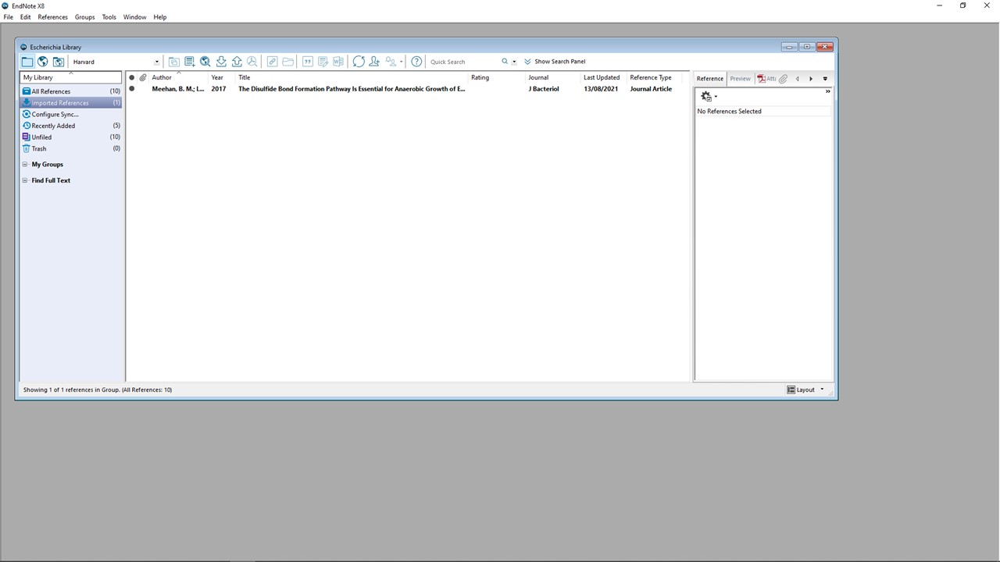
```

You can see all of the references in your library by clicking on "All References" in the menu at the right.

```{r Endnote5, echo=FALSE, fig.cap="The imported reference highlighted in All References"}
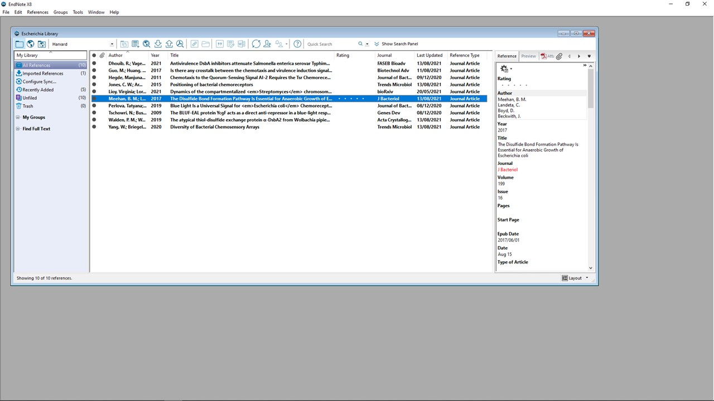
```

If you wish, you can attach the PDF of the paper to the reference record in Endnote, as a way to easily organize and find the paper files. You can do this by selecting the reference in your library and then clicking References > File Attachments > Attach File, and choosing the correct file.

You can also attach a file by double-clicking on the reference to open it, and clicking on the paperclip icon.

```{r Endnote6, echo=FALSE, fig.cap="The reference for the Meehan et al. article"}
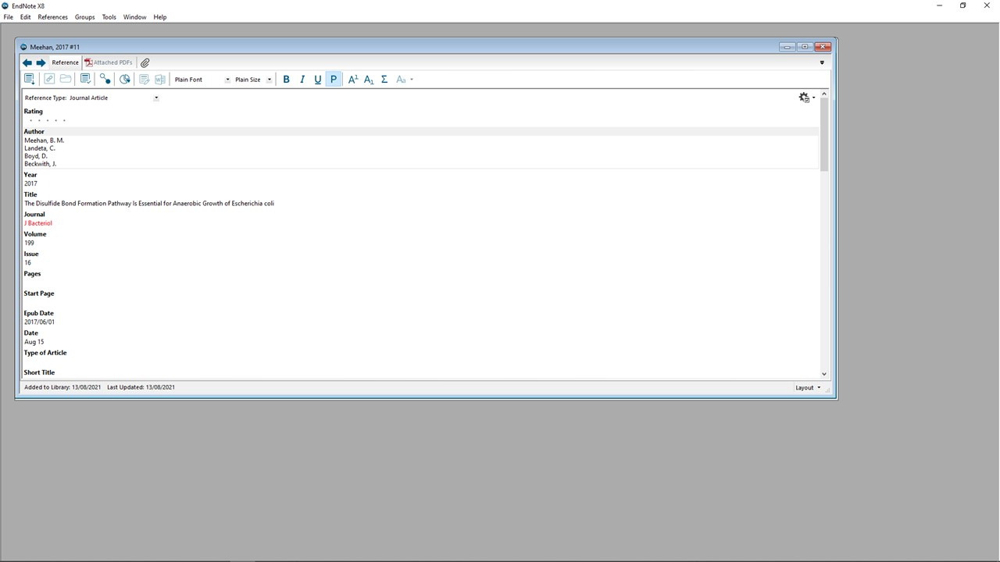
```

## How to insert a citation from Endnote in your Word document

Option 1: Add a citation through Endnote

First, position the cursor at the position in the text where you want to insert a citation. Next, open Endnote, select the reference you wish to cite, and click on the " button (indicated by a blue arrow.

```{r Endnote7, echo=FALSE, fig.cap="Inserting a reference into word using the \" button"}
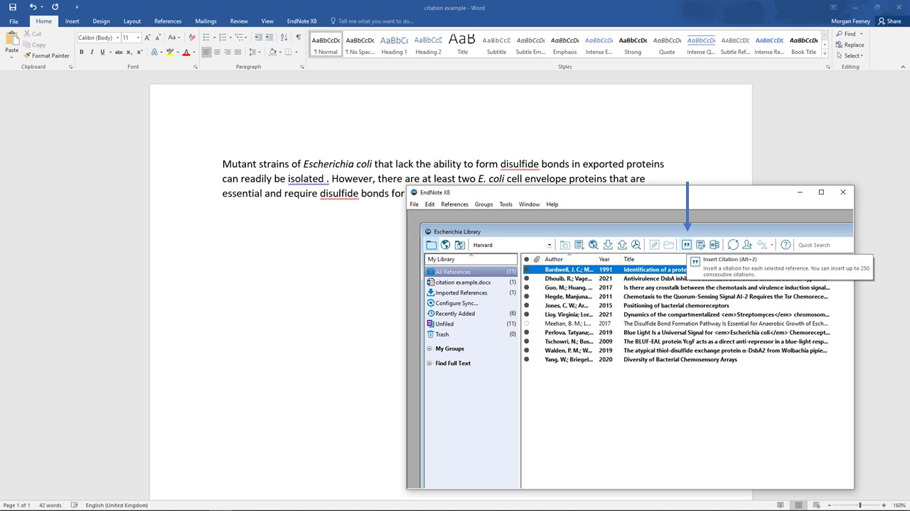
```

Endnote will automatically add the citation at the position where your cursor was ((Bardwell et al., 1991) in this example). It will also add the reference to your list of references cited, at the end of the document.](https://Endnote-Fig8.jpg)

```{r Endnote8, echo=FALSE, fig.cap="The new citation inserted into our text"}
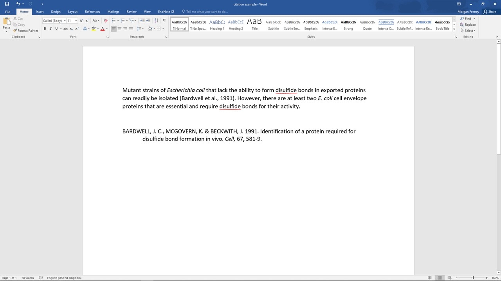
```

Option 2: Add a citation through Word

You can also add a citation in Word, using the Endnote menu in the ribbon at the top. First place your cursor at the correct position in the text and then click on "Insert Citation".

```{r Endnote9, echo=FALSE, fig.cap="Inserting a reference into word by clicking on \" Insert citation\" (indicated by a blue arrow)"}
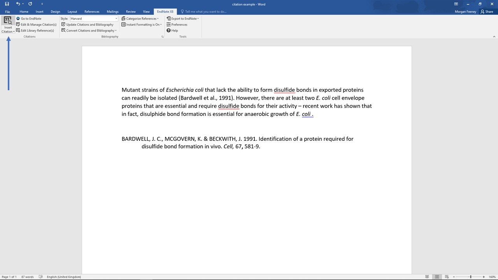
```

This will bring up a dialog box, where you can search for the publication that you wish to cite (in this case, we searched based on the last name of the first author). This brings up the correct reference, which you can then cite by clicking on the "insert" button.

```{r Endnote10, echo=FALSE, fig.cap="Searching for the reference that you wish to cite in Word and inserting it by clicking on the insert button (indicated by a blue arrow)."}

```

As with the previous option, this will insert the citation in the text and add the reference to the bibliography at the end of the document.

```{r Endnote11, echo=FALSE, fig.cap="The updated Word document, with the citation in the text and the new reference added to the bibliography"}
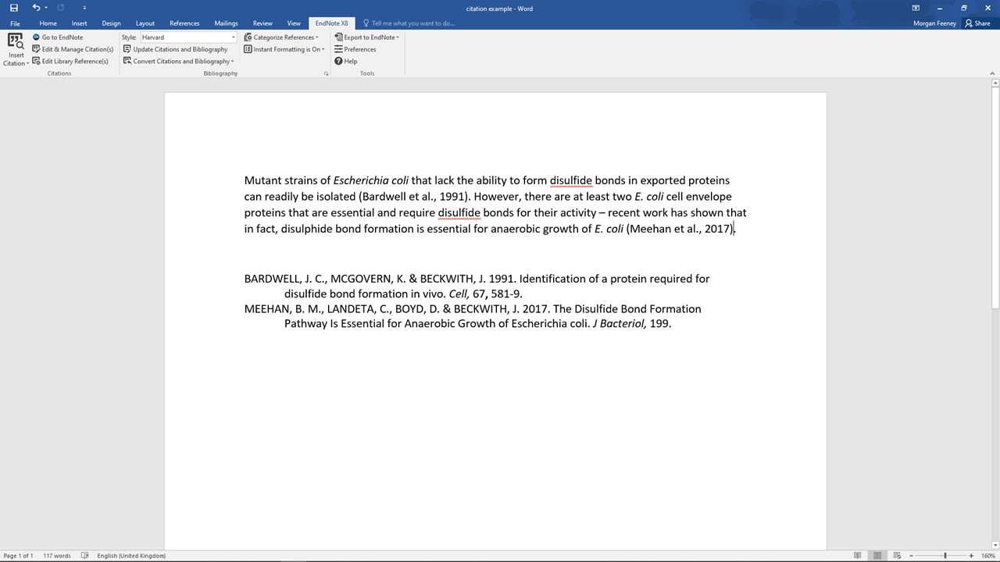
```

## How to change the output style of your references

<div id="note">
You can format your references for your thesis in either [Harvard](https://guides.lib.strath.ac.uk/referencing_guide/harvard) or [Vancouver](https://guides.lib.strath.ac.uk/referencing_guide/vancouver) style. 
</div>

You can select a different style for your references by clicking on the "Style" drop-down menu in the Endnote menu bar, and choosing your preferred option.

```{r Endnote12, echo=FALSE, fig.cap="Changing Endnote's output style (in this case to Vancouver, indicated with a blue arrow)"}
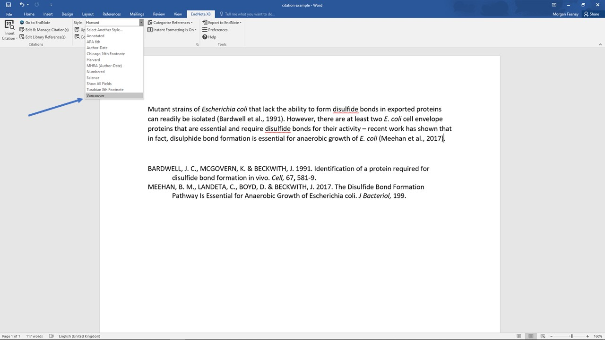
```

This will automatically change the format of your citations and reference list to the desired output format, as shown here.

```{r Endnote13, echo=FALSE, fig.cap="The Word document with citations and bibliography now in Vancouver style"}
knitr::include_graphics("./images/Endnote-Fig13.JPG")
```

You can also change the output style directly in Endnote, by going to Edit > Output Styles and selecting your desired style.

## How to correct some common errors

### Formatting errors

Do not trust Endnote to preserve text formatting or any special characters correctly. (In the example above, notice that it has not formatted the species name, *Escherichia coli* in italics as it should have.)

You can correct any errors by editing the reference directly in Endnote (i.e. adding italics where appropriate). You can italicize text within the reference list directly in Word, if you wish, but these changes may be lost when the citations and bibliography are updated.

```{r Endnote14, echo=FALSE, fig.cap="The Endnote reference formatted correctly. Note that the species name has been italicized (indicated with an arrow). The buttons for editing text formatting are indicated with a blue box."}
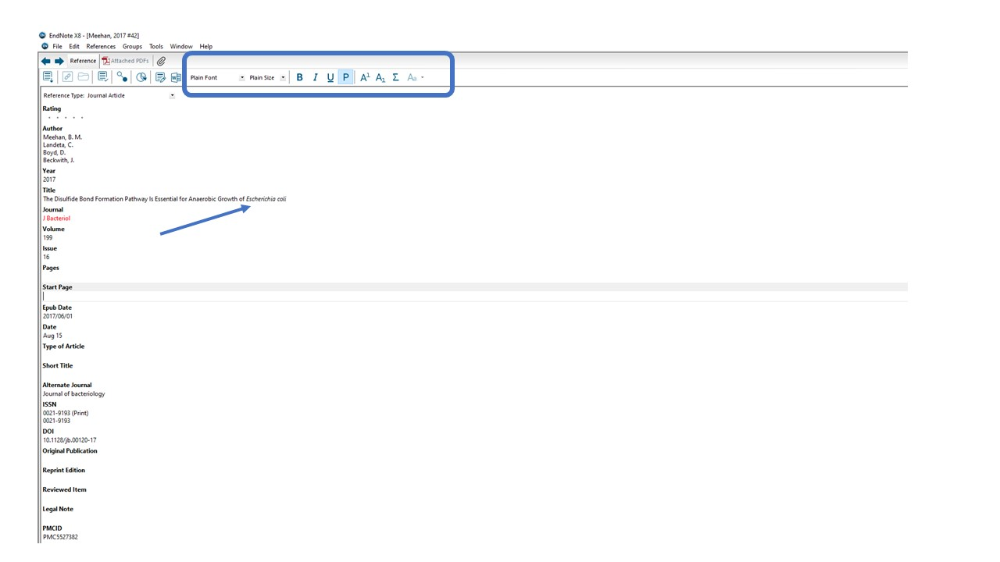
```

### Deleting citations

You may occasionally insert the wrong citation by accident, or find that you have changed your text and therefore need to remove a citation. This is quite straightforward.

For a single citation alone in the text, you can remove the citation by simply deleting the text in Word. 

Where you have groups of citations enclosed within a single set of brackets, it is easiest to use the "Edit and Manage Citations" tool found in the Endnote ribbon. Click on "Edit Reference" and select "Remove Citation".

```{r Endnote15, echo=FALSE, fig.cap="Removing a reference in Word. The \"Edit and Manage Citations\" button is indicated with a blue arrow. The Remove Citation option, in the Edit Reference menu, is highlighted."}
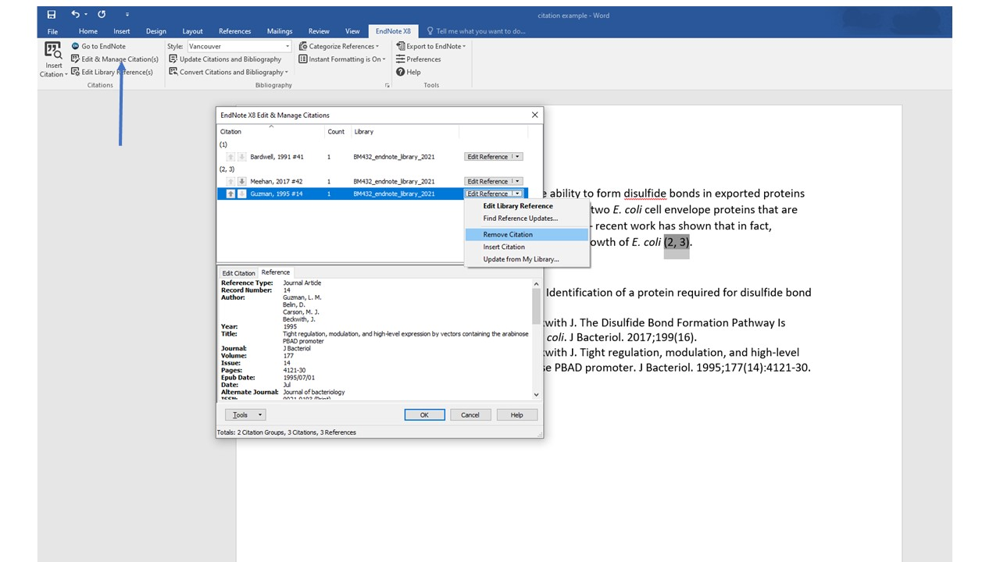
```

# Mendeley

You can download [Mendeley Desktop](https://www.mendeley.com/download-desktop-new) or [Mendeley Reference Manager](https://www.mendeley.com/reference-management/reference-manager) from the web; please refer to their website from installation instructions and FAQ, etc. 

You will also want to download the MS Word Plugin, if you are using Mendeley with Word. 

A number of useful [help guides](https://www.mendeley.com/guides) are available online. 

<div id="warning">
Note that you may run into some issues if you have multiple reference managers interfacing with Word (e.g., if Endnote and Mendeley both have add-ons running in Word) - if you run into problems, you may need to disable or uninstall one of the programs.
</div>

Worked examples here are using Mendeley Desktop v 1.19.8 on a Windows machine - some of the details may vary if you are using a different system. 

## How to import a reference into your Mendeley library 

If you have downloaded a PDF file of the article you wish to reference, you can add the PDF, and an automatically generated reference, to your Mendeley library simply by dragging the file into Mendeley Desktop. (The program includes a built-in PDF viewer, so you can read your article in Mendeley as well as record your notes on it.)

You can also use reference files downloaded from PubMed or journal websites, as described above. Once you have downloaded the file for the article you wish to reference, you will want to open it in Mendeley. You can do this in a number of different ways:
- by double-clicking on the file to open it, if Mendeley is set as the default program to open this type of file (Mendeley should open automatically if it is not already open)
- dragging the file into Mendeley (from the downloads folder or wherever you have saved it)
- right-clicking the file and selecting Open (if Mendeley is your default), or Open with (and selecting Mendeley)

## How to insert a citation from Mendeley in your Word document


```{r Mendeley1, echo=FALSE, fig.cap="caption"}
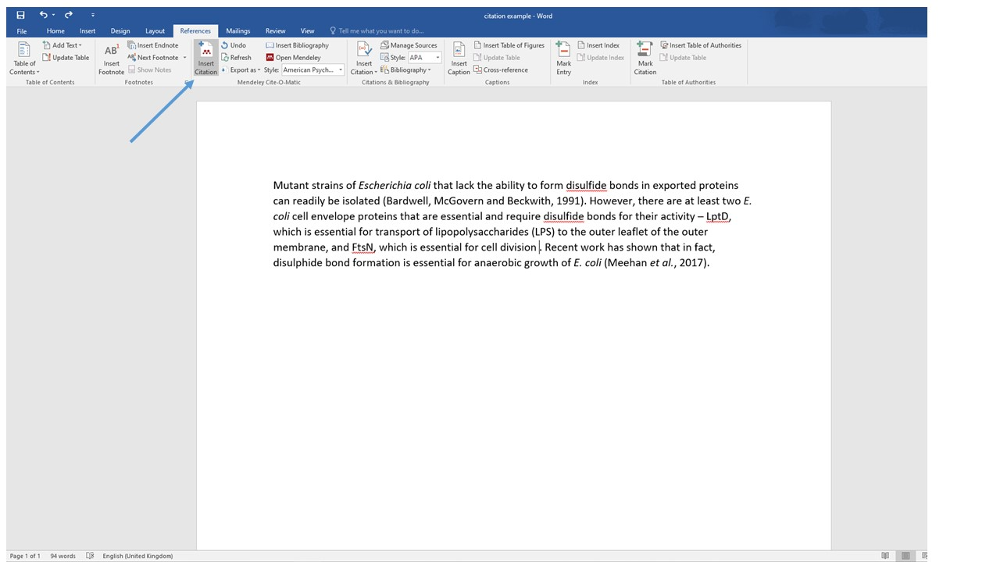
```

```{r Mendeley2, echo=FALSE, fig.cap="caption"}
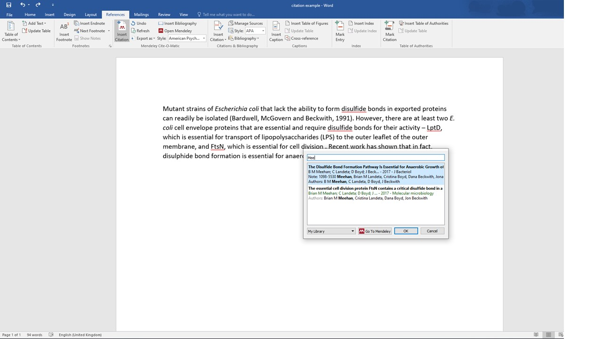
```

```{r Mendeley3, echo=FALSE, fig.cap="caption"}
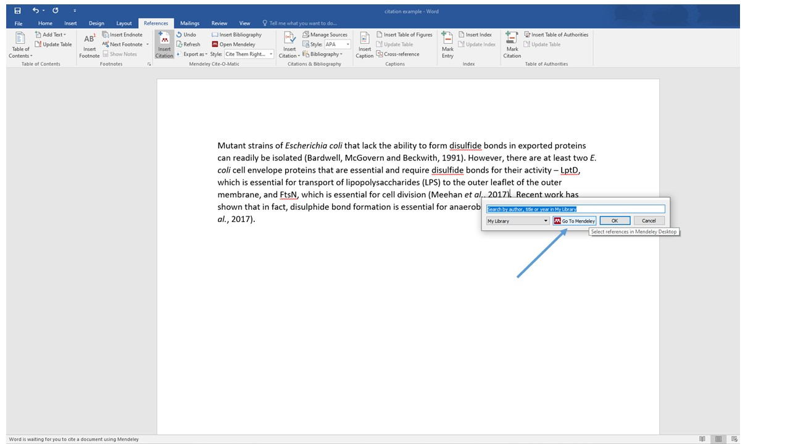
```

```{r Mendeley4, echo=FALSE, fig.cap="caption"}
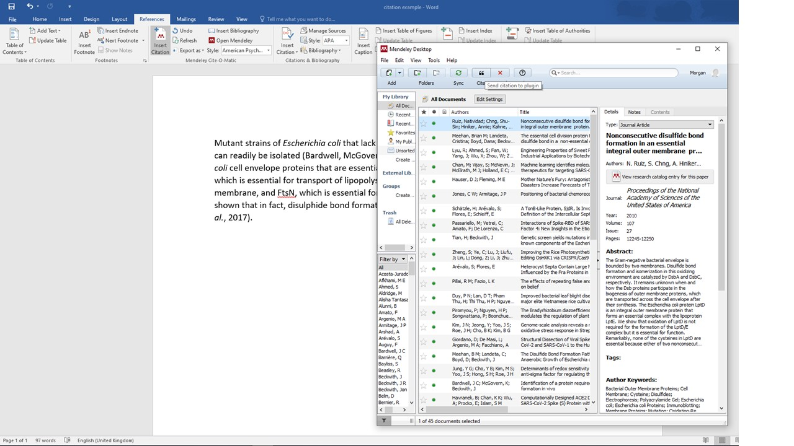
```

```{r Mendeley5, echo=FALSE, fig.cap="caption"}
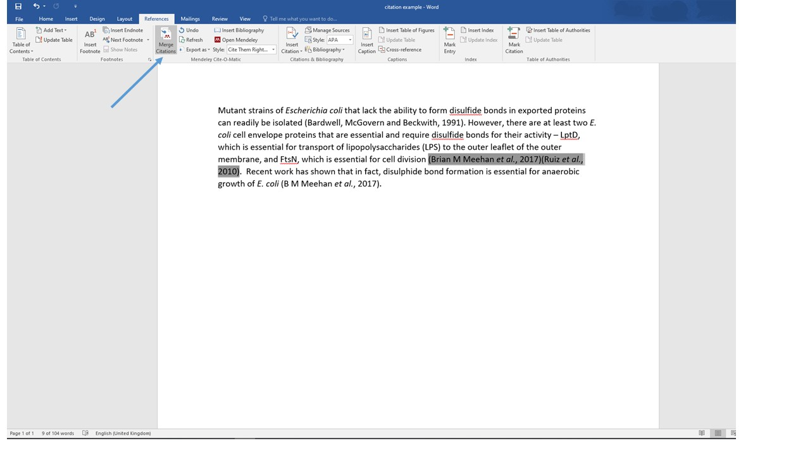
```

```{r Mendeley6, echo=FALSE, fig.cap="caption"}
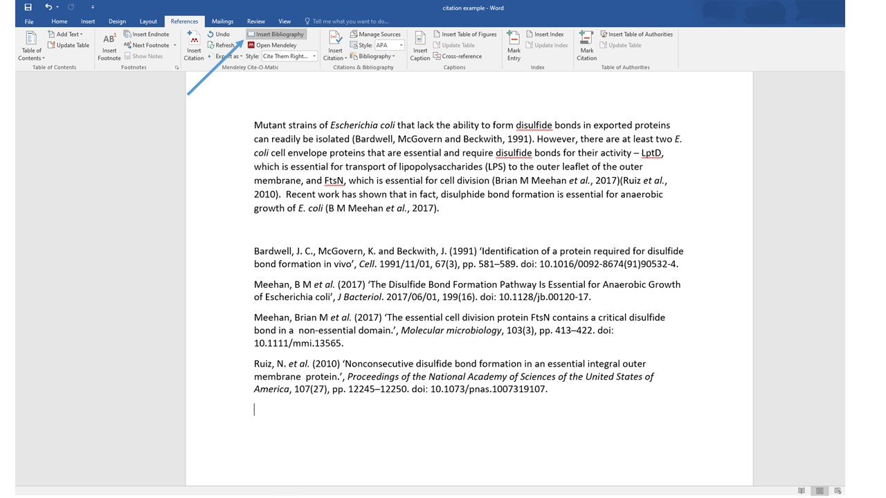
```

```{r Mendeley7, echo=FALSE, fig.cap="caption"}
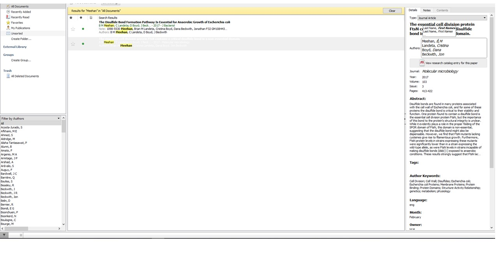
```

```{r Mendeley8, echo=FALSE, fig.cap="caption"}
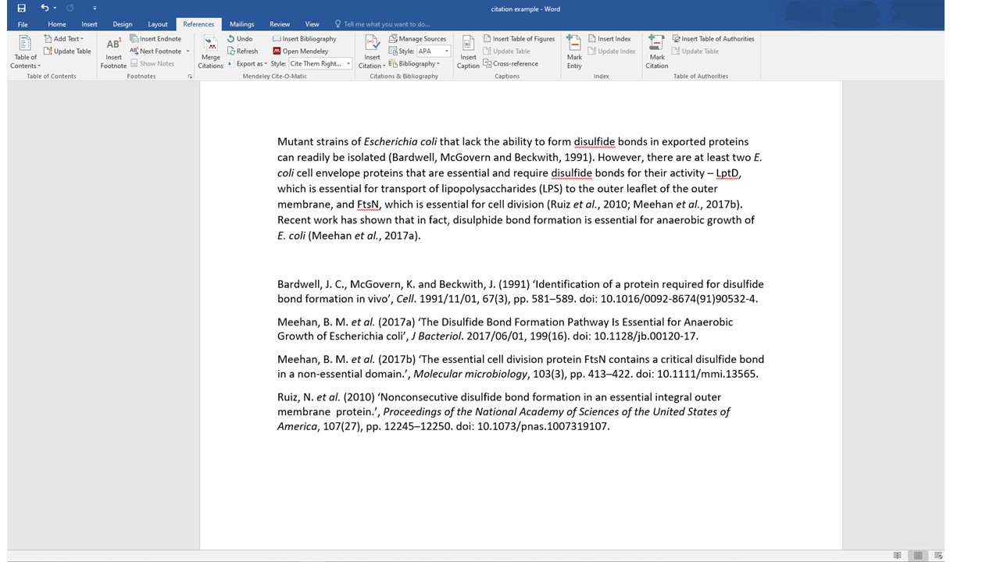
```

## How to change the output style of your references

<div id="note">
You can format your references for your thesis in either [Harvard](https://guides.lib.strath.ac.uk/referencing_guide/harvard) or [Vancouver](https://guides.lib.strath.ac.uk/referencing_guide/vancouver) style. 
</div>

## How to correct some common errors

### Formatting errors

### Deleting citations


