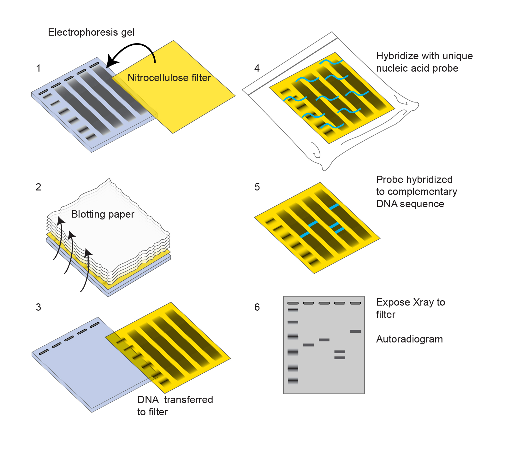
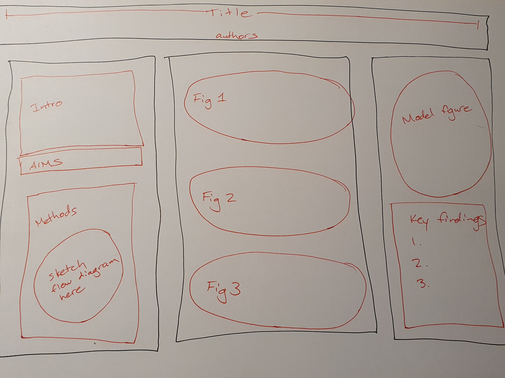
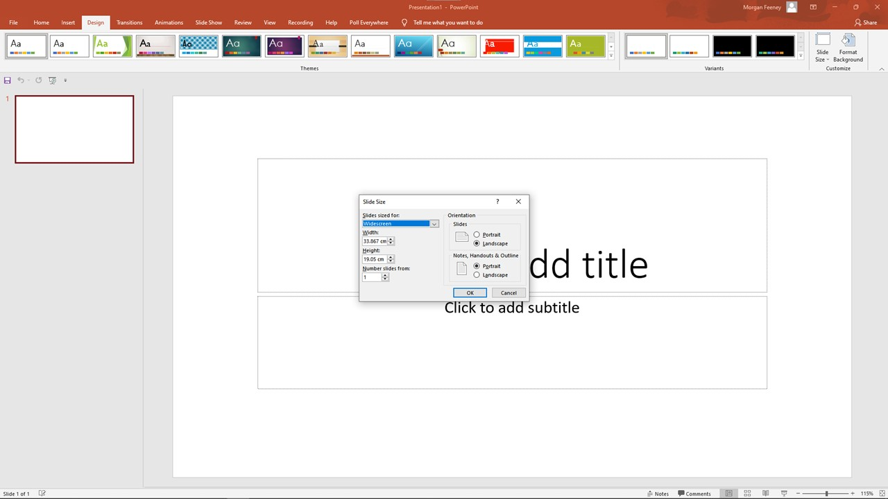

```{r setup, include=FALSE}
knitr::opts_chunk$set(echo = TRUE, warning = FALSE, message = FALSE)
library("dplyr")
library("ggplot2")

#import bgal data

bgal = read.table("./data/bgal-ex-csv.csv",
                         header=TRUE,
                         sep=",",
                         stringsAsFactors=TRUE)

bgal$Antibiotic = as.factor(bgal$Antibiotic)
```

<div id="summary">
- Your poster should tell a clear story about your project, and should serve as an aide for you as a presenter
- The design should be clear and clean, with the necessary information/key points and "take-home message" easy for your audience to see and understand

</div>

# Introduction

Refer to the page on [the anatomy of a scientific poster](./posters.html) to review the components of a scientific poster. 

A good research poster tells a story, explaining:

1) the importance of your research (why you set out to answer the question), 
2) the aims and hypothesis of the study, 
3) the results, and 
4) the context and significance of these results to the field. 

The graphical layout of your poster should guide your reader through these points in order (e.g., using numbers or arrows between sections). 

<div id="warning">
Keep in mind that you are presenting to a non-specialist audience who may be unfamiliar with your specific area of research: your poster should convince them that your work is interesting and that you have answered an important scientific question.
</div>

<div id="note">
We have covered the [basics of figure preparation](./03-04-figure_preparation.html) in a previous workshop. Many of the same principles apply to poster design (careful choice of fonts and colour palettes, use of whitespace).
</div>

A poster is similar to a thesis or a research paper in that many of the same sections (methods, results, etc.) are usually present. However, you cannot simply cut and paste content from your thesis onto a poster - large blocks of text and complex multi-panel figures are not well-suited to the poster format. You want your poster to be as clear and concise as possible, preferring graphics over text and concise bullet points over long, complete sentences.


# Designing Your Poster 

Some general rules to keep in mind when designing your poster:

- Less is more
  - Everything on your poster *must count* - every single element has to contribute to the overall message you wish to convey. 
  - Once you have drafted your poster, examine each element on it individually and critically assess whether or not it is *essential* to convey your message to the audience. If it is not essential, it must go.^[Non-essential elements include everything from data that aren't relevant to the points you are making, to cute cartoons that only distract your reader.]
  - *No one* goes to a poster session at a scientific conference wanting to read a wall of dense text or look at fifty heat-maps. Identify the key points that you want to make, and the data that are important to prove those points, and make them shine by removing all extraneous or distracting items.
- Narrative flow: make it easy for your audience visually to understand where they should look first, when they first encounter your poster, and in what direction they should move through the sections.
- As you design your poster, keep your audience in mind (how much do they likely know about the topic already?)
- Clarity should be the bedrock of your poster presentation – avoid specialist jargon and acronyms, confusing figures, and muddled organisation. 

<div id="note">
No two scientific posters are the same - each will need slightly different sections and a different layout. The design principles laid out here are general guidelines only - they may be broken, where breaking them leads to more effective communication on your poster.
</div>

To design your poster, first [Identify the "Take-Home Message"], then [Identify the Content] you want to include on your poster, prepare a [First Draft], and finally [Edit] your poster to prepare the final draft. 

## Identify the "Take-Home Message"

Summarize in 1-3 sentences what it is that you want your audience to remember after seeing your poster. 
- Why your research is important, how it addresses a gap in the literature (discovering something that wasn't known before you started your project)
- What it is specifically you found, the main and most important conclusion you can draw from your results

Everything that you choose to include on your poster should support this message. 

<div id="goofus-gallant">
<div id="goofus">
*Bad examples of poster "take-home messages"*
  
- Antibiotics are important
  - Too vague (which antibiotics? important for what?); does not give any precise idea of what your work added to the field
- RpoS is conserved in bacteria
  - Does not explain what RpoS is or why it is important; does not give any precise idea of what your work added to the field 
- The OxyR regulon includes *hemH, ahpC, dsbG, fur, dps, grxA, hcp,* the *suf* and *znu* genes, *trxC*, and *gor*. *gor* encodes glutathione reductase and is an essential gene in *Escherichia coli*. We found that some bacteria do not have the *gor* gene.
  - contains a lot of information that is not germane to the main point (long list of genes - not clear what any of them do or why they are important); gives some idea of what your work adds to the field, but a bit vague (which bacteria lack *gor*?)
</div>

<div id="gallant">
*Better examples of poster "take-home messages"*

- RpoS is an alternative sigma factor that controls the expression of stress response genes in *Escherichia coli*. We looked at the conservation of the *rpoS* gene and found that it is present in $\gamma$-, $\beta$-, and $\delta$- proteobacteria.
  - Gives some context (more explanation of what sigma factors are would be helpful, depending on the intended audience), explains precisely what you discovered (the conservation of RpoS)
- All bacteria encounter oxidative stress, particularly pathogens targeted by immune cells. Glutathione is a major part of their defense against oxidative stress. We found that some pathogens, like *Mycobacterium tuberculosis*, do not have the genes for glutathione synthesis or reduction - instead, they use an alternative thiol, mycothiol.
  - Gives context and explains why the work is important (pathogens); explains precisely what your work adds to the field
</div>
</div>

## Identify the Content

Use subheadings to divide your poster into different sections as appropriate for your project. These subheadings should be clear, concise, and informative: for example, “Cell division proteins in Archaea” is a better subheading than “Introduction.” The number and content of subsections may vary from one poster to another, but you must at a minimum include your aims and hypotheses, your work, and your conclusions.

Each section should be as concise as possible (ideally ≤ 100 words in most cases). Use bullet points instead of full sentences, but make sure that they convey your ideas clearly. 

Any text must conform to the norms of academic scientific communication – it must be precise, concise, and specific. (For example: “the LD50 of drug X is 50 $\mu$g/mL” is a clearer and better statement than “some toxicity was observed.”)

Use plenty of white space: large blocks of text are difficult for a reader to parse. 

### Title

- Should be short (ideally <15 words), very large font
- Should explain clearly what your research is about/what the major finding of your project is
- Does not need to be the same title as used for your written thesis. 
- Short, declarative statements or questions generally work well as poster titles

<div id="goofus-gallant">
<div id="goofus">
*Bad examples of poster titles*
  
- **"The role of Cys188 in the function of YFP1 and mediating the protein-protein contacts between YFP1 and ABC6 in human epithelial cells exposed to EGF"**: lots of acronyms that the reader may not understand; too wordy; no context
- **"MAPKK and MAPKKK"**: acronyms that the reader may not understand; too vague
- **"AMR and the overprescription of co-amoxiclav, streptomycin, tetracycline, methicillin, and erythromycin"**; acronym that the reader may  not understand; long list of specialized terms the reader may not be familiar with
</div>

<div id="gallant">
*Good examples of poster titles*

- **"Do all bacteria have cell walls?"**: short and clear; asks a question to engage a reader's interest
- **"Identification of two genes essential for drought tolerance in *Arabidopsis*"**: short and to the point; makes the topic and main finding of the study clear
- **"Magnesium is an essential cofactor for the DNA polymerase from *Bacillus strathclydensis*"**: short declarative statement; makes the topic and main finding clear
</div>
</div>

### Figures, Graphs, Tables

- You will want to include data on your poster to support your final conclusions/"take-home messages"; these data may be presented in different forms, including figures, graphs, or tables.

<div id="note">
In addition to using figures to present your data, consider using figures in the introduction, materials & methods, and conclusions. 

- A methods figure (a flow chart illustrating the steps done in an experiment) is a concise and clear way of presenting how an experiment was done.
- Model figures (e.g., blobograms that illustrate biological pathways) can be concise and clear ways to summarize the state of a field (what is currently known) and to illustrate your contribution (what you have added to the field).

```{r methods-fig,  out.width="60%", out.height="60%", echo=FALSE, fig.cap="An example of a methods figure (in this case, for Southern blotting [from NIH](https://www.genome.gov/genetics-glossary/Southern-Blot))"}

```


</div>

- Consider the best way to present your data (easiest way for your audience to understand it). 
  - Generally speaking, visual representations (images, graphs, etc.) are better than tables or text for a poster presentation.
  
- Any figures present on your poster should be clear and easy to read. Avoid “chart-junk” and remove any unnecessary information that does not contribute to your main message/narrative. 

- Complex, multi-panel figures do not work well on a poster; to communicate your points clearly, remove any extraneous information.

- Likewise, not all of the figures or tables produced for your thesis will fit into your poster: you must decide which are the most important/key points to include. 
  - Do not try to cram in too much information, as it is better to present 2-3 experiments clearly than 10 experiments in a rushed, superficial way.

- All figures need a title and a legend. These should be as concise as possible, and should give enough information for your audience to understand the figure. 

<div id ="goofus-gallant">
<div id="goofus">
*Example of a bad poster figure*


```{r bad-ex, echo=FALSE, fig.width=5, fig.height=5, fig.cap="Effect of adding antibiotics on beta-galactosidase activity in four reporter strains. ADA110 = AB734 (ibp::lacZ); ADA310 = AB734 (cspA::lacZ); ADA410 = AB734 (P3rpoH::lacZ); ADA510 = AB734 (sulA::lacZ). Antibiotics were added to the cultures for 20 minutes and then beta-galactosidase assays were performed. Amp = Ampicillin, Carb = Carbenicillin, Cm = Chloramphenicol, Nal = Nalidixic acid, Pmx = Polymyxin, Sm = Streptomycin. Controls were water (H2O) or ethanol (EtOH)."}  
#plot all data

ggplot(bgal,
       aes(x=Strain, y=Miller.units, fill=Antibiotic)) +
  geom_boxplot() +
  labs(y="Beta-galactosidase activity (Miller Units)")
```

In Figure 2.1, we are looking at all the data from a 96-well plate beta-galactosidase assay. These data are not bad *per se*, but they are not ideal for a poster as currently presented.

- There is a lot of data and it is not clear what the reader should focus on.
- The reader has to do a lot of work, looking between the figure legend with the genotypes and the full names of the antibiotics, and the figure itself, to understand what is being presented. 
- The figure legend is quite wordy and takes a long time to read.
</div>

<div id="gallant">
*Example of a better poster figure*

```{r better-ex, echo=FALSE, fig.width=5, fig.height=5, fig.cap="Nalidixic acid specifically induces expression of a sulA::lacZ reporter. Antibiotics were added to the cultures for 20 minutes and then beta-galactosidase assays were performed. Amp = Ampicillin, Carb = Carbenicillin, Cm = Chloramphenicol, Nal = Nalidixic acid, Pmx = Polymyxin, Sm = Streptomycin. Controls were water (H2O) or ethanol (EtOH)."}  

#plot ADA510 data

ADA510 <- bgal[73:96, ]

ggplot(ADA510,
       aes(y=Miller.units, fill=Antibiotic)) +
  geom_boxplot() +
theme(axis.text.x=element_blank(),  
      axis.ticks.x=element_blank()  
) +
  labs(y="Beta-galactosidase activity (Miller Units)")

```

In Figure 2.2, we are looking at just a subset of the data from a 96-well plate beta-galactosidase assay. The author has chosen to focus on just one of the *lacZ* reporter strains in order to make a key point that s/he wants the reader to remember: that nalidixic acid specifically induces expression of this reporter.

- There is a lot less data and it is clearer what the reader should focus on (Nal)
- The reader still has to do a lot of work, looking between the figure legend with the full names of the antibiotics, and the figure itself, to understand what is being presented. 

The figure and legend could be cleaned up to make the presentation even better, but this is an improvement over Figure 2.1. It makes a specific, focussed point instead of trying to cram in all the data that the author has collected during his/her project.
</div>
</div>


### Text

- Keep text on the poster to a minimum
  - Use bullet points instead of full sentences
  - Use figures instead of text (e.g., a diagram showing the steps done in an experiment instead of a written description)
  - Delete any unnecessary words
- All text should be large enough to read from several feet away 
- Use a dyslexia-friendly font like Arial
  - Use a monospace font like Courier for any nucleotide or protein sequence alignments


<div id ="goofus-gallant">
<div id="goofus">
*Bad example of a poster text box*

Introduction:

Cell division is a complex process requiring a number of different proteins assembled into the divisome. In *Escherichia coli*, these proteins include FtsZ, ZipA, FtsA, FtsW, FtsN, FtsB, FtsL, FtsQ, FtsI, FtsW, and many other proteins. FtsZ localizes to midcell and this localization is essential for correct positioning of the divisome and eventual construction of the cell division septum. In *Streptomyces*, however, *ftsZ* is not an essential gene. The aim of this work, therefore, is to discover why *ftsZ* is not essential in *Streptomyces* as it is in other bacteria.

</div>

<div id="gallant">
*Better example of a poster text box*

Cell division in bacteria:

- Divisome: protein complex required for cell division
- FtsZ needed for correct divisome positioning and septum formation
  - *ftsZ* essential in *E. coli* but not in *Streptomyces*
  
Aim:

- Discover why *ftsZ* is not essential in *Streptomyces*
</div>
</div>


## Graphic Design

- Make sure there is plenty of white space - do not crowd everything together to fit more in. 
- Guide the reader's eye to move naturally from one section to another in a logical order. 
  - It may help to number your sections, or to use arrows to guide the reader's eye.
- Align your boxes to a grid as much as possible - avoid complicated, messy jumbles that can make your poster feel cluttered and busy.
- Many posters use a plain coloured background, with white boxes or bubbles outlining the different subsections.

### Colour choices

- Use a clear and consistent colour scheme throughout, ensuring that your colour choices are colour-blind accessible. 
- Make sure that there is enough contrast between any background colour and the font colour, such that the font is easy to read.
  - Dark fonts on a pale or white background are easiest to read.
- Do not use a bewildering array of colours; use 3-5 colours at most, and use them consistently throughout the poster. 
  - Use contrasting colours to draw your audience's attention to key points.
- Avoid messy, unnecessarily detailed backgrounds - these only distract from the poster content. 
- Overall, make sure that you use colour thoughtfully so that it aids in the clarity of your poster.  

# How to Prepare a Poster

## First Draft

Once you have decided what information needs to be included on your poster, you may find it helpful to draw a rough sketch (on paper or electronically) of your poster layout first. 

```{r poster, echo=FALSE, fig.cap="A rough sketch of a poster layout"}

```

You can then start assembling the poster, adding images and text using the software of your choice. 

## Software

PowerPoint and Adobe programs are very commonly used. You may use any software you like to prepare your poster.

It is usually best to prepare your figures separately (using the software of your choice) --> save them as image files (e.g., .png files) --> insert the figures into the poster as images. (Assembling the figures directly in the poster means that you will have many more movable pieces, and therefore more chances of those pieces being mis-aligned or lost.)

## Size

Your poster should be the size of an A0 paper (84.1 cm x 118.9 cm). 

If you are using PowerPoint, you can set the size of your poster by going to the "Design" ribbon, clicking on "Slide Size" > "Custom Slide Size" and entering the desired dimensions for Width and Height.

```{r poster-size, echo=FALSE, fig.cap="Adjusting slide size in PowerPoint"}

```

## Editing your poster

Once you have prepared a first draft of your poster, you will need to edit it. Practice presenting your poster in front of friends and/or colleagues, and note what works well (and what doesn't). Improve your poster based on their feedback. 

Things to keep in mind while you are editing your poster: 

- Remove any text or figures that do not help you present your project 
- Add any information that was missing (e.g., to answer any questions that your audience asked during your practice presentations)
- Consider the overall aesthetics of your poster (e.g., is the colour scheme working well, is there enough whitespace, does the reader naturally move through the sections in the intended order?)