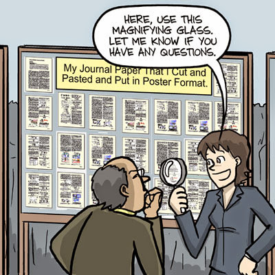
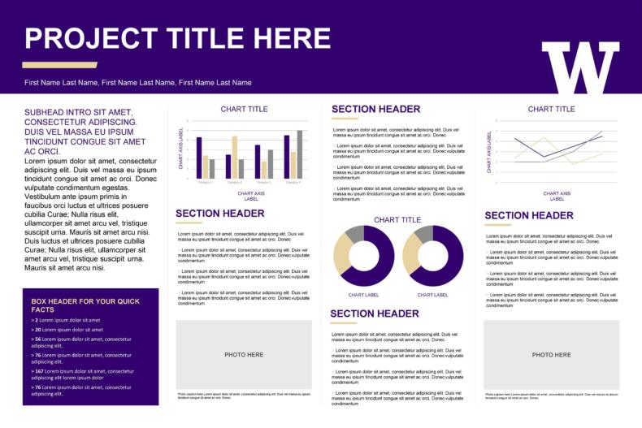

```{r setup, include=FALSE}
knitr::opts_chunk$set(echo = FALSE)
```

<div id="summary">
- A scientific poster helps to communicate the results of a particular study to an audience 
  - A poster should help the presenter communicate (serve as a visual aide/memory prompt), but should also be able to stand alone (communicate the work done without the author present to explain it)
- A poster should generally contain a title, list of authors, and several sections presenting the work: introduction, materials and methods, results, conclusions/significance
</div>

# Introduction

Posters are a common way to communicate science at conferences and other venues. They are often printed on a single large sheet of paper (e.g., A0), but size requirements vary between conferences.

You should use your poster as a visual aide to presenting your work - it should have the key figures, results, etc. that you need to show your audience to convince them of the main findings of your work.

At the same time, however, your poster should be able to stand alone: a person should be able to look at it, without you being there to explain it, and still understand the work that you have done.

However, a poster is not a manuscript, and you cannot simply copy/paste figures and text from your thesis onto a poster template. A poster is primarily about visual communication, so text should be kept at a minimum and figures should be kept simple and clear.

```{r poster, echo=FALSE, fig.cap="A poster is not a manuscript, from [PhD Comics](http://phdcomics.com/comics.php)."}

```

# The Anatomy of a Scientific Poster

Every poster is different, but all posters should contain the following elements in some form. Boiled down to the essentials, the poster should inform your audience of why your research is important, the aims/hypothesis of your work, what experiments were done and how, and the overall conclusions/"take-home messages". 

There are many possible poster designs (just one example shown below), but it is common to use subheadings to divide the information on a poster, and to direct and focus the reader's attention. 

```{r template, echo=FALSE, fig.cap="Example poster template, from [Template Lab](https://templatelab.com/research-posters/)."}

```

## Title

- A short description of what the poster is about. May be a declarative statement of what the research has found, or a descriptive statement of what the research is about.   

## Authors

- Authors are usually listed directly below the title
- Everyone who has contributed to the work should be listed
- The person who prepared the poster (you) should be listed first, and the supervisor last
- Institutional affiliations should also be listed (e.g., University of Strathclyde)

## Introduction

- Gives enough background for the reader to understand your research question and why it is important. 
- Clearly sets out the aims and hypothesis for the work

## Materials and Methods

- Gives enough information for the reader to understand how the experiments were done
- Gives key parameters for the methods done, but not necessarily as detailed as a paper/thesis
- Often uses a figure/flow diagram to illustrate methods

## Results

- Includes key results that answer the stated hypothesis/research aims
- Uses subheadings to break into subsections as necessary
- Uses graphs or charts where necessary to illustrate key points

## Conclusions and Significance

- 1-3 clear, concise "take home" messages for your audience
- Usually relating back to the aims/hypothesis defined earlier
- May use a model figure to summarize results/put results in context

<div id="note">
The titles of the subsections on a poster may not match the sections listed above. For example, it is best to have clear, specific, focused titles that state the take-home message of a section (e.g., "Drug X decreases lymphocyte survival" instead of "Results").
</div>