```{r setup, include=FALSE}
knitr::opts_chunk$set(echo = FALSE)
```

<div id="summary">
- Plain text files in a common, open, non-proprietary file format are best practice
  - these kinds file formats enable *exchangeability* and give greatest flexibility for choice of tools/programs for downstream analysis
- There are many good tools for data analysis, including:
  - `Excel` is a general spreadsheet tool, with some statistical capability
  - `Minitab` is a general-purpose statistical package, with an intuitive graphical interface
  - `R` is a general-purpose programming language with an emphasis on statistics and data science
- `Minitab` and `R` have modes of operation that enforce good data practice; `Excel` does not
- `R` has an extremely wide range of libraries and packages for specialised and advanced statistical analysis and visualisation, which are not available in either `Minitab` or `Excel`
</div>

# Setup

To participate in this workshop or to work through the example in your own time, you will need the following on your own computer:

1. The cleaned `OpenRefine` dataset from the ["Cleaning Data With OpenRefine" workshop](./workshop-openrefine.html): `esoph-tab.tsv` (or whatever you named it)
2. Microsoft `Excel` (you have a licence for this *via* the university)
3. `Minitab` (you have a licence for this *via* the university)
4. `R` and `RStudio` (this is free and open-source)

<div id="note">
Please see the [configuration notebook](./configuration.html) for help and guidance on setting up `R` and `RStudio`.

For guidance in obtaining, installing and using the latest versions of `Excel` and `Minitab` please visit the [university's IT pages](https://www.strath.ac.uk/professionalservices/is/software/).
</div>

# Introduction

Data can be collected, stored, and analysed in a variety of ways, using a wide range of tools. We do not prescribe any particular approach, other than to note best practices for `FAIR` and open science prefer open, plain-text, human-readable non-proprietary data formats that are shared in public repositories. The best tool for data analysis for *your* work may differ depending on your research area, and from project to project. Most good tools will allow you to read and write data in exchangeable formats compatible with `FAIR` and open science. In this workshop we will explore the use of three common tools, `Excel`, `Minitab` and `R`, to open and summarise the dataset `esoph-tab.tsv` we cleaned in the earlier workshop.

We will perform three main tasks in each package:

1. Loading (or importing) the dataset
2. Generating standard summary statistics: mean, standard deviation, quartiles, etc.
3. Visualising the distribution of the data graphically

# `Excel`

Microsoft `Excel` is almost ubiquitous. It is now available free of charge as a cloud service, as part of `Office365`^[https://office.live.com/start/Excel.aspx]. Alternatives to `Excel`, such as `Google Sheets`^[Google Sheets is a cloud-based spreadsheet package, free for personal use] and `Libre Office`^[[Libre Office](https://www.libreoffice.org/) is a free, open office quite intended as a drop-in, free replacement for Microsoft Office], work in much the same way. This workshop should be adaptable to those alternatives with minimal modification.

<div id="warning">
Your experience with Excel may vary slightly from the one described below, depending on what operating system and what version of Excel you are using.
</div>

## Loading data

1. Start `Excel`
2. Click on `Open`
3. Navigate to the location of `esoph-tab.tsv`, select it and click `Open`

```{r fig-excel-open, echo=FALSE, fig.cap="Importing a plain-text file in `Excel`", out.width="600px"}
knitr::include_graphics("images/excel-01_landing.png")
knitr::include_graphics("images/excel-02_select.png")
```

<div id="warning">
**For any format other than its own, proprietary `.xls` or `.xlsx` format, `Excel` will start the `Text Import Wizard`.**

This makes loading the simplest datasets seem more complicated than it really is, and serves to nudge users towards Microsoft's own format, and away from good data practice.
</div>

```{r fig-excel-import1, echo=FALSE, fig.cap="The `Excel` Text Import Wizard", out.width="400px"}
knitr::include_graphics("images/excel-03_import1.png")
```

<div id="note">
The `Text Import Wizard` should correctly identify that your data are *delimited*^[*delimited*: separated by a character that indicates a new column is starting. This is often a *tab* (`\t`) or comma (`,`)].

**However, `Excel` may not notice that the first row is a *header row*^[*header row*: a row in a table that indicates the contents of each column], and may treat all rows (data or metadata) equivalently.**
</div>

1. Click on `Next >`

```{r excel-import2, echo=FALSE, fig.cap="The `Excel` Text Import Wizard: selecting a delimiter", out.width="400px"}
knitr::include_graphics("images/excel-04_import2.png")
```

On the next page of the wizard, `Excel` indicates that it has identified the *tab* (`\t`) character as the column delimiter. You would be able to select a different character if this was incorrect. In this instance, no changes are necessary.

1. Click on `Next >`

```{r excel-import3, echo=FALSE, fig.cap="The `Excel` Text Import Wizard: selecting data format", out.width="400px"}
knitr::include_graphics("images/excel-05_import3.png")
```

In the next wizard page, `Excel` allows you to select each column's data format. These formats are: `General`, `Text`, `Date`, and "skip column".

<div id="warning">
`Excel` does not allow you here to specify data formats or data types that are standard for statistical or data analysis. In particular, it does not distinguish between categorical and continuous (numerical) data. It does not allow you to specify whether numerical values should be counts (whole numbers) or "real" values (can take any decimal value).

**Importing data into `Excel` has very limited data validation.**
</div>

1. Click `Finish`

`Excel` now presents your data in spreadsheet format.

```{r excel-sheet, echo=FALSE, fig.cap="Excel has imported our data. But look closely.", out.width="600px"}
knitr::include_graphics("images/excel-06_sheet.png")
```

<div id="note">
Here, `Excel` again attempts to nudge us towards using one of the proprietary `Excel` formats by claiming that there is `<b>Possible Data Loss:</b> Some features might be lost if you save this workbook in the comma-delimited (.csv) format. To preserve these features, save it in Excel format.` 

**This is misleading.** Our data should "safe" so long as we keep it in plain text, open, non-proprietary formats.
</div>

<div id="questions">
1. Would it be better if `Excel` were able to distinguish header rows from data rows?
2. What kinds of data do we have in each column? (numerical or categorical? count or real-valued?)
3. Did `Excel` import our data correctly?
</div>

<div id="warning">
**`Excel` did not import our data correctly.**

`Excel` interpreted the range `10-19` as a date: October 19th. Our `tobgp` column now has a number of dates interspersed among the values. This is bad: `Excel` has changed our data without asking or notifying us that it would do so.
</div>

So that `Excel` does not modify our data silently, we must specify `Text` as the data format for our columns:

1. Close the spreadsheet.
2. Start `Excel`
3. Click on `Open`
4. Navigate to the location of `esoph-tab.tsv`, select it and click `Open`
5. Click on `Next >`
6. Click on `Next >`
7. Click on each column in turn and select `Text`

```{r excel-text-format, echo=FALSE, fig.cap="Be sure to select the `Text` data format for each column.", out.width="400px"}
knitr::include_graphics("images/excel-07_text.png")
```

1. Click on `Finish`

```{r excel-reload-sheet, echo=FALSE, fig.cap="Excel has now imported our data correctly.", out.width="600px"}
knitr::include_graphics("images/excel-08_sheet.png")
```

Excel has now imported our data, and it *looks* to be correct.

<div id="questions">
1. Why did `Excel` not import our data correctly, first time?
2. What other kinds of data might cause problems for `Excel` (Hint^[https://www.theregister.com/2020/08/06/excel_gene_names/])?
</div>

## Summary Statistics

To obtain summary statistics for each column we need to use `Excel`'s *functions* and *pivot tables*, as we need to treat *categorical* data differently from *continuous* (numerical) data. We want to know, for instance, the number of datapoints we have in each `agegp` category, rather than a "mean" of the categories (which has no real meaning); but for our cases and controls, we might still want to know means, standard deviations, etc.

<div id="warning">
In all cases, we are potentially modifying our cleaned dataset *directly* because we are working in the same file we loaded - **this would be bad practice**.

**Our first step should be to save a new spreadsheet to do our analysis in**
</div>

1. Save the current file as an `Excel` workbook (note: this is necessary to avoid losing `Excel`'s formulas)

### Summary statistics for quantitative/numerical data

We will calculate mean and standard deviation values for columns `ncases` and `ncontrols`. To do so, we need to use `Excel`'s `AVERAGE()` and `STDEV()` functions.

- The `ncases` values run from cell `D2` to cell `D89`
- The `ncontrols` values run from cell `E2` to cell `E89`

1. In cell `D90` enter the text `=AVERAGE(D2:D89)` and hit the return key. This will calculate the mean of quantitative data in the column of cells extending from `D2` to `D89`, and populate 

<div id="question">
1. Did `Excel` calculate the average value? If so, what is it?
</div>

<div id="warning">
**`Excel` will not calculate a mean value for text data.**

When we selected `Text` as the input data format, `Excel` used this to do two things:

1. All numerical values are now understood as text, *not* as numbers^[In Excel, numbers are right-aligned, text is left-aligned. Each cell also has a green triangle in its upper left corner to indicate that it is a text value, not numerical].
2. All cells in both columns - *all the way to the bottom of the spreadsheet* - are interpreted as text, not numbers, formulas, or any other element.
</div>

<div id="note">
To rectify this problem, we need to change the data in the two columns `D` and `E` to be numbers:

1. Select all numerical data in columns `D` and `E` (`D2:E89`)
2. Click on the `warning` icon (a small yellow triangle with an exclamation mark)
3. Click on `Convert to Number`

```{r fix-numbers, echo=FALSE, fig.cap="Converting text to numbers in `Excel`.", out.width="600px"}
knitr::include_graphics("images/excel-09_warning.png")
knitr::include_graphics("images/excel-10_convert.png")
```
</div>

<div id="questions">
1. Does the formula now give a plausible mean value?
2. If you were new to this file, how could you tell that the formula gives a mean value, and not a standard deviation, or something else entirely?
</div>

1. As there is no visual indication in the file of what the number in cell `D90` represents, add a label to cell `C90` with the text `Mean:`.
2. Copy and paste the cell `D90` into cell `E90`
3. Add the label `Std Dev:` to cell `C91`
4. Enter the formula `=STDEV(D2:D89)` into cell `D91`
5. Copy and past the formula from cell `D91` into cell `E91`

<div id="warning">
Depending on your version of `Excel` you may need to use the function `STDEV.S()`.
</div>

Now we have some summary information for our quantitative data.

```{r fix-quantsum, echo=FALSE, fig.cap="Spreadsheet with quantitative data summary.", out.width="600px"}
knitr::include_graphics("images/excel-11_quantsum.png")
```

### Summary statistics for categorical data

It is often useful to know how many datapoints you have in each category. Here, we *could* independently sum each of the `ncases` or `ncontrols` cells, depending on which mixture of categorical variables we wanted (e.g. combine all cells for rows where `tobgp` is equal to `10-19`), but `Excel` provides a tool called a *pivot table* to make things easier for us.

For instance, suppose we wanted to know the numbers of cases and controls in each category of the `alcgp` column. We could insert a *pivot table* that combined all values from `ncases` and `ncontrols`, for each of the individual categories in `alcgp`. To do this:

1. Select all of your data (`A2:E89`)
2. Click `Insert` $\rightarrow$ `Pivot Table` $\rightarrow$ `OK`

```{r fig-pivot, echo=FALSE, fig.cap="Creating a pivot table.", out.width="600px"}
knitr::include_graphics("images/excel-12_pivot1.png")
knitr::include_graphics("images/excel-13_pivot2.png")
```

This brings up an interface that might at first look confusing. We are going to try to create a table that has one row per category in `alcgp`, and holds three columns in total:

- The `alcgp` category
- The *sum* of values in `ncases` for that category
- The *sum* of values in `ncontrols` for that category

To do so:

1. Click on the checkbox next to `alcgp` - this will place it in the `Rows` box, and you will see a view of the new pivot table
2. Click on the checkbox next to `ncases` - this will place it in the `Values` box as `Sum of ncases` and you will see the pivot table change
3. Click on the checkbox next to `ncontrols` - this will place it in the `Values` box as `Sum of ncontrols` and you will see the pivot table change 

```{r fig-pivot-table, echo=FALSE, fig.cap="Creating a pivot table.", out.width="600px"}
knitr::include_graphics("images/excel-14_pivot3.png")
```

<div id="questions">
1. How many cases are there in total?
2. How many controls are there in the `120+` category
3. Why do you think the column of category names is not sorted in numerical order?
</div>

## Data visualiation

Suppose we want to compare the numbers of cases and controls for each of our `alcgp` categories, we can reasonably use a bar graph (though we should really use a 1D scatterplot). To do so:

1. Select the data in the pivot table (`A3:C7` in the figure)
2. Click on `Insert` $\rightarrow$ `Pivot Chart`

This will create a bar chart in the current worksheet, showing the number of controls and cases in each category of `alcgp`.

```{r fig-pivot-hart, echo=FALSE, fig.cap="Creating a pivot table.", out.width="600px"}
knitr::include_graphics("images/excel-15_pivot4.png")
```

# `Minitab`

`Minitab` is a statistical software package, often used for teaching. It is moving towards a cloud-hosted model, but the `Minitab Express` package is still available for desktop use. This software requires a licence, which you will need to obtain from the university before you can run the tool.

<div id="warning">
Also, because of licensing restrictions, **you must be on the university network, or connected to the university VPN, so that the licensing server can be reached**. Otherwise, you will not be able to use `Minitab`.
</div>

## Loading data

1. Start `Minitab Express`
2. Click on `File` $\rightarrow$ `Open Worksheet`
3. Navigate to the location of `esoph-tab.csv`, select it and click `Open`

```{r fig-minitab-load, echo=FALSE, fig.cap="Importing CSV into Minitab.", out.width="600px"}
knitr::include_graphics("images/minitab-01_import.png")
knitr::include_graphics("images/minitab-02_landing.png")
```

<div id="warning">
`Minitab Express` will not import tab-separated value files.
</div>

`Minitab Express` presents your data in a panelled window. By default, the data is presented in spreadsheet form in the lower panel. The top panel will contain output, and the left panel will be a `Navigator`. This layout reflects `Minitab`'s role as a statistical analysis package, rather than a general spreadsheet tool.

<div id="note">
`Minitab Express` did not ask any questions about data type or formats.
</div>

To see how `Minitab Express` understood your data:

1. Click on any column in the spreadsheet view
2. Click on the `Inspector` button (top right)

A new window appears. Click on the `Column` icon (third icon).

```{r fig-minitab-inspector, echo=FALSE, fig.cap="Minitab column inspector.", out.width="300px"}
knitr::include_graphics("images/minitab-03_inspector.png")
```

<div id="questions">
1. Has `Minitab Express` correctly distinguished between the header and data rows?
2. What data type or format does `Minitab Express` think each column is?
3. What kinds of data does `Minitab Express` "know about"?
4. Do you need to change any of the data values or formats?
5. How does this compare to loading data into `Excel`?
</div>

## Summary Statistics

As a statistical package, `Minitab Express` is written to make obtaining summary statistical data relatively straightforward. Here we will try to recover the same data as we did in `Excel`.

### Summary statistics for quantitative/numerical data

To obtain summary statistics for a single data column in `Minitab Express`:

1. Click on `Summary` $\rightarrow$ `Column Statistics`
2. Select `C4 ncases` and click on the arrow next to `Variable`
3. Click `OK`

```{r fig-minitab-summary, echo=FALSE, fig.cap="Generating a single-column summary with Minitab.", out.width="600px"}
knitr::include_graphics("images/minitab-04_summary1.png")
knitr::include_graphics("images/minitab-05_summary2.png")
knitr::include_graphics("images/minitab-06_summary3.png")
```

`Minitab` then updates the spreadsheet with calculated values and presents some output in the top panel, describing what values were calculated, and which cells in the spreadsheet hold output values.

To generate a set of descriptive statistics for a data column:

1. Click on `Summary` $\rightarrow$ `Descriptive Statistics`
2. Select `C5 ncontrols` and click on the arrow next to `Variable`
3. Click `OK`

`Minitab` doesn't put these values in the spreadsheet, but it does show a nicely-formatted table with a number of descriptive statistics in the upper panel. You can switch between views on the data by clicking on previous steps in the `Navigator` (on the left, by default).

```{r fig-minitab-summary2, echo=FALSE, fig.cap="Generating a single-column summary with Minitab.", out.width="600px"}
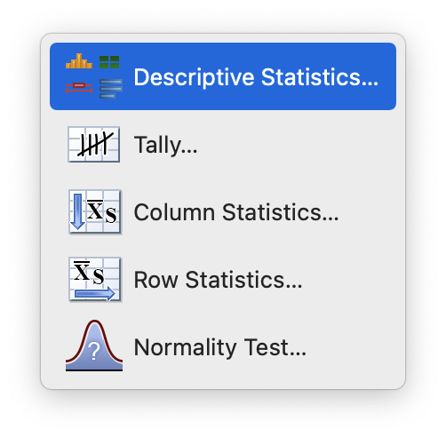
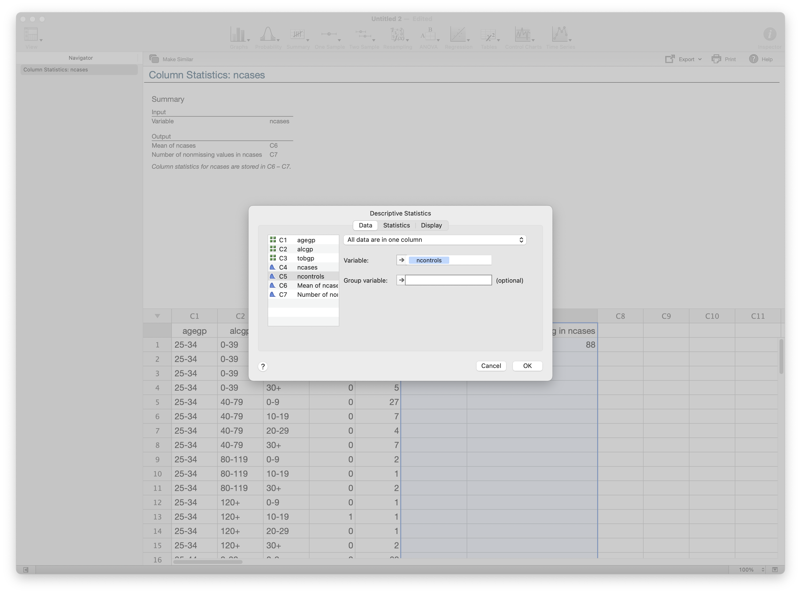
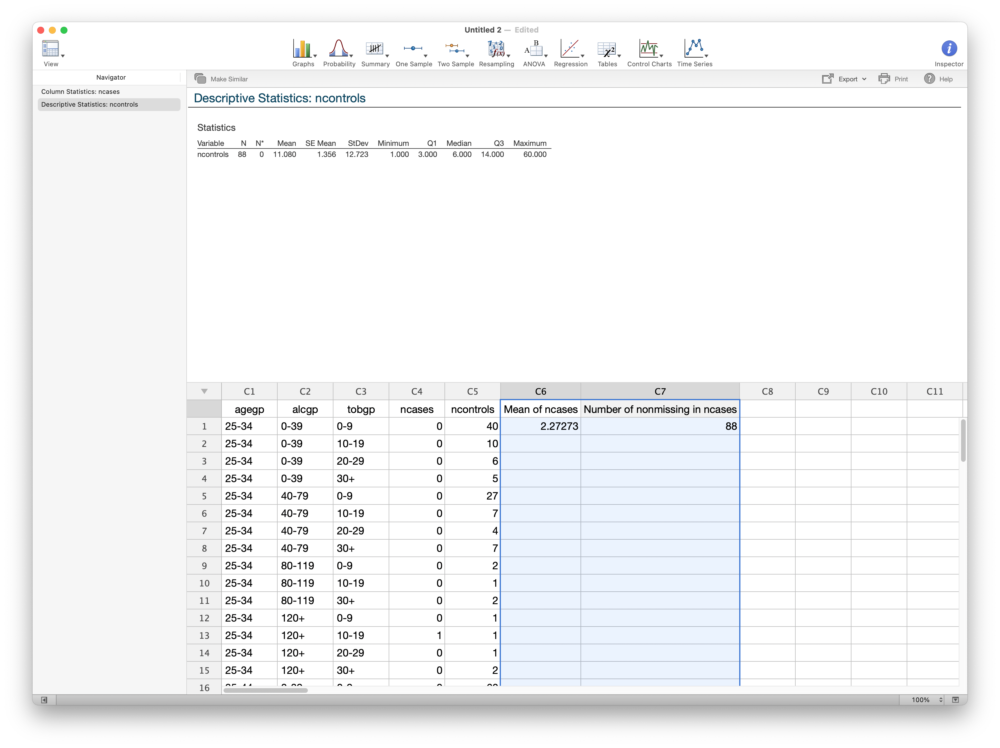
```

<div id="questions">
1. Does `Minitab` give you the same information/values as `Excel` for this data?
2. Does `Minitab` give you any useful extra data?
</div>

### Summary statistics and visualisation for qualitative data

We will again try to obtain case and control counts, conditioned on the `alcgp` category.

1. Click on `Graphs` $\rightarrow$ `Bar Chart`
2. Select `Mean or other function of a continuous variable`
3. Click on `Multiple Y variables` $\rightarrow$ `Clustered`
4. Choose `ncases` and `ncontrols` as the continuous variables
5. Choose `alcgp` as the categorical variable
6. Select `Sum` as the function

```{r fig-minitab-summary3, echo=FALSE, fig.cap="Generating a pivot view Minitab.", out.width="300px"}
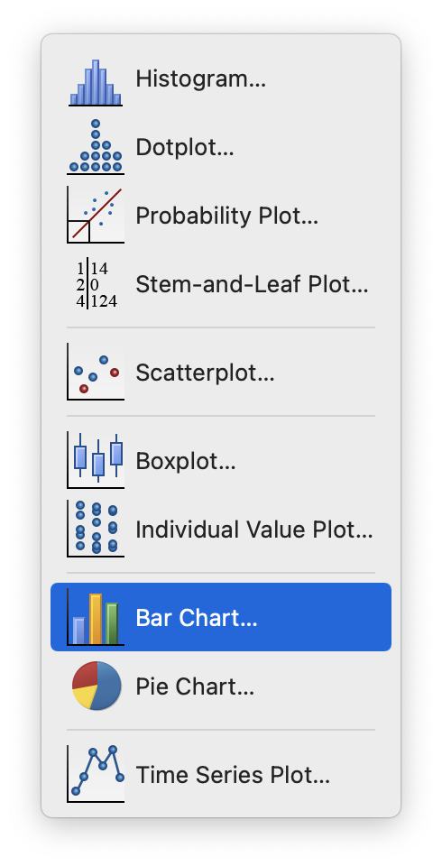
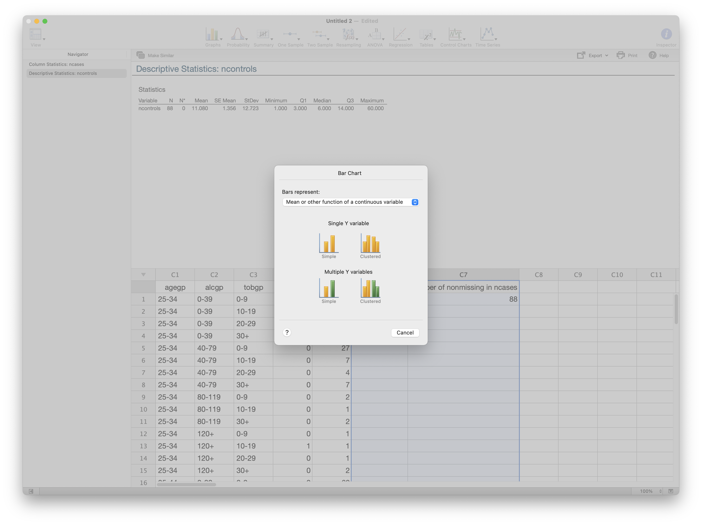
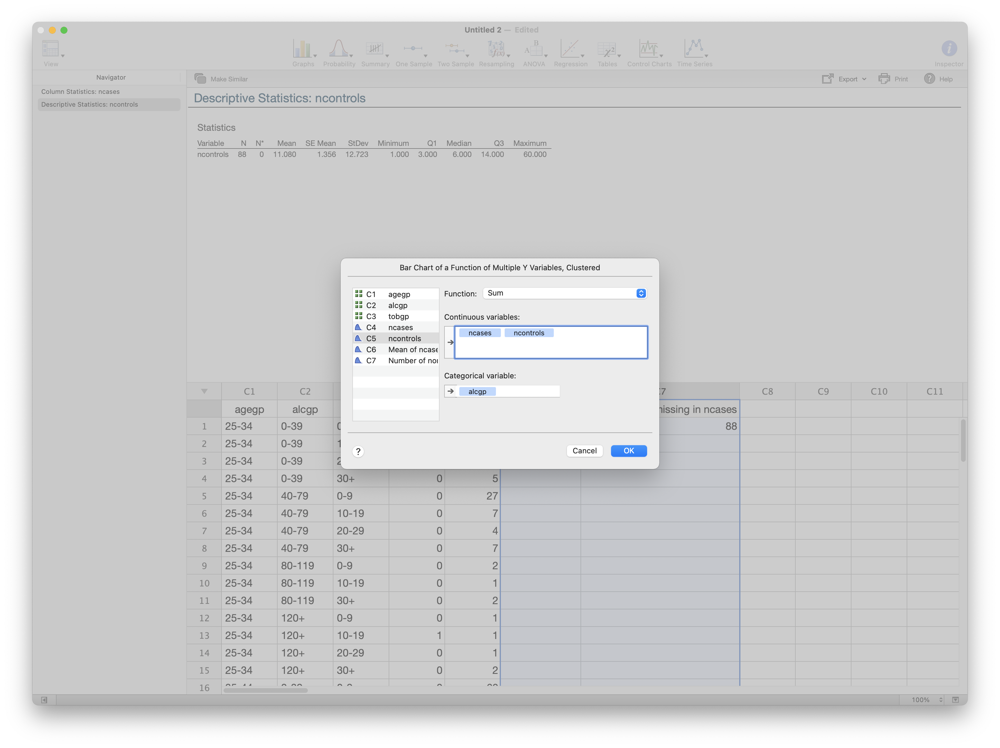
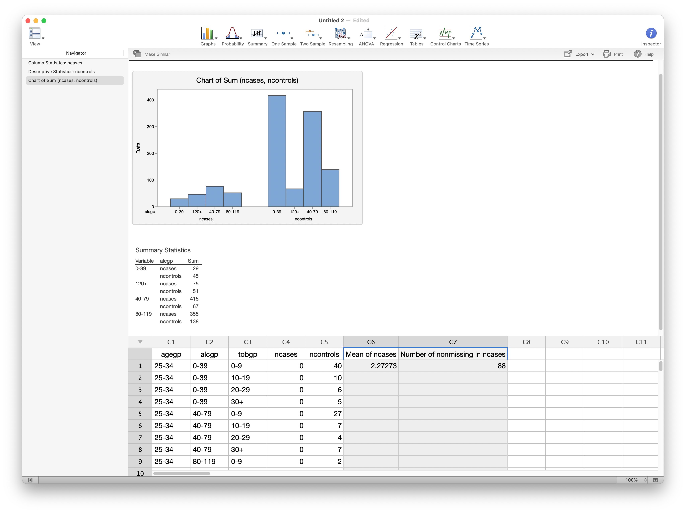
```

`Minitab`, unlike `Excel`, shows both the tabular summary and the bar graph visualisation in the upper panel. Also, the data for `ncases` and `ncontrol` are separated into two groups, rather than being presented side-by-side.

<div id="questions">
1. Was the data import and summary process easier and more convenient in `Excel` or `Minitab`? Why do you think that was?
2. Which is better - presenting `ncases` and `ncontrol` side-by-side for each `alcgp` category, or separating them into distinct groups?
</div>

# `R`

`R` is a general programming language, designed to be used by statisticians and data scientists. Unlike `Excel` and `Minitab` it is free and open-source. It has a very large number of third-party libraries are available for statistical, bioinformatics, and other activities. It is the *de facto* language of choice for much statistical and bioinformatics work in academia.

`RStudio` is a free, open-source integrated development environment (IDE) designed for use with `R`. It has powerful version control and project management features. 

## Loading data

1. Start `RStudio`
2. In the `Files` panel, navigate to the location of the `esoph-tab.tsv` file
3. Click on the `esoph-tab.tsv` file

<div id="note">
Clicking on the `esoph-tab.tsv` file shows the contents of the file in an editor (top left by default), but **does not load or import the dataset into `R`**
</div>

```{r fig-r-view, echo=FALSE, fig.cap="The RStudio window, when viewing the data file.", out.width="600px"}
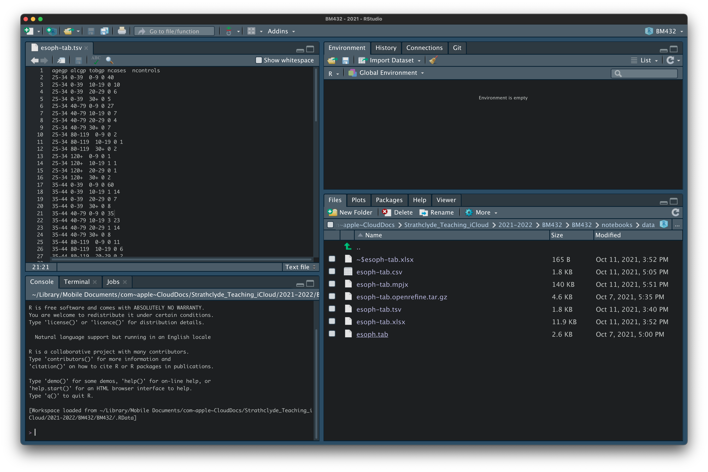
```

<div id="warning">
Working in `R`/`RStudio` is unlike working in a point-and-click environment such as `Excel` or `Minitab`. Commands are issued by typing them in the `Console` window (bottom left, by default) or by writing and running scripts.

**In this workshop, we will write and run a simple script**
</div>

Before we load the data, we need to make sure we are in the correct working directory, and create an empty script. Using a script allows us to save and modify our commands as we develop the analysis. It is also easy to attach to a paper, or to share so that others can see exactly how the analysis was performed. Scripts can be placed under version control, and reused for new datasets.

1. In the `Files` panel, click `More`
2. Click `Set as Working Directory`

```{r fig-r-setwd, echo=FALSE, fig.cap="Set working directory in R.", out.width="600px"}
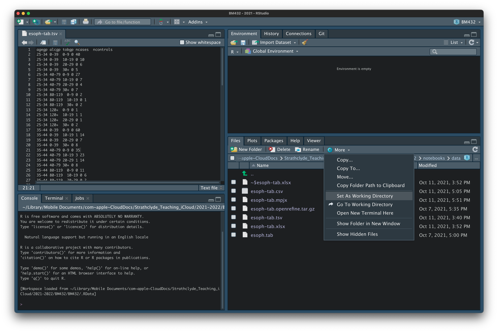
```

<div id="note">
In the `Console` window, you should see that a command has been run (setting the working directory).
</div>

To create an empty script:

1. Click on `File` $\rightarrow$ `New File` $\rightarrow$ `R Script`

This will start a new file in the top left `Editor` panel. It will be called `Untitled1`. 

```{r fig-r-newscript, echo=FALSE, fig.cap="Start a new blank script.", out.width="600px"}
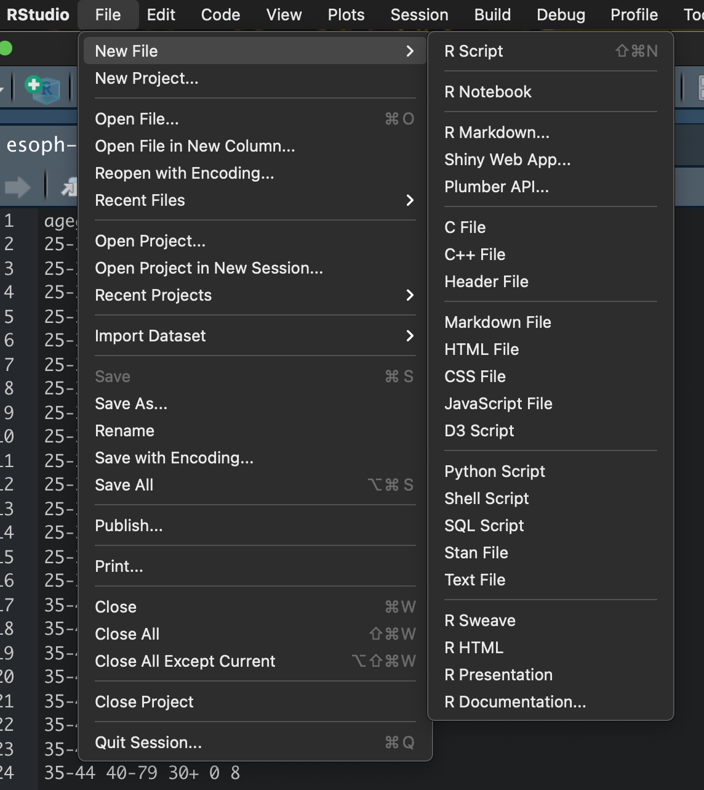
```

To load the data from `esoph-tab.tsv` we need to use the command `read.table()`. Type the text below into the empty panel `Untitled1`:

```R
# Load Oesophagus case/control data
# First row is a header
data = read.table("esoph-tab.tsv", header=TRUE, sep="\t")
```

First, save the script. Click File > Save As. (Alternatively, click on the "Save" icon (picture of a floppy disk.))

This will bring up a "Save File" dialogue. Save the file as `summarise_esoph.R`

Next, click `Run` to run the script.

```{r fig-r-load-save, echo=FALSE, fig.cap="Write, run and save the script.", out.width="600px"}
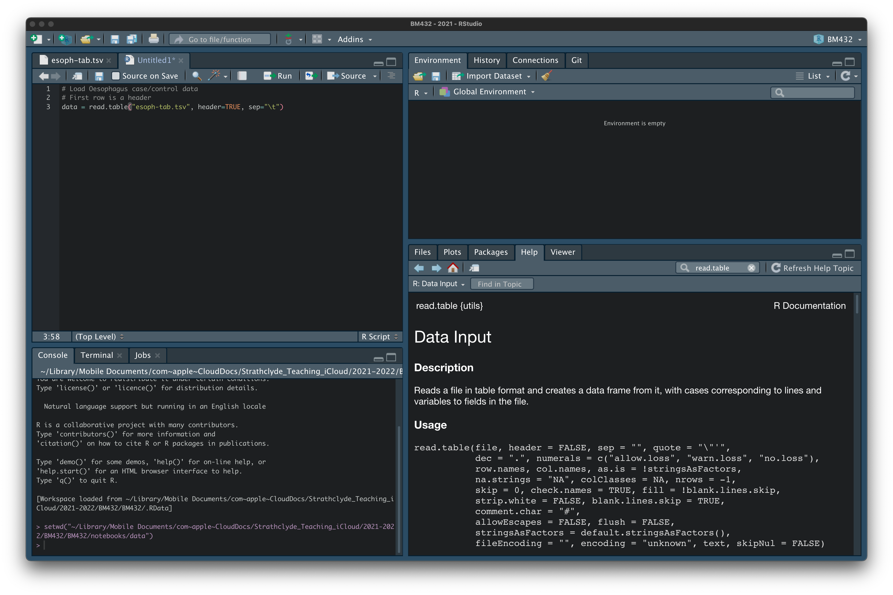
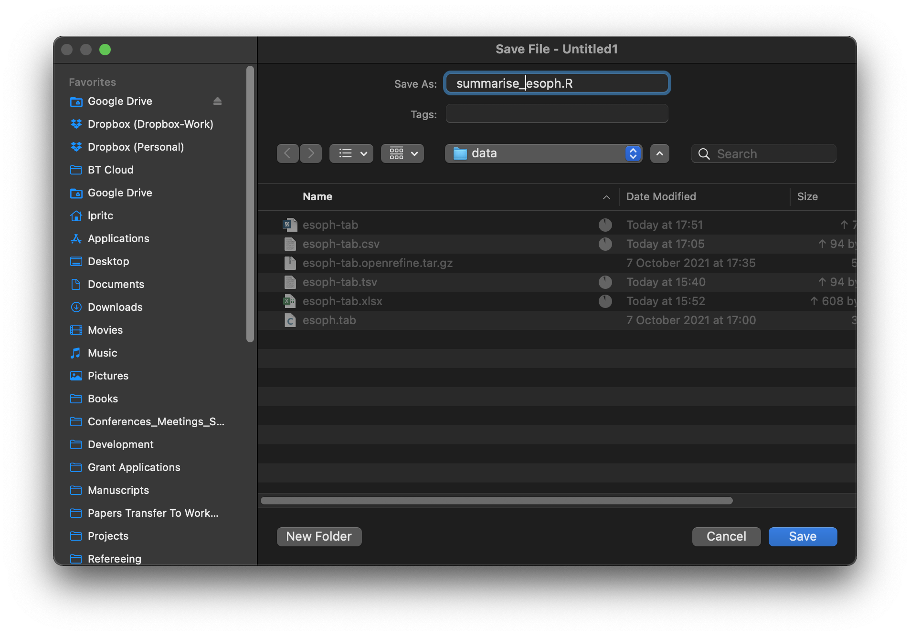
```

<div id="note">
You can get help on any `R` command by typing its name into the search field of the `Help` panel (bottom left, by default)

When script commands are run in `RStudio`, you can see them being executed in the `Console` panel.
</div>

<details>
  <summary>Breaking down what's happening in the script (Click to toggle)</summary>
The first two lines start with the "hash"/"pound"/octothorpe character. This means that the line is a *comment* and not treated like a command. This is one way in which we annotate and document our code, so it is understandable when we return to it in future (and so others can understand it).

The data is loaded on line three: `data = read.table("esoph-tab.tsv", header=TRUE, sep="\t", stringsAsFactors=TRUE)`. This does the following:

- It opens (`read.table()`) the file `esoph-tab.tsv`
  - It tells `R` that the first line of the file/first row of the table is a header (`header=TRUE`)
  - It tells `R` that the separator/delimiter is a tab character (`sep="\t"`)
  - It tells `R` that the columns containing strings are *categorical variables* (`stringsAsFactors=TRUE`)
- It places the data into a *variable*^[You can think of a variable as a box with a label on it. The label is the variable name (here, `data`), and the contents of the box are the data that was loaded. When you want to talk about the box or its contents, you can do so with the variable name.] so we can use it.
</details>

<div id="note">
When the data is loaded, the `Environment` panel (top right, by default) shows that `data` exists, with 88 observations of 5 variables.

- Click on the triangle next to `data`: this shows a summary of the dataset
- Click on the name `data`: this shows the data values in spreadsheet format in the `Editor` panel
  - **You cannot edit data in the spreadsheet view**
  
**The `data` variable contains an object called a *dataframe*^[The term *dataframe* refers to data stored according to good data practices: each row is an observation; each column is a variable] in `R` jargon.**
</div>

```{r fig-r-viewdata, echo=FALSE, fig.cap="Viewing the dataset in R's spreadsheet view.", out.width="600px"}
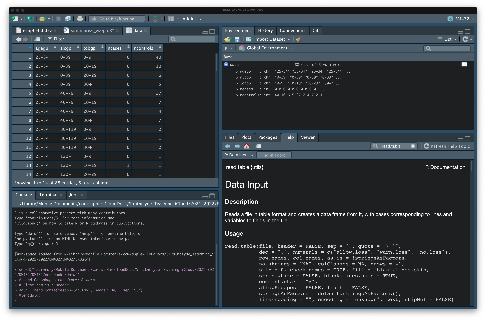
```

<div id="questions">
1. What kinds of values did `R` read each column of the dataset in as?
2. Is the data import process more, or less, reproducible than loading data into `Excel` or `Minitab`?
</div>

## Summary Statistics

To get basic summary statistics from a *dataframe*, we can use the `summary()` command in `R`. Add the following lines to your script, select that line, and then `Run` the script:

```r
# Obtain a summary of each column in the loaded data
summary(data)
```

This generates output in the `Console` panel:

```r
> summary(data)
   agegp       alcgp      tobgp        ncases         ncontrols    
 25-34:15   0-39  :23   0-9  :24   Min.   : 0.000   Min.   : 1.00  
 35-44:15   120+  :21   10-19:24   1st Qu.: 0.000   1st Qu.: 3.00  
 45-54:16   40-79 :23   20-29:20   Median : 1.000   Median : 6.00  
 55-64:16   80-119:21   30+  :20   Mean   : 2.273   Mean   :11.08  
 65-74:15                          3rd Qu.: 4.000   3rd Qu.:14.00  
 75+  :11                          Max.   :17.000   Max.   :60.00  
```

```{r fig-r-summary, echo=FALSE, fig.caption="Basic dataframe summary."}
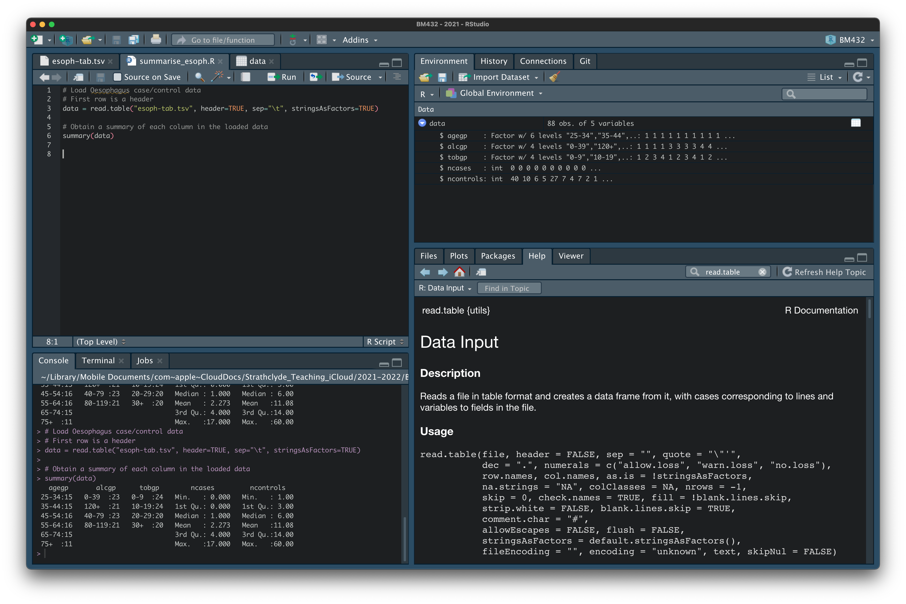
```

<div id="questions">
1. How do these summary statistics differ from those in `Minitab`?
</div>

So far, the output does not include standard deviations for `ncases` and `ncontrols`. We can get this information by using the command `sd()` in our script, and selecting each column separately. To indicate a column, we use the variable name, followed by the `$` symbol, and then the column name. So, to obtain standard deviations for our two columns in the `data` dataframe, we add the following lines to our script:

```r
# Calculate standard deviations of the number of cases and controls
sd(data$ncases)
sd(data$ncontrols)
```

and running the script then gives us the result:

```r
> # Calculate standard deviations of the number of cases and controls
> sd(data$ncases)
[1] 2.753169
> sd(data$ncontrols)
[1] 12.7227
```

```{r fig-r-sdevs, echo=FALSE, fig.cap="Calculating standard deviations on data columns.", out.width="600px"}
knitr::include_graphics("images/r-08_sdevs.png")
```

### Summary statistics grouped by categorical data

To aggregate the number counts of cases and controls by `alcgp` category in `R`, we can use the `aggregate()` function. This requires us to name the columns we'd like to process (here, `ncases` and `ncontrols`), and columns we'd like to aggregate *by* (here, `alcgp`). The command itself can look quite daunting. Place the following command in your script and run it:

```r
# Produce a table with counts of ncases and ncontrols for each alcgp category
aggregate(cbind(ncases_tot=data$ncases, ncontrols_tot=data$ncontrols),
    by=list(alcgp=data$alcgp), FUN=sum)
```

```{r fig-r-aggregate, echo=FALSE, fig.cap="Aggregating summary data into a table.", out.width="600px"}
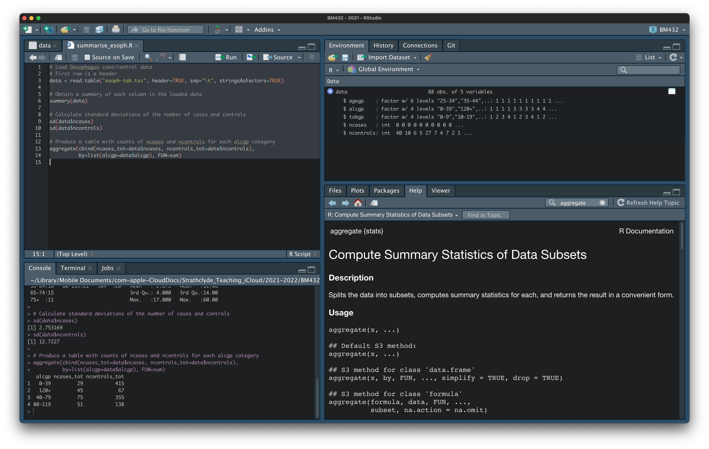
```

<details>
  <summary>Breakdown of the `aggregate()` command (Click to toggle)</summary>

- The `aggregate()` function splits the `data` dataset into subsets (controlled by `alcgp` category) and calculates summary statistics for each subset, presenting a table as output.
  - `cbind()` combines the columns we're interested in (`data$ncases` and `data$ncontrols`) into input for the `aggregate()` function.
  - We use `ncases_tot=data$ncases` and `ncontrols_tot=data$ncontrols` as the values for `cbind()` so that the final table has column headers `ncases_tot` and `ncontrols_tot` (we could provide any names for the output columns)
  - The `by=` part of the command tells `aggregate()` which column to *group values by*
  - We provide the argument `by=list(alcgp=data$alcgp)` to tell `aggregate` to group by the `data$alcgp` column, and give the new column the name `alcgp`
  - The `FUN=sum` tells `aggregate()` to use the `sum()` function to calculate the *sum* of values for each column, in each group. We could have provided an alternative function if we wanted different values.
</details>
  
The output the command provides is:

```r
   alcgp ncases ncontrols
1   0-39     29       415
2   120+     45        67
3  40-79     75       355
4 80-119     51       138
```

<div id="questions">
1. How do these values, and their presentation, compare to the outputs of `Minitab` and `Excel`?
2. How reproducible are the steps for the analyses in `R`, `Minitab`, and `Excel`?
</div>

## Data visualisation

One of the main advantages of using an environment like `R`/`RStudio` is that there are many excellent third-party packages available to perform cutting-edge statistics and specialised data visualisation. Here, we will use three of these packages to process and visualise data, as in `Excel` and `Minitab`. The two packages we'll use are `dplyr`, `tidyr`, and `ggplot2`. Add the following lines to your script and run them:

```r
# Generate a plot of ncases and ncontrols for each alcgp category
library(dplyr)
library(ggplot2)
library(tidyr)
dfm = data %>%
  group_by(alcgp) %>%
  summarise(ncases=sum(ncases), ncontrol=sum(ncontrols)) %>%
  pivot_longer(!alcgp, names_to="datatype", values_to="count")
ggplot(dfm, aes(x=alcgp, y=count)) +
  geom_bar(aes(fill=datatype), position="dodge", stat="identity")
```

When you run the script, the output appears in the `Plots` panel (lower right, by default)

```{r fig-r-ggplot2, echo=FALSE, fig.cap="ggplot2 visualisation of the aggregated data", out.width="600px"}
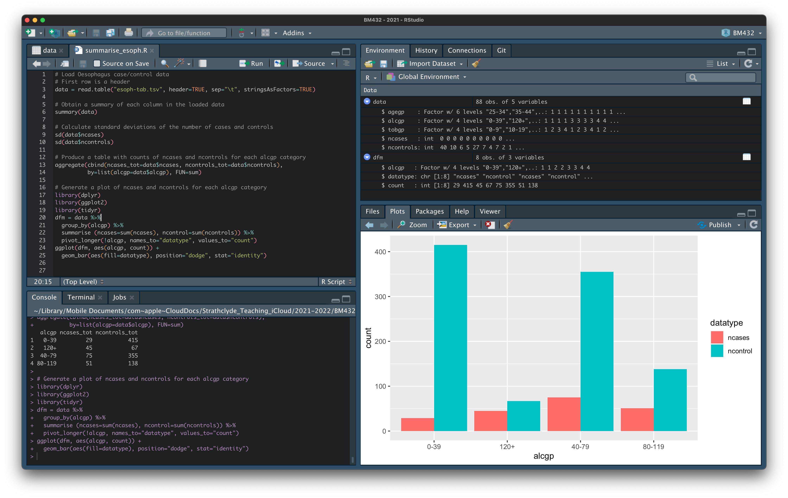
```

<details>
  <summary>Breakdown of the commands used for visualisation (Click to toggle)</summary>
This is certainly a much more complex set of commands than the others, but we unpack them, below.

- The first three lines *import* libraries of commands to help us process and visualise data
  - `library(dplyr)`^[https://dplyr.tidyverse.org/] makes *transforming* data into a new form easier
  - `library(tidyr)`^[https://tidyr.tidyverse.org/] provides commands that make it easier to clean up "messy" data
  - `library(ggplot2)`^[https://ggplot2.tidyverse.org/] provides commands for extremely flexible graphical output
  
All three commands *load* the packages into our workspace, so we can use their commands. They are also all part of the `Tidyverse` - a set of libraries that are very widely used for data science in `R`.

The next command stretches over four lines, because it's really four commands wrapped into one:

- `dfm =` will *assign* the result of processing the data to the *variable* `dfm`
  - The `%>%` symbol is a *pipe*. It takes what is produced on the left of the symbol, and *pipes* it into the commond on the right.
  - `data %>% group_by(algcgp)` *pipes* the `data` dataframe into the command `group_by` which, here, groups all the data by the categories in the column `alcgp`
  -  `%>% summarise(ncases=sum(ncases), ncontrol=sum(ncontrols))` takes the grouped data and uses the `summarise()` command to create two new columns that take the sum of `ncases` and `ncontrols`, just like in the `aggregate()` function above. This is a different way of doing the same task^[There are often many ways to achieve the same goal in `R`. Generally, we use the way that suits the context of the analysis - as we're *piping* commands here, we use a version that works well with *pipes*.]. The resulting dataframe is ready for *piping* into the next command.
  - `%>% pivot_longer(!alcgp, names_to="datatype", values_to="count")` works like `Excel`'s pivot table. It takes the two columns `ncases` and `ncontrols` and *pivots* them so that the data is in "long form"^[see, e.g. [https://anvil.works/blog/tidy-data](https://anvil.works/blog/tidy-data)], a kind of "tidy data" where there is a single column for each variable. Here, the *count* of individuals is a single variable, and the *type of case/control* they are is a single variable. We do this because long form data works best with `ggplot2`.

Now we have the variable `dfm`, which looks like this:

```r
> dfm
# A tibble: 8 x 3
  alcgp  datatype count
  <fct>  <chr>    <int>
1 0-39   ncases      29
2 0-39   ncontrol   415
3 120+   ncases      45
4 120+   ncontrol    67
5 40-79  ncases      75
6 40-79  ncontrol   355
7 80-119 ncases      51
8 80-119 ncontrol   138
```
  
The final command is a `ggplot2` command to plot the content of `dfm`. This breaks down as follows:

- `ggplot(dfm, aes(x=alcgp, y=count))` sets up the data for the plot. We're going to use `dfm` as our dataset. `alcgp` will be our categorical variable on the $x$ axis, and `count` will be our continuous variable on the $y$ axis.
- `geom_bar()` is a command that is *added to* the result of `ggplot()` to create a barchart visualisation. To get the kind of formatting we want, we need to give it some instructions.
  - `aes(fill=datatype)` tells `geom_bar()` to use a different colour for each category in the `datatype` variable
  - `position="dodge"` tells `geom_bar()` to put bars side-by-side, rather than stacking them
  - `stat="identity"` tells `geom_bar()` to use the values in the `count` variable directly, without transforming them or modifying them
</details>

The output image can be saved by adding the following line to the script, and running it:

```r
# Save bar chart as PDF for publication
ggsave("case_control_counts_by_alcgp.pdf")
```

This creates a new PDF (vector) file in the working directory. Vector files are preferred for publications, as they are rescalable to any size without loss of clarity or detail.
  
```{r fig-r-ggsave, echo=FALSE, fig.cap="RStudio view after creating the output figure.", out.width="600px"}
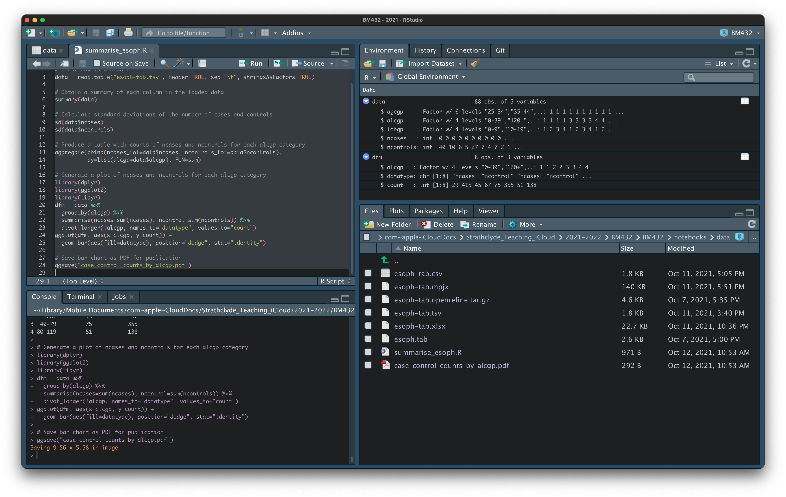
```

<div id="questions">
1. Which of `R`, `Excel` and `Minitab` did you find the easiest to use? Why?
2. Which of `R`, `Excel` and `Minitab` do you think were least likely to introduce accidental changes to the raw dataset?
3. Which of `R`, `Excel` and `Minitab` do you think would make it easiest to rerun the same analysis on a new dataset?
4. Which of the `R`, `Excel` and `Minitab` analyses do you think would be easiest to describe, include in a publication, or share, so that others could follow them?
</div>

<div id="note">
`R` and the `Tidyverse` are extremely powerful and have far more features and capabilities than can be described here. For an introduction to what they can do, you might be interested to try the introduction to `R`, linked below.

- [Data Analysis and Visualisation in `R` for Ecologists (Data Carpentry)](https://datacarpentry.org/R-ecology-lesson/index.html)
</div>