```{r setup, include=FALSE}
knitr::opts_chunk$set(echo = FALSE)
```

<div id="summary">
- Plain text files in a common, open, non-proprietary file format are best practice
  - these kinds file formats enable *exchangeability* and give greatest flexibility for choice of tools/programs for downstream analysis
- There are many good tools for data analysis, including:
  - `Excel` is a general spreadsheet tool, with some statistical capability
    - `Excel` may need care when importing data, as it does not have statistical datatypes, and converts data to new forms silently.
  - `Minitab` is a general-purpose statistical package, with an intuitive graphical interface
  - `R` is a general-purpose programming language with an emphasis on statistics and data science
- `Minitab` and `R` have modes of operation that enforce good data practice; `Excel` does not
- `R` has an extremely wide range of libraries and packages for specialised and advanced statistical analysis, which are not available in either `Minitab` or `Excel`
</div>

# Setup

To participate in this workshop or to work through the example in your own time, you will need the following on your own computer:

1. The cleaned `OpenRefine` dataset from the ["Cleaning Data With OpenRefine" workshop](./workshop-openrefine.html): `esoph-tab.tsv` (or whatever you named it)
2. Microsoft `Excel` (you have a licence for this *via* the university)
3. `Minitab` (you have a licence for this *via* the university)
4. `R` and `RStudio`

<div id="note">
Please see the [configuration notebook](./configuration.html) for help and guidance on setting up `R` and `RStudio`.

To download and install the latest versions of `Excel` and `Minitab` please visit the [university's IT pages](https://www.strath.ac.uk/professionalservices/is/software/).
</div>

# Introduction

Data can be collected, stored, and analysed in a variety of ways, using a wide range of tools. We do not prescribe any particular approach, other than to note best practices for `FAIR` and op science prefer open, plain-text, human-readable non-proprietary data formats that are shared in public repositories. The best tool for data analysis for *your* work may differ depending on your area, and from project to project. Most good tools will allow you to read and write data in exchangeable formats compatible with `FAIR` and open science. In this workshop we will explore three common tools: `Excel`, `Minitab` and `R`, and use these to open and analyse our cleaned dataset `esoph-tab.tsv` from the earlier workshop.

We will perform three main tasks in each package:

1. Loading (or importing) the dataset
2. Generating standard summary statistics: mean, standard deviation, quartiles, etc.
3. Visualising the distribution of the data graphically

# `Excel`

Microsoft `Excel` is almost ubiquitous. It is now available free of charge as a cloud service, as part of `Office365`^[https://office.live.com/start/Excel.aspx]. Alternatives to `Excel`, such as `Google Sheets`^[Google Sheets is a cloud-based spreadsheet package, free for personal use] and `Libre Office`^[[Libre Office](https://www.libreoffice.org/) is a free, open office quite intended as a drop-in, free replacement for Microsoft Office], work in much the same way. This workshop should be adaptable to those alternatives with minimal modification.

## Loading data

1. Start `Excel`
2. Click on `Open`
3. Navigate to the location of `esoph-tab.tsv`, select it and click `Open`

```{r excel-open, echo=FALSE, fig.caption="Opening a plain-text file in `Excel`"}
knitr::include_graphics("images/excel-01_landing.png")
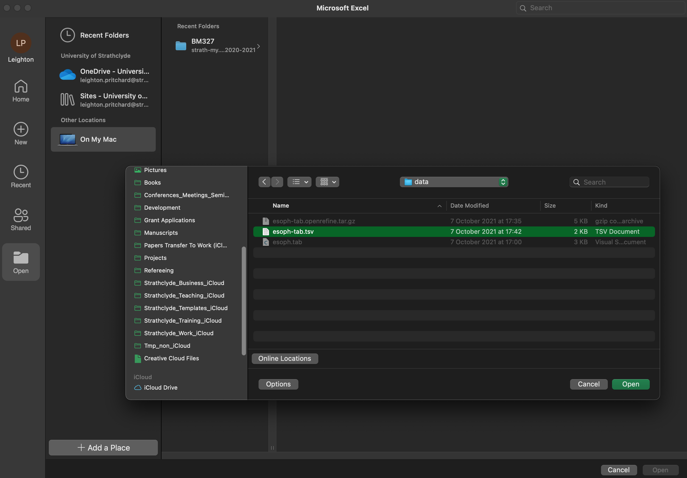
```

<div id="warning">
**For any format other than its own, proprietary `.xls` or `.xlsx` format, `Excel` will start the `Text Import Wizard`.**

This makes loading the simplest datasets seem more complicated than it really is, and serves to nudge users towards Microsoft's own format, and away from good data practice.
</div>

```{r excel-import1, echo=FALSE, fig.caption="The `Excel` Text Import Wizard"}
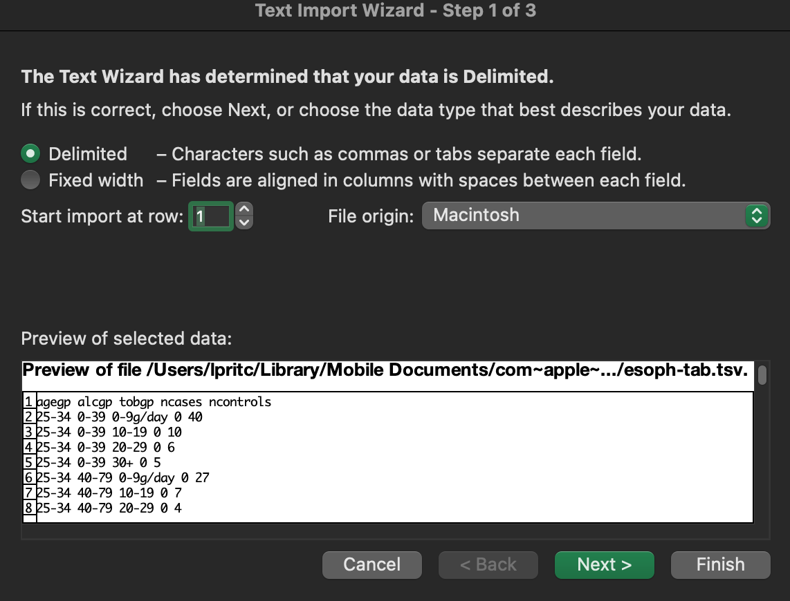
```

<div id="note">
The `Text Import Wizard` should correctly identify that your data are *delimited*^[*delimited*: separated by a character that indicates a new column is starting. This is often a *tab* (`\t`) or comma (`,`)].

**However, `Excel` may not notice that the first row is a *header row*^[*header row*: a row in a table that indicates the contents of each column], and may treat all rows equivalently.**
</div>

1. Click on `Next >`

```{r excel-import2, echo=FALSE, fig.caption="The `Excel` Text Import Wizard: selecting a delimiter"}
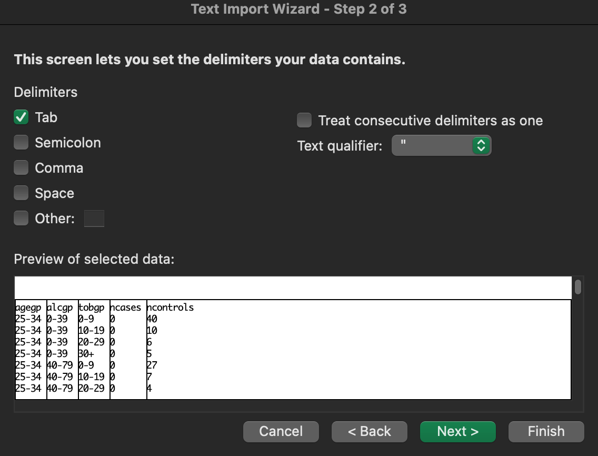
```

On the next page of the wizard, `Excel` indicates that it has identified the *tab* (`\t`) character as the column delimiter. You would be able to select a different character if this was incorrect. Here, no changes are necessary.

1. Click on `Next >`

```{r excel-import3, echo=FALSE, fig.caption="The `Excel` Text Import Wizard: selecting data format"}
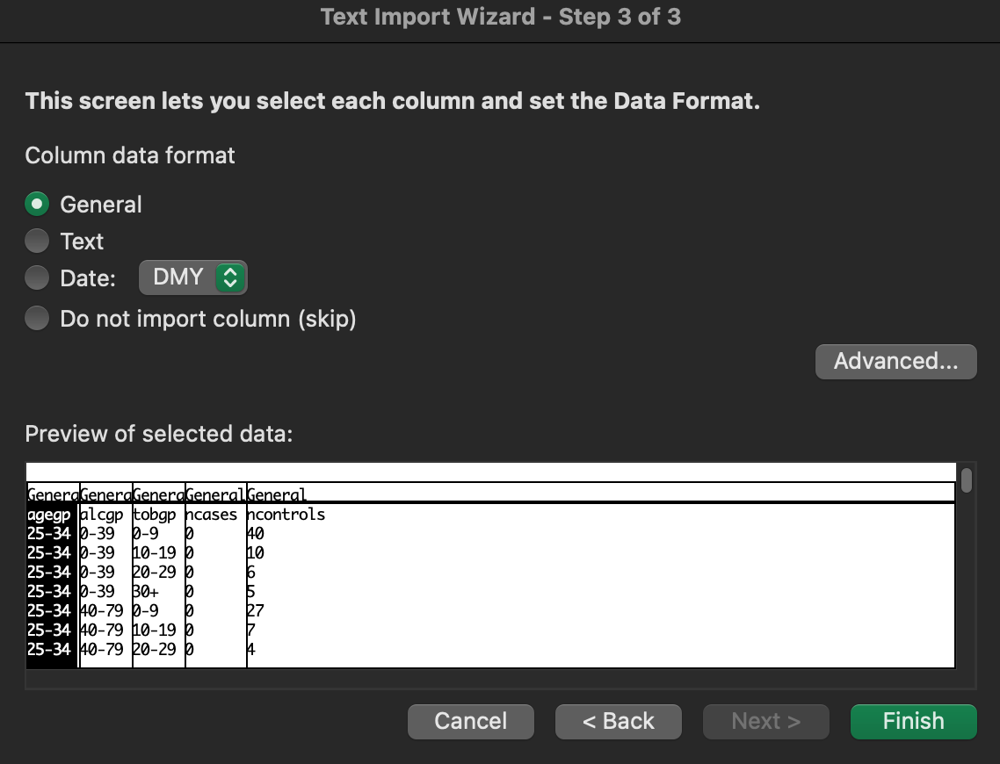
```

In the next wizard page, `Excel` allows you to select each column's data format. These formats are: `General`, `Text`, `Date`, and "skip column".

<div id="warning">
`Excel` does not allow you here to specify data formats or data types useful for statistical or data analysis.

In particular, it does not distinguish between categorical and numerical data. It does not allow you to specify whether numerical values should be counts (whole numbers) or "real" values (can take any decimal value).

**Importing data into `Excel` has very limited data validation.**
</div>

1. Click `Finish`

`Excel` now presents your data in spreadsheet format.

```{r excel-sheet, echo=FALSE, fig.caption="Excel has imported our data. But look closely."}
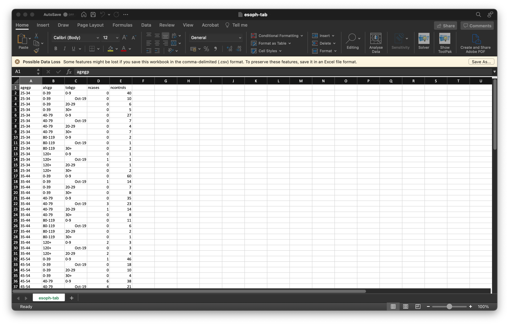
```

<div id="note">
Here, `Excel` again attempts to nudge us towards using one of the proprietary `Excel` formats by claiming that there is `**Possible Data Loss:** Some features might be lost if you save this workbook in the comma-delimited (.csv) format. To preserve these features, save it in Excel format.` 

**This is misleading.** Our data should "safe" so long as we keep it in plain text, open, non-proprietary formats.
</div>

<div id="questions">
1. Would it be better if `Excel` were able to distinguish header rows from data rows?
2. What kinds of data do we have in each column? (numerical or categorical? count or real-valued?)
3. Did `Excel` import our data correctly?
</div>

<div id="warning">
**`Excel` did not import our data correctly.**

`Excel` interpreted the range `10-19` as a date: October 19th. Our `tobgp` column now has a number of dates interspersed among the values. This is bad: `Excel` has changed our data without asking or notifying us that it would do so.
</div>

To avoid this problem, we must specify `Text` as the data format for our columns:

1. Close the spreadsheet.
2. Start `Excel`
3. Click on `Open`
4. Navigate to the location of `esoph-tab.tsv`, select it and click `Open`
5. Click on `Next >`
6. Click on `Next >`
7. Click on each column in turn and select `Text`

```{r excel-text-format, echo=FALSE, fig.caption="Be sure to select the `Text` data format for each column."}
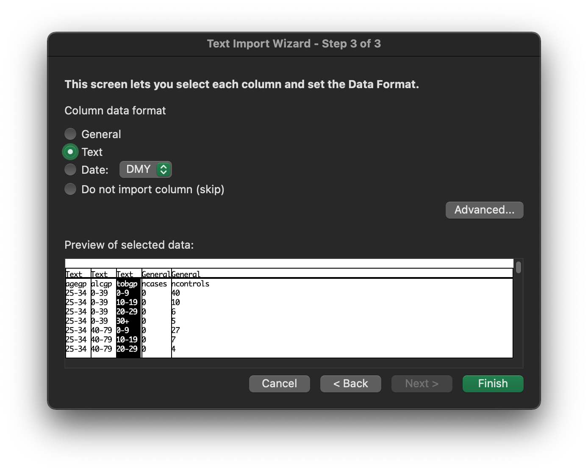
```

1. Click on `Finish`

```{r excel-reload-sheet, echo=FALSE, fig.caption="Excel has now imported our data correctly."}
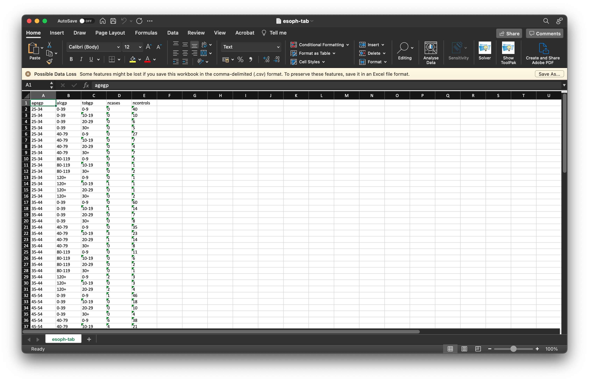
```

Excel has now imported our data, and it *looks* to be correct.

<div id="questions">
1. Did `Excel` import our data correctly?
</div>

## Summary Statistics

To obtain summary statistics for each column we need to use `Excel`'s *functions* and *pivot tables*, as we need to treat *categorical* data differently from *numerical* data. We want to know, for instance, the number of datapoints we have in each `agegp` category, rather than a "mean" of the categories (which has no real meaning); but for our cases and controls, we might still want to know means, standard deviations, etc.

<div id="warning">
In all cases, we are potentially modifying our cleaned dataset *directly* because we are making changes to the same file we loaded - **this would be bad practice**.

**Our first step should be to save a new spreadsheet to do our analysis in**
</div>

1. Save the current file as an `Excel` workbook (note: this is necessary to avoid losing `Excel`'s calculations and formatting)

```{r excel-save, echo=FALSE, fig.caption="Save the spreadsheet in `Excel` workbook format."}

```

### Summary statistics for quantitative/numerical data

We will calculate mean and standard deviation values for columns `ncases` and `ncontrols`. To do so, we need to use `Excel`'s `AVERAGE` and `STDEV.S` functions.

- The `ncases` values run from cell `D2` to cell `D89`
- The `ncontrols` values run from cell `E2` to cell `E89`

1. In cell `D90` enter the text `=AVERAGE(D2:D89)` and hit the return key. This will calculate the mean of quantitative data in the column of cells extending from `D2` to `D89`, and populate 

<div id="question">
1. Did `Excel` calculate the average value? If so, what is it?
</div>

<div id="warning">
**`Excel` did not calculate the mean value.**

When we selected `Text` as the input data format, `Excel` used this to do two things:

1. All numerical values are now understood as text, *not* as numbers^[In Excel, numbers are right-aligned, text is left-aligned. Each cell also has a green triangle in its upper left corner to indicate that it is a text value, not numerical].
2. All cells in both columns - *all the way to the bottom of the spreadsheet* - are interpreted as text, not numbers, formulas, or any other element.
</div>

<div id="note">
To rectify this problem, we need to change those two columns to `General` format:

1. Select all numerical data in columns `D` and `E` (`D2:E89`)
2. Click on the `warning` icon (a small yellow triangle with an exclamation mark)
3. Click on `Convert to Number`

```{r fix-numbers, echo=FALSE, fig.caption="Converting text to numbers in `Excel`."}
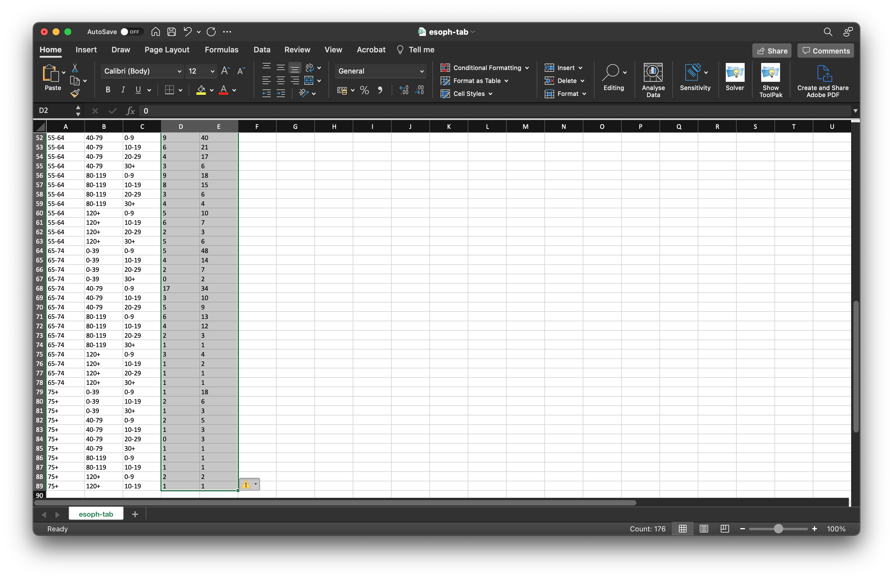
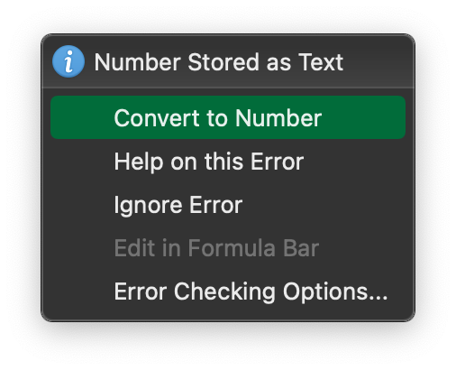
```
</div>

<div id="questions">
1. Does the formula now give a plausible mean value?
2. If you were new to this file, how could you tell that the formula gives a mean value, and not a standard deviation, or something else entirely?
</div>

1. As there is no visual indication in the file of what the number in cell `D90` represents, add a label to cell `C90` with the text `Mean:`.
2. Copy and paste the formula from cell `D90` into cell `E90`
3. Add the label `Std Dev:` to cell `C91`
4. Enter the formula `=STDEV(D2:D89)` into cell `D91`
5. Copy and past the formula from cell `D91` into cell `E91`

Now we have some summary information for our quantitative data.

```{r fix-quantsum, echo=FALSE, fig.caption="Spreadsheet with quantitative data summary."}
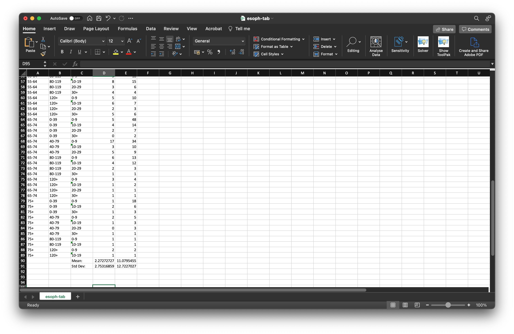
```

### Summary statistics for categorical data

It is often useful to know how many datapoints you have in each category. Here, we *could* independently sum each of the `ncases` or `ncontrols` cells, depending on which mixture of categorical variables we wanted (e.g. combine all cells for rows where `tobgp` is equal to `10-19`), but `Excel` provides a tool called a *pivot table* to make things easier for us.

For instance, suppose we wanted to know the numbers of cases and controls in each category of the `alcgp` column. We could insert a *pivot table* that combined all values from `ncases` and `ncontrols`, for each of the individual categories in `alcgp`. To do this:

1. Select all of your data (`A2:E89`)
2. Click `Insert` $\rightarrow$ `Pivot Table` $\rightarrow$ `OK`

```{r fig-pivot, echo=FALSE, fig.caption="Creating a pivot table."}
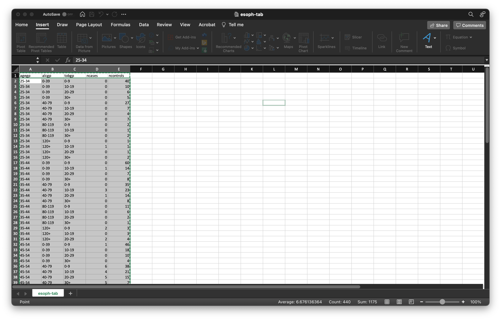
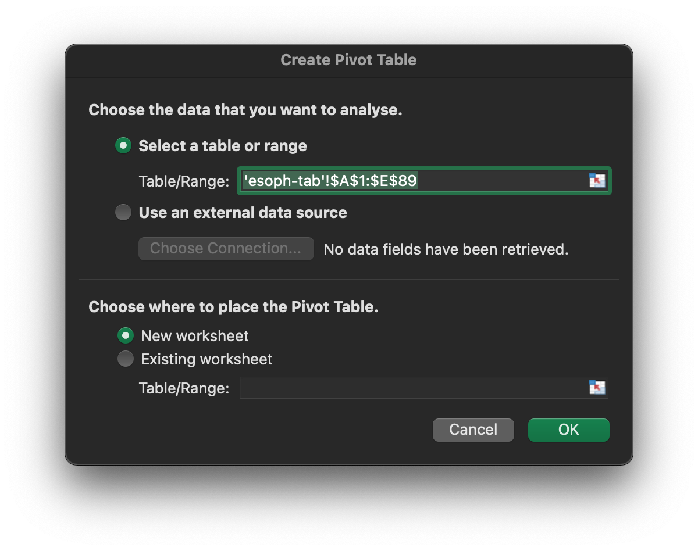
```

This brings up an interface that might at first look confusing. We are going to try to create a table that has one row per category in `alcgp`, and holds three columns:

- The `alcgp` category
- The *sum* of values in `ncases` for that category
- The *sum* of values in `ncontrols` for that category

To do so:

1. Click on the checkbox next to `alcgp` - this will place it in the `Rows` box, and you will see a view of the new pivot table
2. Click on the checkbox next to `ncases` - this will place it in the `Values` box as `Sum of ncases` and you will see the pivot table change
3. Click on the checkbox next to `ncontrols` - this will place it in the `Values` box as `Sum of ncontrols` and you will see the pivot table change 

```{r fig-pivot-table, echo=FALSE, fig.caption="Creating a pivot table."}
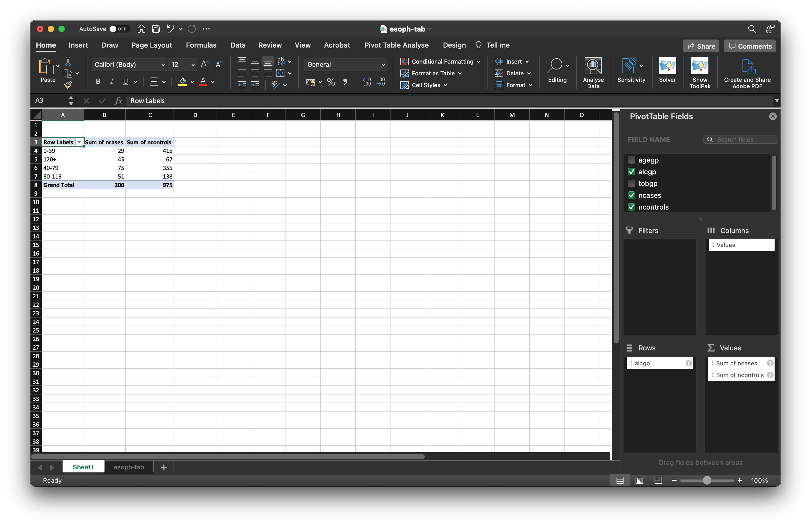
```

<div id="questions">
1. How many cases are there in total?
2. How many controls are there in the `120+` category
3. Why do you think the column of category names is not sorted in numerical order?
</div>

## Data visualiation

Suppose we want to compare the numbers of cases and controls for each of our `alcgp` categories, we can reasonably use a bar graph (though we should really use a 1D scatterplot). To do so:

1. Select the data in the pivot table (`A3:C7` in the figure)
2. Click on `Insert` $\rightarrow$ `Pivot Chart`

This will create a bar chart in the current worksheet, showing the number of controls and cases in each category of `alcgp`.

```{r fig-pivot-hart, echo=FALSE, fig.caption="Creating a pivot table."}
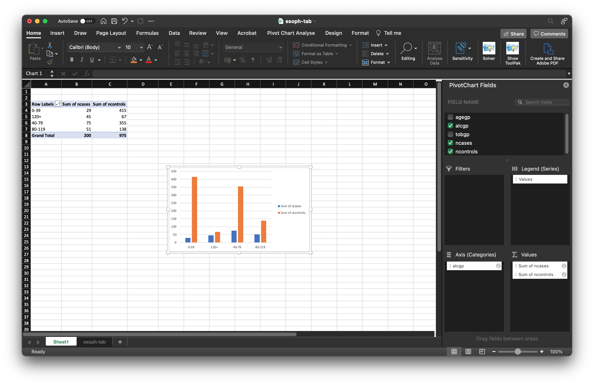
```

# `Minitab`

`Minitab` is a statistical software package, often used for teaching. It is moving towards a cloud-hosted model, but the `Minitab Express` package is still available for desktop use. This software requires a licence, which you will need to obtain from the university before you can run the tool.

<div id="warning">
Also, because of licensing restrictions, you must be connected to the university VPN so that the licensing server can be reached. Otherwise, you will not be able to use `Minitab`.
</div>

## Loading data

1. Start `Minitab Express`
2. Click on `File` $\rightarrow$ `Open Worksheet`
3. Navigate to the location of `esoph-tab.csv`, select it and click `Open`

<div id="warning">
`Minitab Express` will not import tab-separated value files.
</div>

`Minitab Express` presents your data in a panelled window. By default, the data is presented in spreadsheet form in the lower panel. The top panel will contain output, and the left panel will be a `Navigator`. This layout reflects `Minitab`'s role as a statistical analysis package, rather than a general spreadsheet tool.

```{r fig-minitab-load, echo=FALSE, fig.caption="Importing CSV into Minitab."}
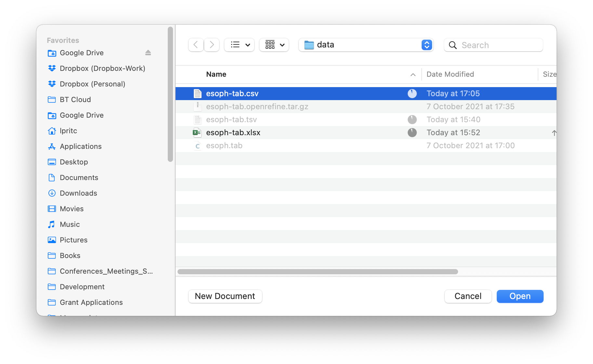
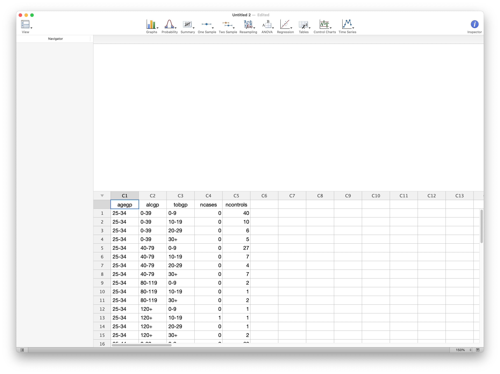
```

<div id="note">
`Minitab Express` did not ask any questions about data type or formats.
</div>

To see how `Minitab Express` imported your data:

1. Click on any column in the spreadsheet view
2. Click on the `Inspector` button (top right)

A new window appears. Click on the `Column` icon (third icon).

```{r fig-minitab-inspector, echo=FALSE, fig.caption="Minitab column inspector."}
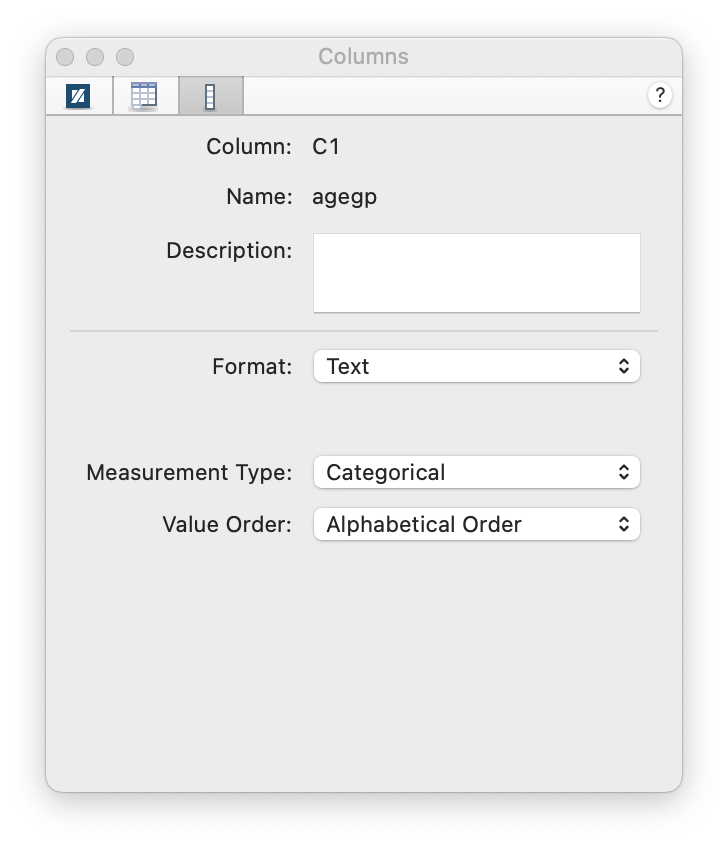
```

<div id="questions">
1. Has `Minitab Express` correctly distinguished between the header and data rows?
2. What data type or format does `Minitab Express` think each column is?
3. What kinds of data does `Minitab Express` "know about"?
4. Do you need to change any of the data values or formats?
5. How does this compare to loading data into `Excel`?
</div>

## Summary Statistics

As a statistical package, `Minitab Express` is written to make obtaining summary statistical data relatively straightforward. Here we will try to recover the same data as we did in `Excel`.

### Summary statistics for quantitative/numerical data

To obtain summary statistics for a single data column in `Minitab Express`:

1. Click on `Summary` $\rightarrow$ `Column Statistics`
2. Select `C4 ncases` and click on the arrow next to `Variable`
3. Click `OK`

`Minitab` then updates the spreadsheet with calculated values and presents some output in the top panel, describing what values were calculated, and which cells in the spreadsheet hold output values.

```{r fig-minitab-summary, echo=FALSE, fig.caption="Generating a single-column summary with Minitab."}
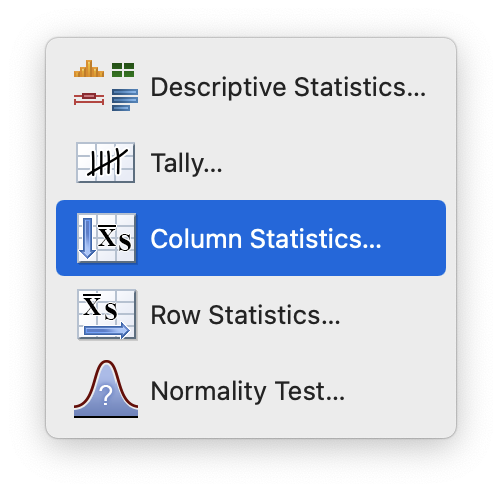
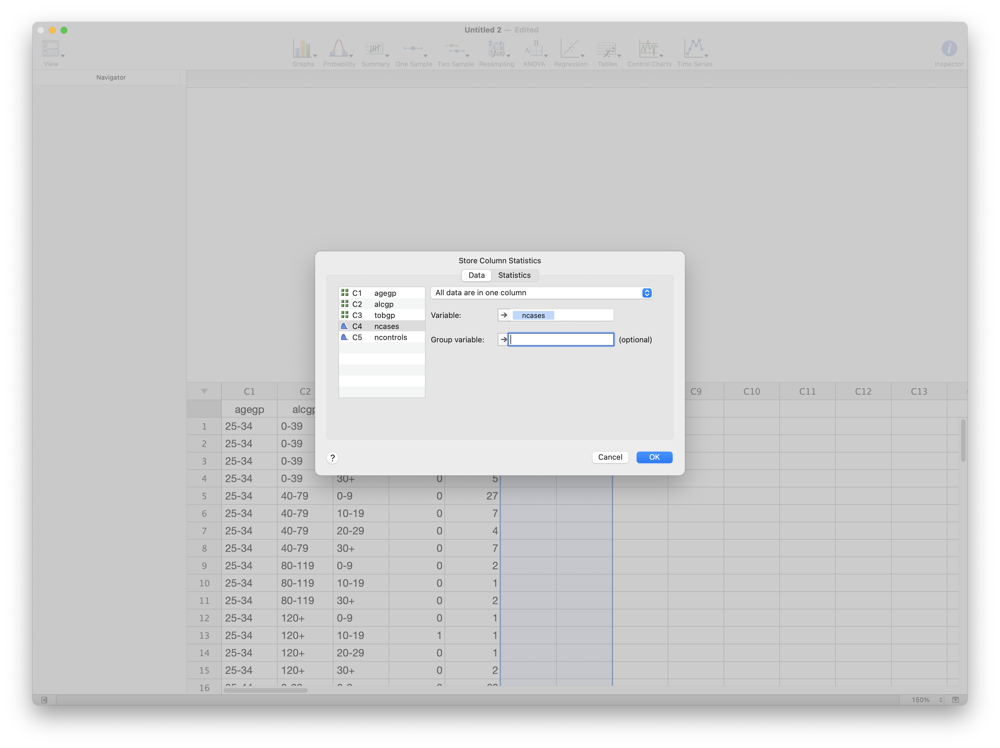
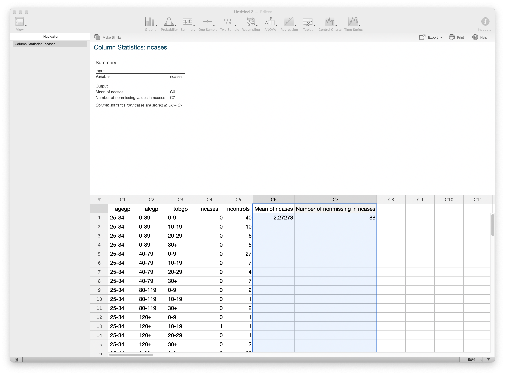
```

To generate a set of descriptive statistics for a data column:

1. Click on `Summary` $\rightarrow$ `Descriptive Statistics`
2. Select `C5 ncontrols` and click on the arrow next to `Variable`
3. Click `OK`

`Minitab` doesn't put these values in the spreadsheet, but it does show a nicely-formatted table with a number of descriptive statistics. You can switch between views on the data by clicking on previous steps in the `Navigator` (on the left, by default).

```{r fig-minitab-summary2, echo=FALSE, fig.caption="Generating a single-column summary with Minitab."}


```

<div id="questions">
1. Does `Minitab` give you the same information/values as `Excel` for this data?
2. Does `Minitab` give you any useful extra data?
</div>

### Summary statistics for qualitative data

We will again try to obtain case and control counts, conditioned on the `alcgp` category.