```{r setup, include=FALSE}
knitr::opts_chunk$set(echo = FALSE)
```

<div id="summary">
</div>

# Setup

To work through these examples, you will need the following on your own computer:

1. The datasets (see [this link](./workshop-visualisation.html) for a description)
2. `Minitab` (you have a licence for this *via* the university)

<div id="warning">
You will need to be either on campus, or connected to the university VPN, to use `Minitab` due to licensing restrictions.
</div>

<div id="note">
- [**Click here to download the `ToothGrowth` dataset**](https://raw.githubusercontent.com/sipbs-compbiol/BM432/2021/notebooks/data/toothgrowth.csv)
- [**Click here to download the `Prestige` dataset**](https://raw.githubusercontent.com/sipbs-compbiol/BM432/2021/notebooks/data/prestige.csv)
</div>

## Boxplot

Our goal is to show how the measured guinea pig tooth growth varies by combination of supplement and supplement dosage. We could approach this in any of several ways, but here we want to treat each supplement as a _category_ or _factor_, and each dosage as a _category_ or _factor_. We'd like to see the distribution of measured tooth lengths _conditioned_ on these explanatory variables.

What we're looking for is a visual representation of the variation in the dataset, for each combination of supplement and dosage. Normally, a 1D scatterplot is a good way to visualise the raw data, with a boxplot/box-and-whisker plot to represent summary statistics.

Click on `Open` $\rightarrow$ `Open Worksheet`, select the `toothgrowth.csv` data file, and click `Open`. This will open up the `ToothGrowth` dataset in `Minitab`.

```{r fig-create-project, echo=FALSE, fig.cap="Open the `ToothGrowth` dataset"}
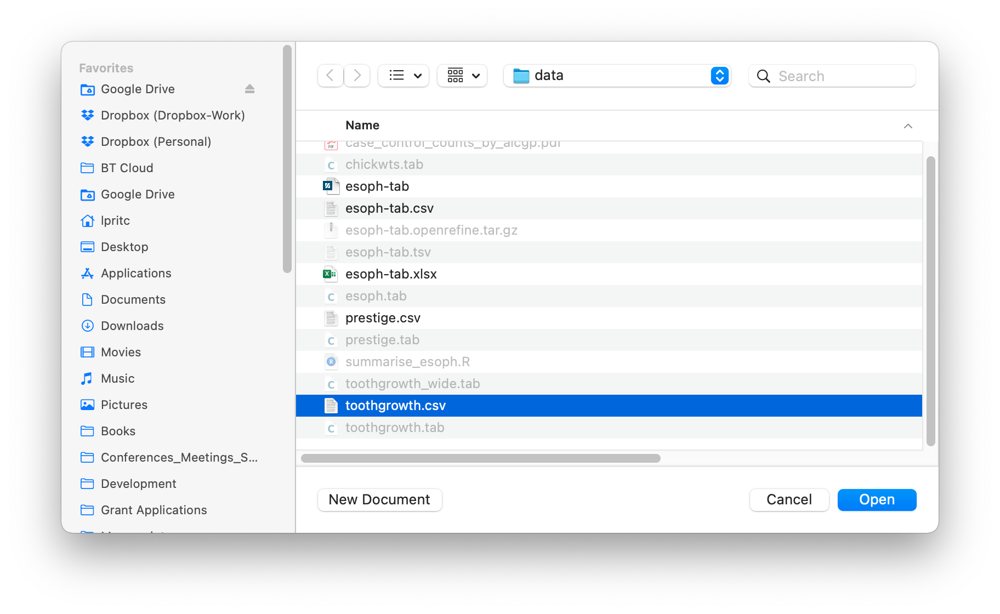
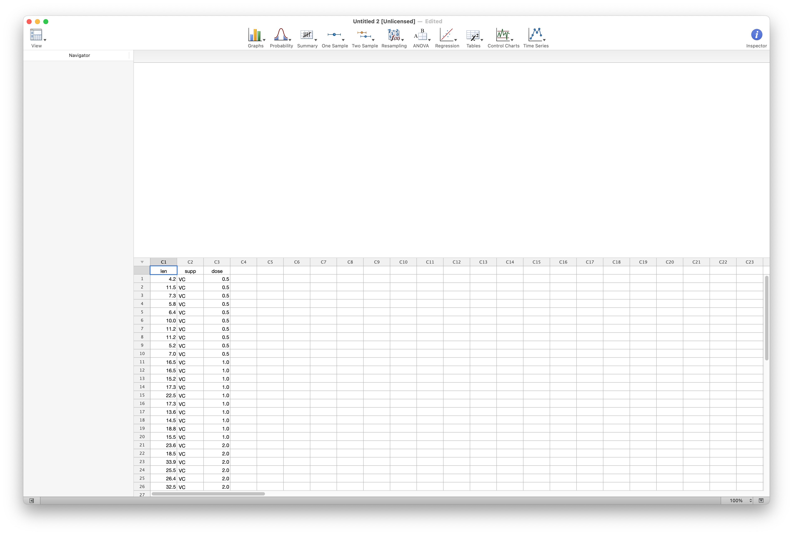
```

Click on `Graphs` $\rightarrow$ `Boxplot` $\rightarrow$ `Single Y Variable` $\rightarrow$ `With Groups`.

```{r fig-create-boxplot, echo=FALSE, fig.cap="Select graph type"}
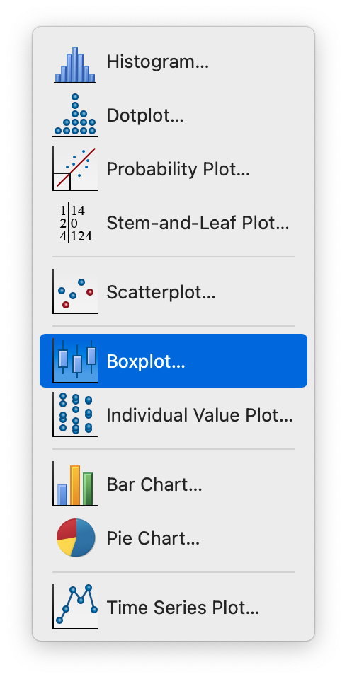
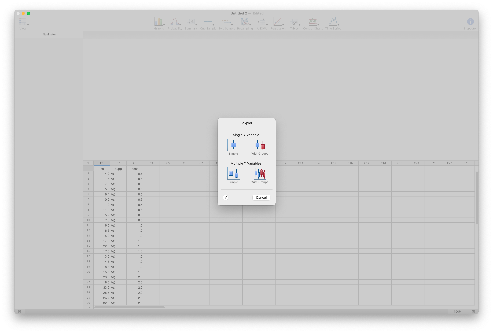
```

Then choose the appropriate $x$- (group) and $y$-variables. We want to see the $y$-variable (_dependent_ variable) `len`, conditioned on the groups: `VC` and `OJ` (`supp`) split by their dosage `dose`, and we select accordingly.

```{r fig-select-groups, echo=FALSE, fig.cap="Select boxplot groups"}
knitr::include_graphics("images/minitabvis-05-select_groups.png")
```

This gives us a similar plot to that we obtained with `Excel`, showing the same trends with dosage for both supplements, and the same outlier information.


```{r fig-boxplot, echo=FALSE, fig.cap="Create the boxplot"}
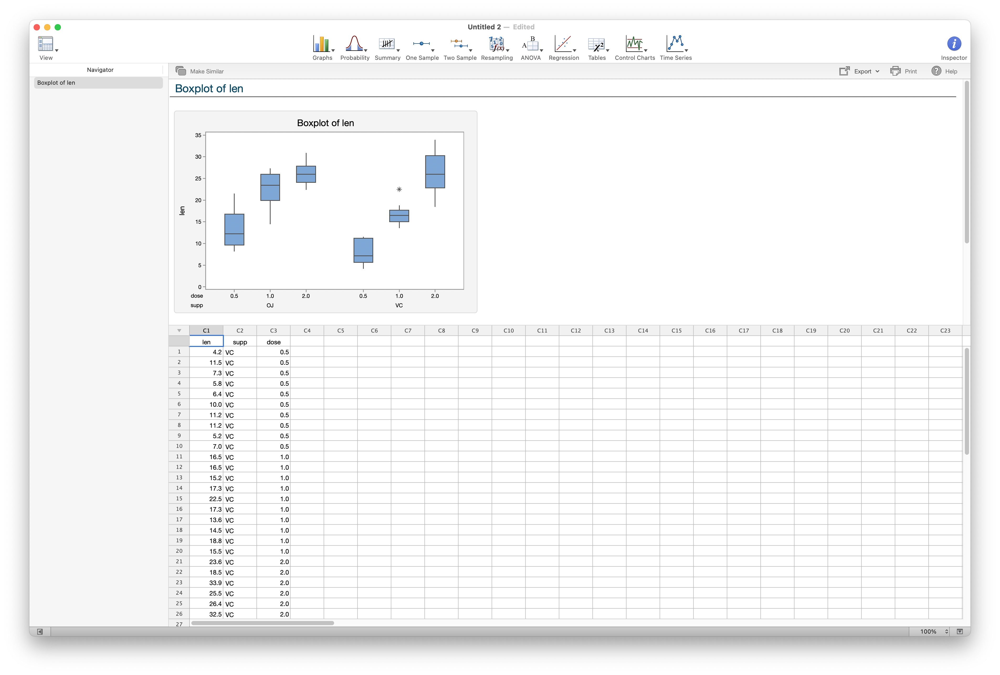
```

<div id="note">
- The `Minitab` plot labels the $x$- and $y$-axes clearly and correctly.
- The `Minitab` plot does not add distracting colour
- By default the `Minitab` plot does not show the mean for each group
</div>

There are relatively few options to improve the graph, visually, but we can retitle the plot by double-clicking on it, and there are options for adding a little more explanatory data.

```{r fig-modify, echo=FALSE, fig.cap="Annotate and retitle the boxplot"}
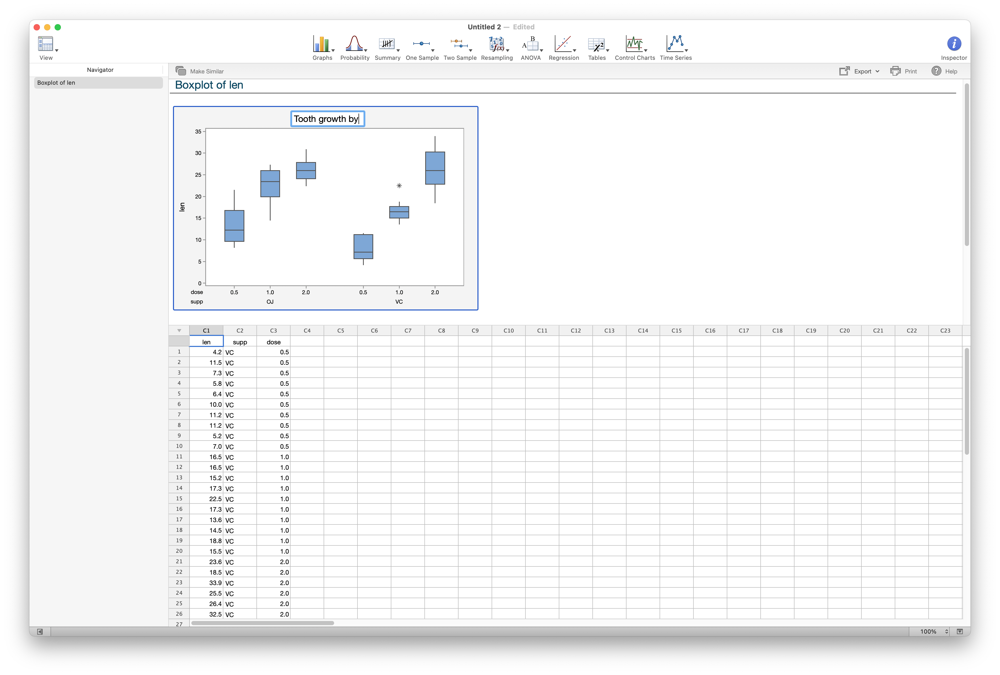
knitr::include_graphics("images/minitabvis-08-additions.png")
```

## Linear regression

The `Prestige` dataset described in the [introduction notebook](./workshop-visualisation.html) represents a set of occupations - one per row (observations) - with variables describing properties of each occupation, such as percentage of women, the "prestige" of the occupation, and the average number of years in education of a person in that occupation.

Using `Minitab` we will model the relationship between prestige and years in education, using a linear relationship. We'd like to overlay a line describing the relationship, with some statistical information about goodness of fit and the inferred parameters of the model (_gradient_ and _intercept_).

Click on `Open` $\rightarrow$ `Open Worksheet`, select the `prestige.csv` data file, and click `Open`. This will open up the `Prestige` dataset in `Minitab`.

```{r fig-create-prestige, echo=FALSE, fig.cap="Open the `Prestige` dataset"}
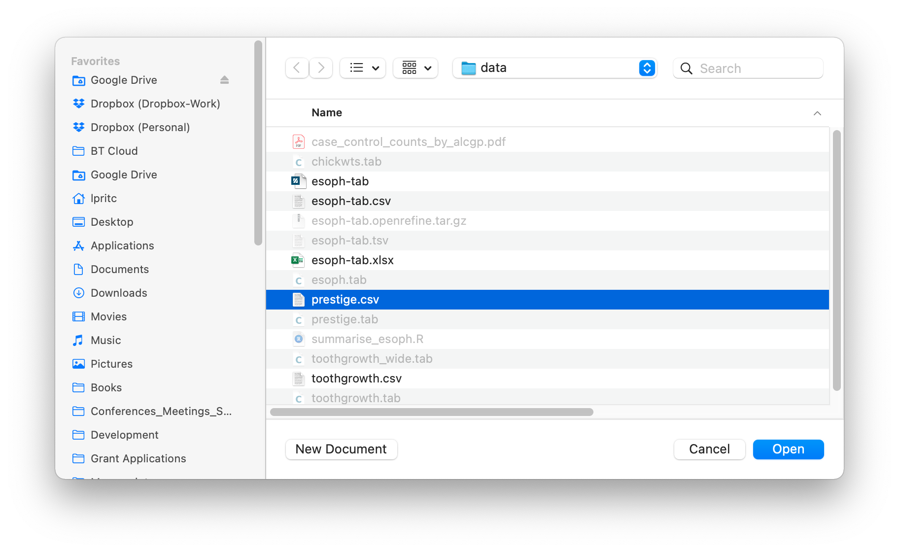
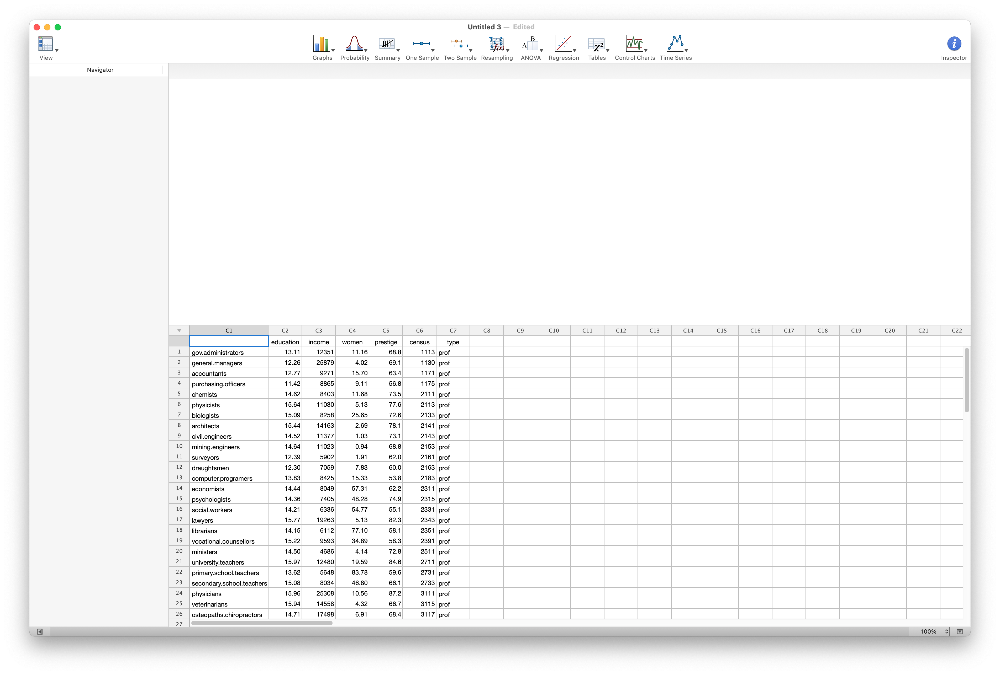
```

Click on `Regression` $\rightarrow$ `Simple Regression...` $\rightarrow$ `Single Y Variable` $\rightarrow$ `With Groups`, and choose the appropriate variables. We want to regress the _response_ variable `prestige` against the _predictor_ `education`

```{r fig-regress-variables, echo=FALSE, fig.cap="Select regression type"}
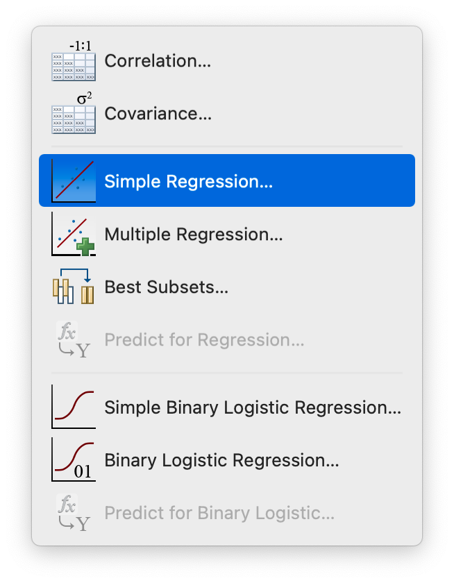
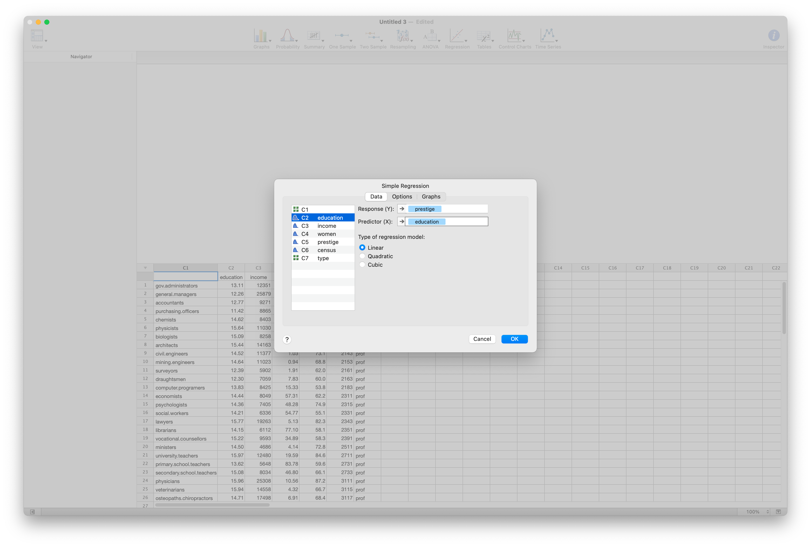
```

We also want to get the extra statistical information about confidence intervals and diagnostic plots that we saw in `Excel`. To do so, select the appropriate options in the `Options` and `Graphs` tabs, then click `OK`

```{r fig-regress-options, echo=FALSE, fig.cap="Select regression type"}
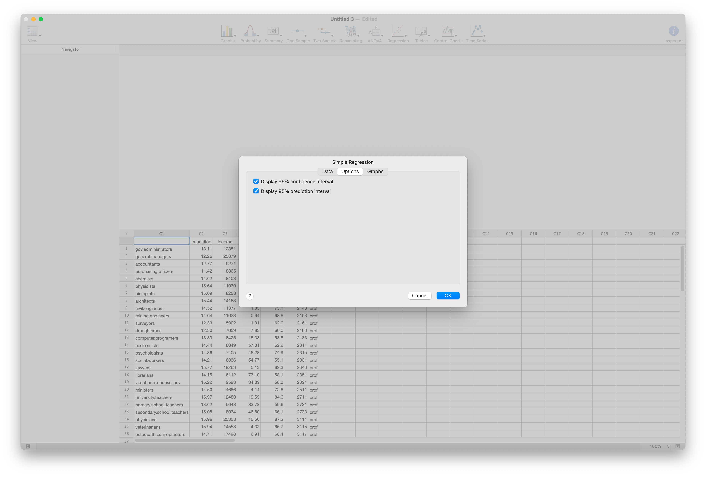
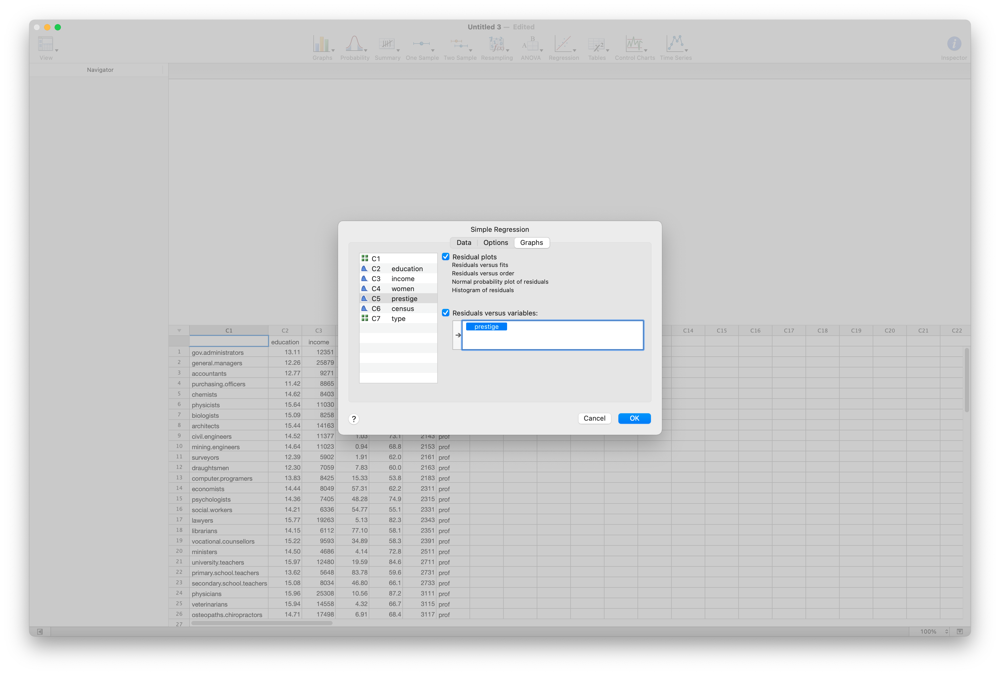
```

<div id="note">
`Minitab`, unlike `Excel`, makes it easy to do _multiple regression_. This enables simultaneous regression of a response variable onto multiple potential explanatory variables, taking into account the combined influence of the explanatory variables. The topic is beyond the scope of this workshop, but this dataset is well-suited to that kind of analysis.
</div>

Clicking `OK` presents an analysis of variance and other useful information about the regression result. Scrolling down in the top panel will show the regression plot and diagnostic plots. There are few visual elements that can be modified.

```{r fig-regress-output, echo=FALSE, fig.cap="Select boxplot groups"}
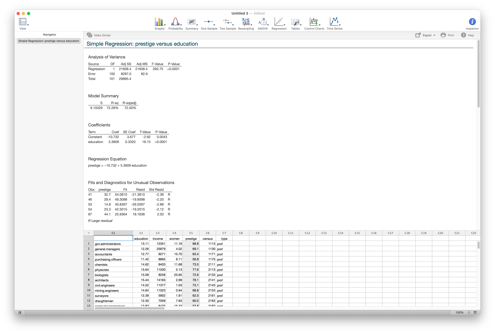
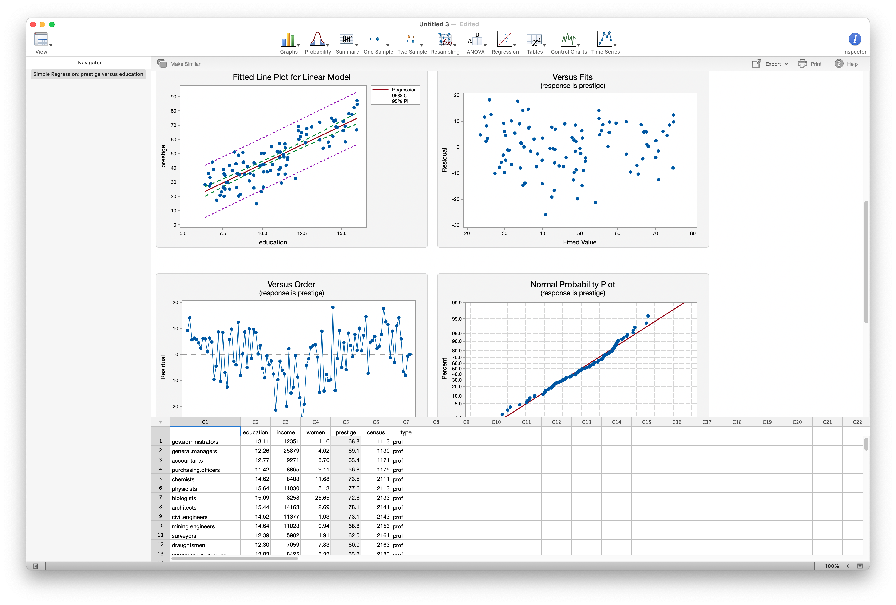
```

<div id="note">
`Minitab` and `Excel` present different summaries and diagnostic information.

- `Excel` will present confidence intervals for fitted parameters, if asked; `Minitab` does not (however, these can be calculated from the information provided)
- `Minitab` provides both a confidence interval for the fit (`95% CI`) and a probability interval for new values (`95% PI`) on the main regression graph.
- `Minitab` provides more diagnostic plots
- `Minitab` indicates potentially problematic datapoints, `Excel` does not
</div>