```{r setup, include=FALSE}
knitr::opts_chunk$set(echo = FALSE)
```

<div id="summary">
- `R` has many options for data visualisation, but for this workshop we will use only _base graphics_ and `ggplot2`
  - base graphics are quick and powerful
  - `ggplot2` graphics are extremely powerful and produce attractive professional graphics, but can take some getting used to
</div>

# Setup

To work through these examples, you will need the following on your own computer:

1. The datasets (see [this link](./workshop-visualisation.html) for a description)
2. `R` and `RStudio`

<div id="note">
- [**Click here to download the `ToothGrowth` dataset**](https://raw.githubusercontent.com/sipbs-compbiol/BM432/2021/notebooks/data/toothgrowth.tab)
- [**Click here to download the `Prestige` dataset**](https://raw.githubusercontent.com/sipbs-compbiol/BM432/2021/notebooks/data/prestige.tab)
</div>

## Boxplot and 1D scatterplot

Our goal is to show how the measured guinea pig tooth growth varies by combination of supplement and supplement dosage. We could approach this in any of several ways, but here we want to treat each supplement as a _category_ or _factor_, and each dosage as a _category_ or _factor_. We'd like to see the distribution of measured tooth lengths _conditioned_ on these explanatory variables.

What we're looking for is a visual representation of the variation in the dataset, for each combination of supplement and dosage. A 1D scatterplot is a good way to visualise the raw data, and a boxplot/box-and-whisker plot is a good way to represent summary statistics.

To work in a reproducible and replicable way, we will create a script to manage our data visualisation.

Start a new `RStudio` session, and use the `Files` panel to navigate to the location of the data for this workshop.

```{r fig-new-session, echo=FALSE, fig.cap="Create a new `R` session"}
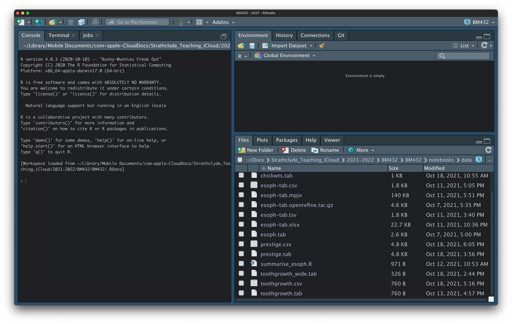
```

Click on `More` and select `Set As Working Directory`. A command will be executed in the console window, to set the working directory.

```{r fig-setwd, echo=FALSE, fig.cap="Set working directory"}
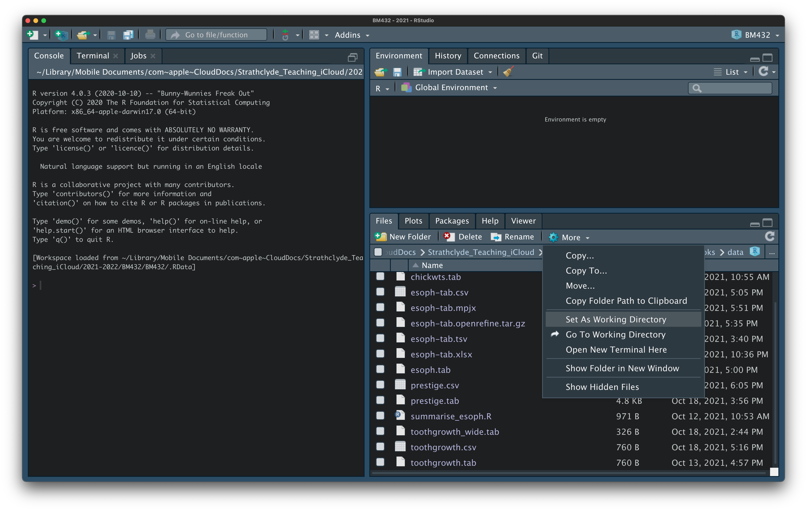
```

Create a new `R` script by clicking on `File` $\rightarrow$ `New File` $\rightarrow$ `R Script`. This will open a new, empty `R` script in the upper left panel.

```{r fig-new-script, echo=FALSE, fig.cap="Create a new `R` script"}
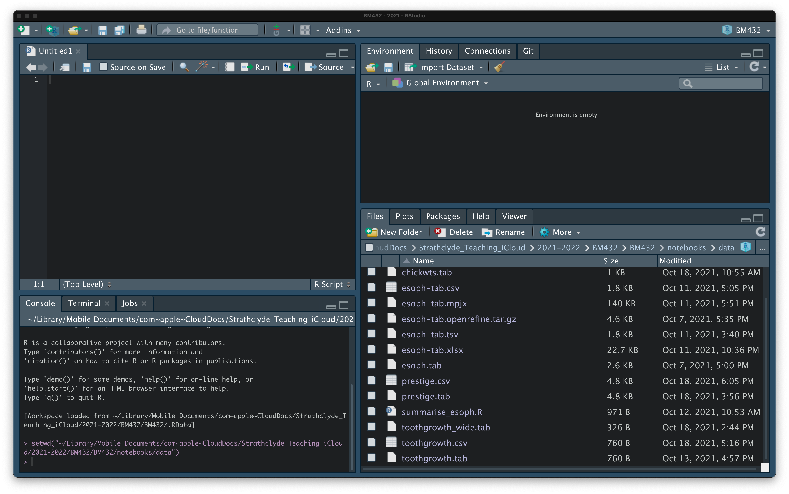
```

Enter the following comment and code into the `R` script. Save the script with a suitable name (e.g. `boxplot.R`), and select the code and click `Run` to load the `ToothGrowth` dataset into a _variable_ called `toothgrowth`.

```r
# Load the ToothGrowth dataset
# There are three columns:
#  - len: length of tooth (cm)
#  - supp: supplement (VC or OJ)
#  - dose: supplement dosage (mg/day)
toothgrowth = read.table("toothgrowth.tab",
                         header=TRUE,
                         sep="\t",
                         stringsAsFactors=TRUE)
```

<details>
  <summary>Click to toggle explanation of the `R` command</summary>
  
- `read.table()` is a function that reads data in from a file, in tabular format. The first argument to the function is the name of the input file
- `header=TRUE` tells the function to read the first line of the file as a header
- `sep="\t"` tells the function to interpret the tab character as a column separator
- `stringsAsFactors=TRUE` tells the function to read data that is a "string" as a qualitative data category
</details>

```{r fig-loaded, echo=FALSE, fig.cap="View of loaded `ToothGrowth` data"}
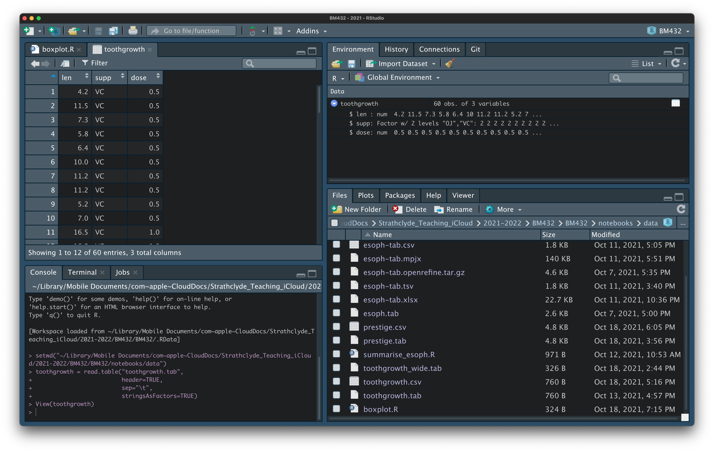
```

### Boxplot: base graphics

`R` has built-in graphics capability called _base graphics_. These are available as functions in `R` without the need to load any other libraries. Although they are powerful and quick, they don't always give the most attractive results.

To use `R`'s base graphics for generation of a boxplot, enter the following comment and code into the `R` script and run it.

```r
# Use R base graphics to produce a boxplot
boxplot(len ~ supp + dose,
        data=toothgrowth,
        xlab="Supplement and dosage",
        ylab="Tooth length",
        main="Tooth length by supplement and dosage")
```

<details>
  <summary>Click to toggle explanation of the `R` command</summary>
  
- `boxplot()` is a function that creates a boxplot
- `len ~ supp + dose` tells the function which data to plot on the $y$- and $x$-axes. Read this as `<YDATA> ~ <XDATA1> + <XDATA2>`; using this expression tells `R` to group the length data by both supplement and dose
- `data=toothgrowth` tells the function that `len`, `supp` and `dose` come from the `toothgrowth` dataframe
- `xlab=` and `ylab=` tell the function what to write as $x$- and $y$-axis labels
- `main=` tells the function what the title of the graph should be
</details>

```{r fig-basebox, echo=FALSE, fig.cap="Base graphics boxplot"}
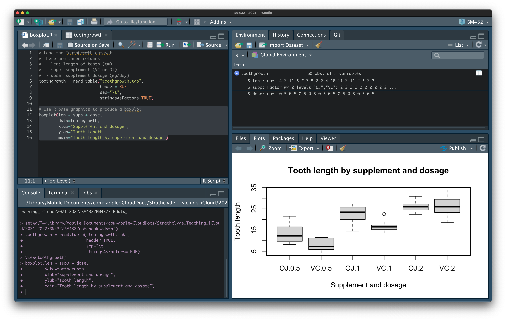
```

<div id="note">
The combinations of supplement and dosage are out of order in the boxplot. This can be fixed, but takes a little effort.
</div>

### 1D scatterplot: base graphics

`R`'s base graphics have a `stripchart()` function, which works in a similar way to `boxplot()` for producing 1D scatterplots. To see it in action, add the code below to your script and run it.

```r
# Use R base graphics to produce a stripchart/1D scatterplot
stripchart(len ~ supp + dose,
        data=toothgrowth,
        method="jitter",
        pch=19,
        frame=FALSE,
        vertical=TRUE,
        xlab="Supplement and dosage",
        ylab="Tooth length",
        main="Tooth length by supplement and dosage")
```

<div id="note">
We only needed to swap the `stripchart()` function call for the `boxplot()` function to get a workable graph. The other options rotate the graph and improve its appearance.
</div>

<details>
  <summary>Click to toggle explanation of the `R` command</summary>

The features here that differ from the boxplot are:

- `stripchart()` is a function that creates a stripchart/1D scatterplot
- `method="jitter"` moves datapoints left and right a bit, so they don't overlap
- `pch=19` changes the symbol for datapoints to be filled circles
- `frame=FALSE` turns off the axis frame
- `vertical=TRUE` plots the tooth lengths vertically, instead of horizontally
</details>

```{r fig-stripchart, echo=FALSE, fig.cap="Base graphics stripchart/1D scatterplot"}
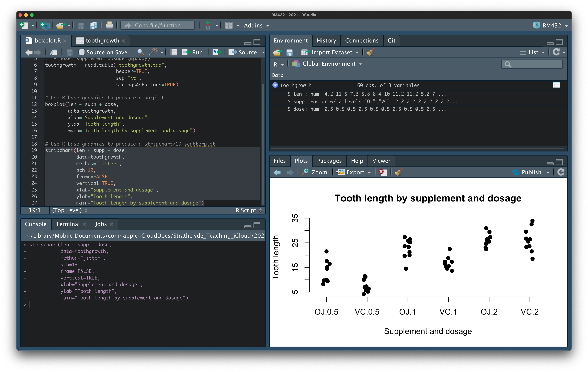
```

<div id="note">
The combinations of supplement and dosage are out of order in the stripchart, too. This can again be fixed, but takes a little effort.
</div>


### Boxplot and 1D scatterplot: ggplot2 graphics

The `ggplot2` library provides functions for generating high-quality, publication-ready figures using the _Grammar of Graphics_. The syntax for creating graphs takes a bit of time to learn, but the results are worth it.

To use a `ggplot2` approach here, combining both a boxplot and 1D scatterplot, add the code below to your script, and run it.

```r
# Use ggplot2 to overlay a stripchart on a boxplot
# First, import the ggplot2 library
library(ggplot2)

# Ensure that dosage is recorded as a category/factor
toothgrowth$dose = as.factor(toothgrowth$dose)

# Plot the graph
ggplot(toothgrowth,
       aes(x=dose, y=len, fill=supp)) +
  geom_boxplot() +
  geom_jitter(position=position_jitterdodge())
```

<details>
  <summary>Click to toggle explanation of the `R` commands</summary>

- `library(ggplot2)` loads the `ggplot2` library, so we can use it

- `as.factor(toothgrowth$dose)` converts the numeric values in the `dose` column of the dataset into categories, so we can use them to group the datasets in `ggplot2` (otherwise, `ggplot2` thinks they're continuous values)

- `ggplot()` is a function that sets up the data for our plot; the first argument is the dataset we're using
- `aes(x=dose, y=len, fill=supp)` tells `ggplot()` that we want to use the `dose` data on the $x$-axis, the `len` data on the $y$ axis, and to colour (fill) the boxes by the category data in the `supp` column
- `geom_boxplot()` draws a boxplot
- `geom_jitter()` draws jittered datapoints
  - `position=position_jitterdodge()` tells `geom_jitter()` to align the points with the boxes
</details>

```{r fig-ggbox, echo=FALSE, fig.cap="`ggplot2` stripchart/1D scatterplot"}
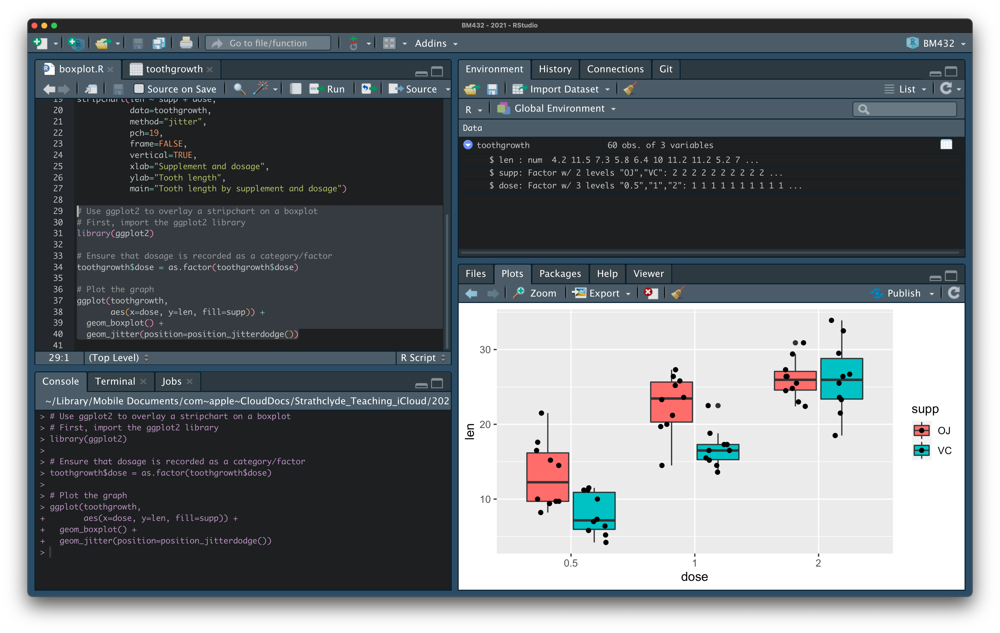
```

This way of producing a graph is fast, economical, and powerful. We have accomplished in four lines of code something that we couldn't even achieve in `Excel` or `Minitab`. It also allows us to experiment by making minor changes to the code to modify the visualisation. For instance, we could add a line to the code to change the category colours:

```r
ggplot(toothgrowth,
       aes(x=dose, y=len, fill=supp)) +
  geom_boxplot() +
  geom_jitter(position=position_jitterdodge()) +
  scale_fill_manual(values=c("#999999", "#E69F00"))
```

<details>
  <summary>Click to toggle explanation of the `R` command</summary>

The feature here that differs from the plot above is:

- `scale_fill_manual()` is a function that defines a colour scale
  - here we pass two values for our two categories `OJ` and `VC`: one is grey, and the other yellow.
</details>

```{r fig-ggbox2, echo=FALSE, fig.cap="Recolouring the `ggplot` output"}
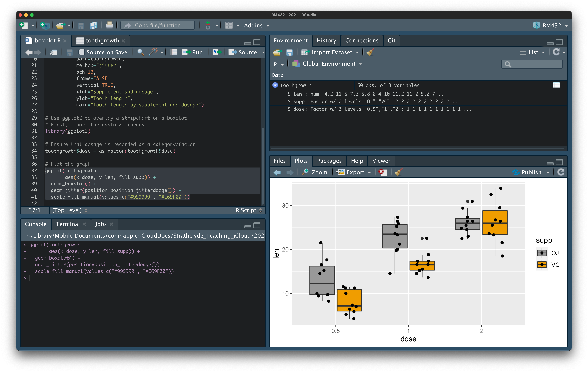
```

## Linear regression

The `Prestige` dataset described in the [introduction notebook](./workshop-visualisation.html) represents a set of occupations - one per row (observations) - with variables describing properties of each occupation, such as percentage of women, the "prestige" of the occupation, and the average number of years in education of a person in that occupation.

In `R` (like `Minitab`) we can model the relationship between prestige and years in education, using a linear relationship, without plotting it - and we can use graphical tools to overlay a regression curve within a plot, that describes the relationship, with some statistical information about goodness of fit and the inferred parameters of the model (_gradient_ and _intercept_).

Create a new `R` script by clicking on `File` $\rightarrow$ `New File` $\rightarrow$ `R Script`. This will open a new, empty `R` script in the upper left panel.

```{r fig-new-script-fit, echo=FALSE, fig.cap="Create a new `R` script"}

```

Enter the following comment and code into the `R` script. Save the script with a suitable name (e.g. `linreg.R`), and select the code and click `Run` to load the `Prestige` dataset into a _variable_ called `prestige`.

```r
# Load the Prestige dataset
prestige = read.table("prestige.tab",
                         header=TRUE,
                         sep="\t",
                         stringsAsFactors=TRUE)
```

<details>
  <summary>Click to toggle explanation of the `R` command</summary>
  
- `read.table()` is a function that reads data in from a file, in tabular format. The first argument to the function is the name of the input file
- `header=TRUE` tells the function to read the first line of the file as a header
- `sep="\t"` tells the function to interpret the tab character as a column separator
- `stringsAsFactors=TRUE` tells the function to read data that is a "string" as a qualitative data category
</details>

```{r fig-loaded-linreg, echo=FALSE, fig.cap="View of loaded `Prestige` data"}
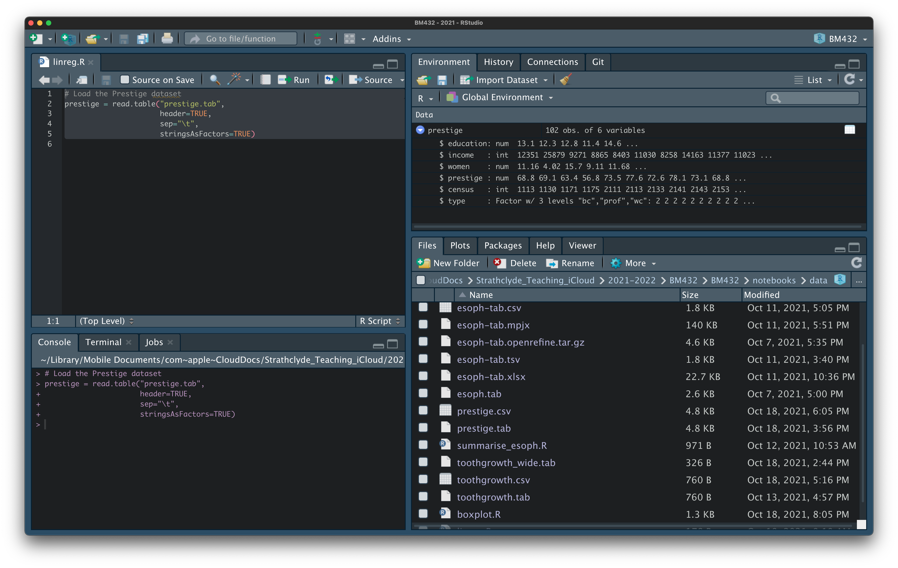
```

### Linear regression: base graphics

The first step in the analysis to conduct the linear regression. To do this in `R`, use the function `lm()` to regress the `prestige` variable onto the `education` variable with the code below:

```r
# Carry out linear regression on the dataset, with prestige as
# the dependent variable, and education as the explanatory
# variable
model = lm(prestige ~ education, data=prestige)
```

<details>
  <summary>Click to toggle explanation of the `R` command</summary>
  
- The `lm()` function carries out a linear regression
- `prestige ~ education` tells the function to use `education` as the explanatory variable, and `prestige` as the dependent variable
- `data=prestige` tells the function to use the dataframe `prestige` as the source for the `education` and `prestige` columns in the regression
</details>

This appears to run silently, but in the upper right panel you will see a new variable called `model` has been populated. This contains the output of the linear regression, including the _intercept_ and _gradient_ (the `coefficients`), and diagnostic information.

```{r fig-model, echo=FALSE, fig.cap="The linear regression model is fitted"}
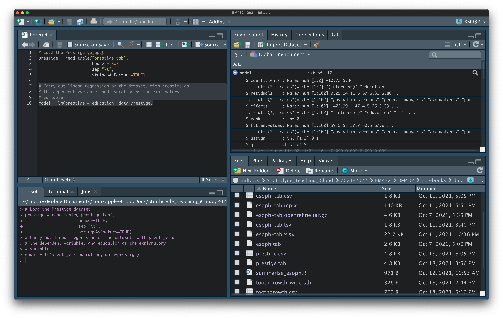
```

The diagnostic information about the regression can be plotted using `R`'s base `plot()` function. To use it enter the following code in your script and run it.

```r
# Show diagnostic graphics for the regression model
plot(model)
```

This will ask you to hit the `<Return>` key to list through diagnostic plots in the lower right panel. 

```{r fig-diag1, echo=FALSE, fig.cap="Regression diagnostics"}
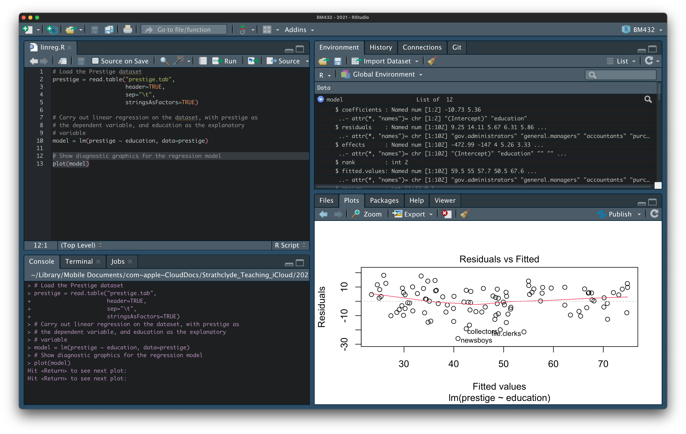
```

This is inconvenient, so we can modify our code in-place to put all four graphs together, as follows:

```r
# Show diagnostic graphics for the regression model
par(mfrow=c(2,2))
plot(model)
par(mfrow=c(1,1))
```

Running this code now gives all four diagnostic plots together.

```{r fig-diag2, echo=FALSE, fig.cap="Regression diagnostics"}
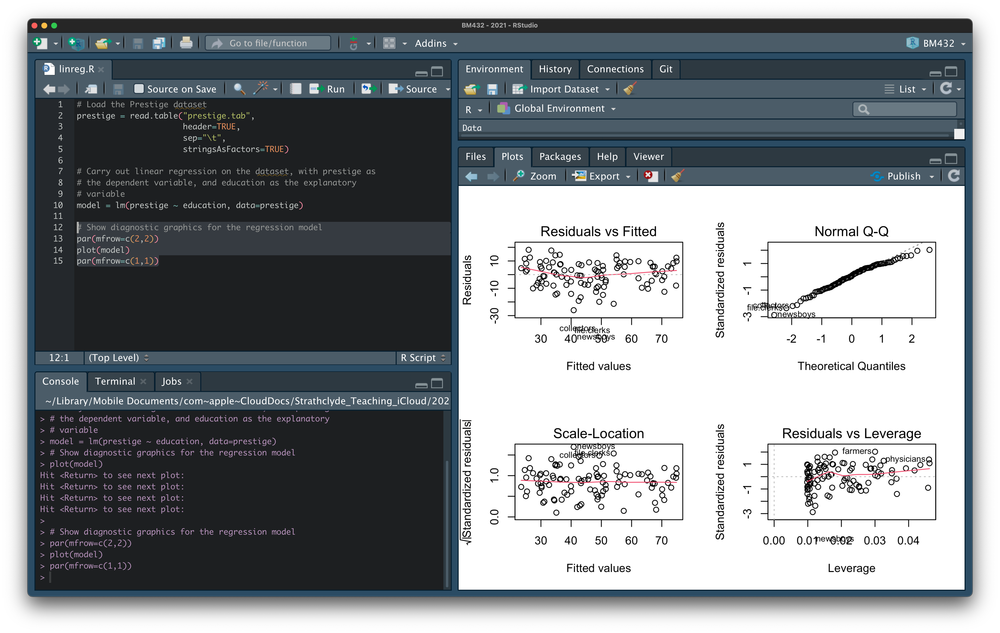
```

<div id="note">
It may seem odd to you that, when we `plot()` the linear regression output we don't see the overlaid regression curve. This reflect's `R`'s usage as a statistical programming tool. In reality, we tend to fit much more complex models than simple linear regression, and overlaying the fitted curve onto data isn't generally as informative or interpretable about the quality of the model fit as these diagnostic plots.
</div>

To plot the fitted regression curve over the data using base graphics, we can use the code below:

```r
# Plot fitted regression curve on the data
plot(prestige ~ education, data=prestige)
lines(sort(prestige$education),
      fitted(model)[order(prestige$education)],
      col="red")
```

```{r fig-fit-base, echo=FALSE, fig.cap="Fitted regression curve in base graphics"}
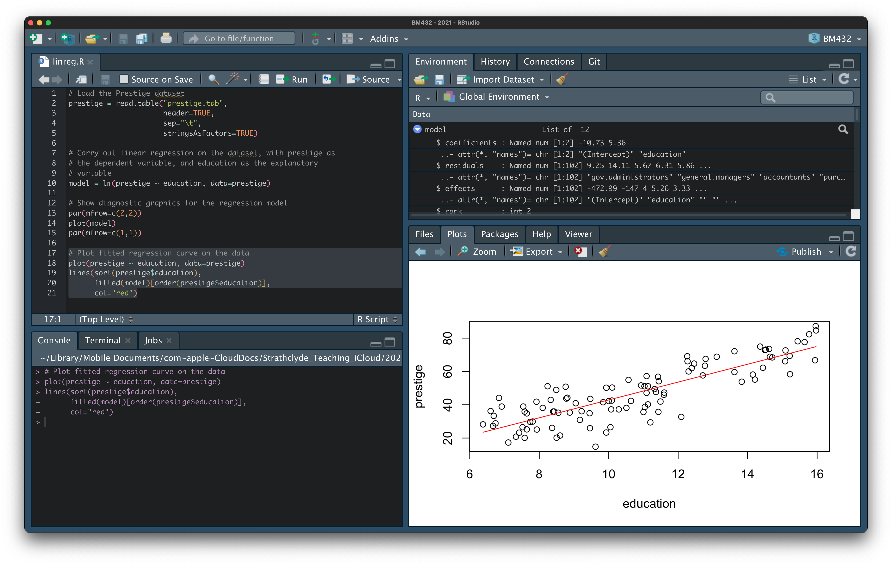
```

So far, we have not seen an explicit numerical representation of the fitted model parameters: _intercept_ and _gradient_. They are present, in the summary of the `model` variable in the top right panel (the values are `-10.73` and `5.36` as we found with `Excel` and `Minitab`). We can access them directly using the console (lower left panel): type the command below, and hit the `<Return>` key:

```r
model
```

```{r fig-fit-params, echo=FALSE, fig.cap="Retrieve model parameters"}
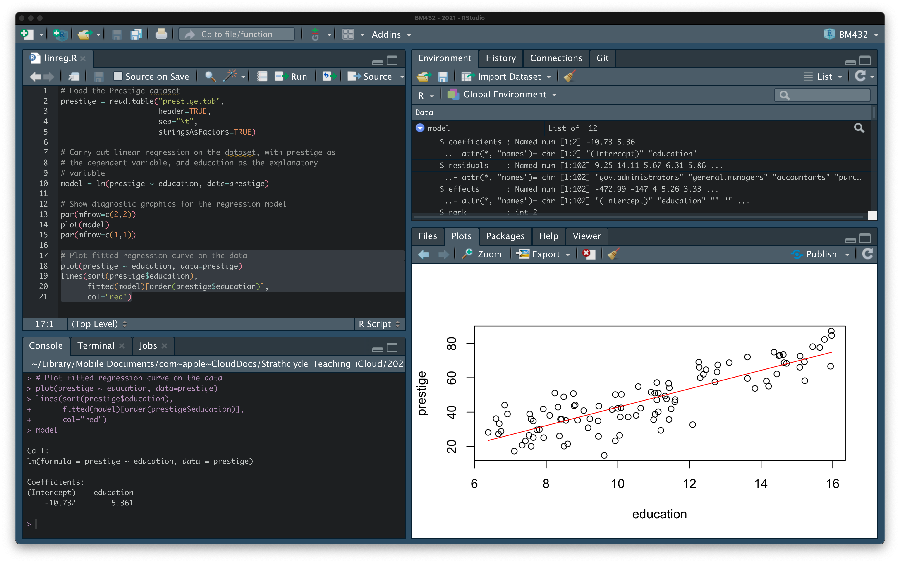
```

This returns the information:

```r
Call:
lm(formula = prestige ~ education, data = prestige)

Coefficients:
(Intercept)    education  
    -10.732        5.361  
```

Reminding us of the nature of the model (`prestige ~ education`) and giving us the fitted parameter values.

<div id="note">
Here `R` calls the intercept `(Intercept)` but does not refer to a _gradient_. Instead, it associates the _gradient_ value with the `education` variable. This reinforces the meaning that each unit (year) increase in the `education` variable is associated with a predicted 5.361 increase in `prestige` score.
</div>

Alternatively, enter the following `R` code in the console and hit `<Return>`:

```r
summary(model)
```

```{r fig-fit-summary, echo=FALSE, fig.cap="Retrieve model summary"}
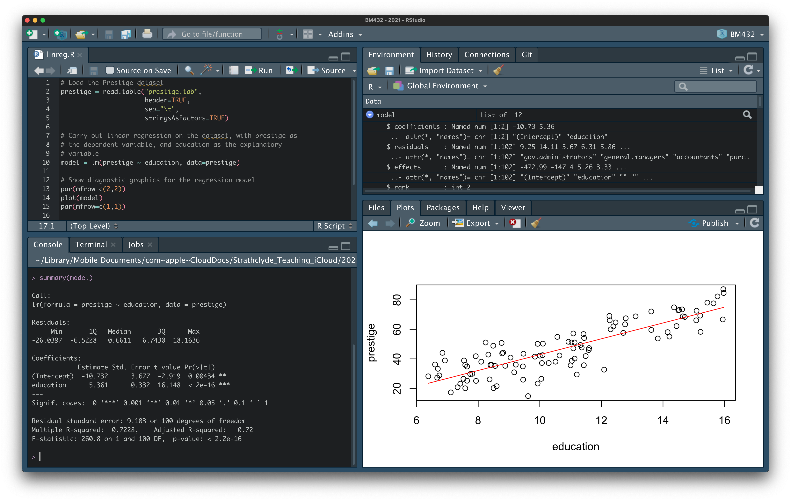
```

This gives us more information about the model fit:

```r
Call:
lm(formula = prestige ~ education, data = prestige)

Residuals:
     Min       1Q   Median       3Q      Max 
-26.0397  -6.5228   0.6611   6.7430  18.1636 

Coefficients:
            Estimate Std. Error t value Pr(>|t|)    
(Intercept)  -10.732      3.677  -2.919  0.00434 ** 
education      5.361      0.332  16.148  < 2e-16 ***
---
Signif. codes:  0 ‘***’ 0.001 ‘**’ 0.01 ‘*’ 0.05 ‘.’ 0.1 ‘ ’ 1

Residual standard error: 9.103 on 100 degrees of freedom
Multiple R-squared:  0.7228,	Adjusted R-squared:   0.72 
F-statistic: 260.8 on 1 and 100 DF,  p-value: < 2.2e-16
```

Again, it reminds us of the model formula (`prestige ~ education`), but gives us some more information, including the parameter estimates (again `-10.732`, and `5.361`) but also the $r^2$ value (`0.7228`, as before), and some other measures of significance.

<div id="warning">
The probability estimates in the ANOVA table (here the values `0.00434 **` and `< 2e-16 ***`) are estimates of the probability that the true value of the parameter is zero.

It is possible that you may have a different _null hypothesis_ in mind. For instance, that the intercept is equal to -10, or that the gradient has the value 10. You would need to perform a different statistical test for those.
</div>

We can add arbitrary text to our regression plot, including the regression parameters and $r^2$ value. Because these are results we've obtained in `R`, we can refer to them with variable names, rather than having to type them directly. That way, if the data (or fit) changes, the values are still correct.

<details>
  <summary>Click to toggle how to get the variable values in `R`</summary>
  
```r
> model$coefficients[1]
(Intercept) 
  -10.73198 
> model$coefficients[2]
education 
 5.360878 
> summary(model)$r.squared
[1] 0.7228007
```
</details>

To add the equation to the plot in base graphics, we can add the code below to our script, and run it:

```r
# Add text annotation to plot
text(x=6.2, y=70, pos=4,
     labels=paste("y =",
                  round(model$coefficients[2], 2),
                  "x +",
                  round(model$coefficients[1], 2),
                  "; r^2 = ",
                  round(summary(model)$r.squared, 2)))
```

<details>
  <summary>Click to toggle explanation of the `R` command</summary>
  
- The `text()` function places text on the current plot
  - `x=` sets the location of the text on the $x$-axis
  - `y=` sets the location of the text on the $y$-axis
  - `pos=4` makes the text start to the right of the ($x$, $y$) point specified in `x=`, `y=`
  - `labels=` sets the text to be shown
- `paste()` "sticks together" the text that follows into a single string
  - `round()` rounds a value to the specified number of significant figures
</details>

```{r fig-fit-annotated, echo=FALSE, fig.cap="Annotated regression in base graphics"}
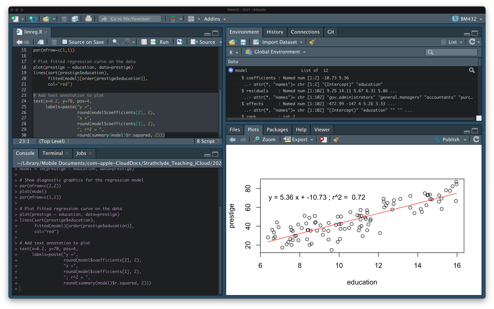
```