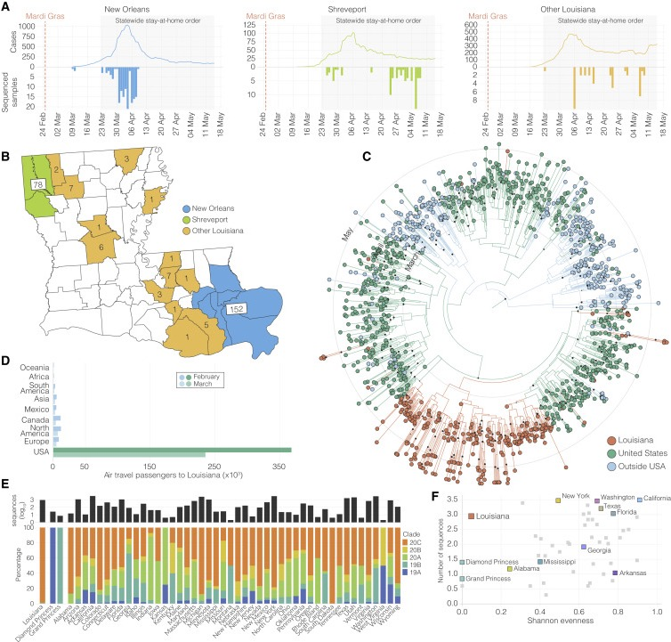

<style>
.forceBreak { -webkit-column-break-after: always; break-after: column; }
</style>

```{r setup, include=FALSE}
# Package imports
library(dplyr)
library(ggplot2)
library(ggthemes)
library(googlesheets4)
library(knitr)
library(stringr)
library(tidyr)
library(tm)
library(wordcloud)
library(wordcloud2)

# Authenticate with Google Forms
gs4_deauth()

# Grab data and clean it
dfm = read_sheet("https://docs.google.com/spreadsheets/d/1y8SM2IdBDEbRky23s3FQUfkMvxCBK0opEICz00ojclo/edit?resourcekey#gid=1938337482")
colnames(dfm) = c("timestamp", "figure", "effectiveness", "understandable",
                  "appealing",
                  "bestpractice", "bestpractice_errors", "bestpractice_unsure",
                  "effectiveness_comment", "improvements",
                  "colours", "fonts", "labels", "statistics", "whitespace",
                  "data", "legend", "title", "reproduce_paper", "reproduce_raw",
                  "describe", "figure_comments", "time_taken", "numfigures",
                  "prereading", "other_comments")

# Ignore responses prior to 25/10/2022
dfm = dfm %>% filter(timestamp > "2022-10-24")

# Convert figure choice to integer
dfm = dfm %>% separate(figure, c("fignum"), remove=FALSE)

# Make columns the appropriate datatype
factor_headers = c("figure", "fignum", "bestpractice", "time_taken")
for (colname in factor_headers) {
  dfm[[colname]] = as.factor(dfm[[colname]])
}
dfm$fignum = factor(dfm$fignum, levels=c("1", "2", "3", "4", "5", "6", "7", "8", "9", "10"))
dfm$time_taken = factor(dfm$time_taken, levels=c("Less than 5 minutes","About 5 or 10 minutes","About 15 minutes","About 30 minutes","More than 30 minutes"))

# Function to generate Economist-style figures from categories
draw_economist_categories = function(dfm, categories, fig_num) {
  ratings = dfm %>%
    filter(fignum == fig_num) %>%
    pivot_longer(cols=all_of(categories),
                 names_to = "category",
                 values_to = "rating")
  ratings$rating = factor(ratings$rating, levels=c("1", "2", "3", "4", "5"))
  p = ggplot(ratings, aes(x=rating))
  p = p + geom_bar() +
    stat_count(geom="text", color="white", aes(label=..count..), vjust=2)
  p = p + facet_wrap(~category)
  p = p + theme_economist()
  p
}

# Function to generate Tufte-style figures from categories
draw_tufte_categories = function(dfm, categories, fig_num) {
  ratings = dfm %>%
    filter(fignum == fig_num) %>%
    pivot_longer(cols=all_of(categories),
                 names_to = "category",
                 values_to = "rating")
  p = ggplot(ratings, aes(x=category, y=rating))
  p = p + geom_boxplot(outlier.colour="red") + geom_point(position=position_jitter(height=0.01, width=0.1), alpha=0.35)
  p = p + theme_tufte() + coord_flip()
  p
}

# Function to generate hc-style figures from categories
draw_hc_categories = function(dfm, categories) {
  ratings = dfm %>%
    pivot_longer(cols=all_of(categories),
                 names_to = "category",
                 values_to = "rating")
  p = ggplot(ratings, aes(x=fignum, y=rating))
  p = p + geom_boxplot(outlier.colour="red") + geom_point(position=position_jitter(height=0.01, width=0.1), alpha=0.35)
  p = p + facet_wrap(~category, ncol=1)
  p = p + theme_hc()
  p
}

# Process character column into a wordcloud
process_words = function(dfrm, column) {
  corpus = Corpus(VectorSource(dfrm[column]))
  comments = corpus %>%
    tm_map(removeNumbers) %>%
    tm_map(removePunctuation) %>%
    tm_map(stripWhitespace) %>%
    tm_map(content_transformer(tolower)) %>%
    tm_map(removeWords, stopwords("english"))
  wordmat <- as.matrix(TermDocumentMatrix(comments))
  words <- sort(rowSums(wordmat), decreasing=TRUE)
  dfm_words <- data.frame(word = names(words), freq=words)
  dfm_words
}

# Code block options
knitr::opts_chunk$set(echo = FALSE, warning = FALSE)
```

# 1. Introduction

## Learning Objectives

- You should be able to critically analyse how data is visualised 
- You should be able to judge a figure's clarity and potential for misunderstanding
- You should be able to identify potential sources of bias
- You should understand how to create effective figures for your own work

## Background Reading

- Introduction to Data Visualisation
  - [https://sipbs-compbiol.github.io/BM432/notebooks/04-data_presentation_workshop.html](https://sipbs-compbiol.github.io/BM432/notebooks/04-data_presentation_workshop.html)
  
- Interactive Data Visualisation examples
  - [https://sipbs-bm432.shinyapps.io/03-04a-barchart/](https://sipbs-bm432.shinyapps.io/03-04a-barchart/)
  
- Additional information:
  - ["Fundamentals of Data Visualisation" _by Claus O. Wilke_](https://clauswilke.com/dataviz/)
  - ["Data Visualisation: A Practical Introduction" _by Kieran Healy_](https://socviz.co/index.html#preface)
  
## Exercise: Ten figures (three per student)

- **For your assigned figure, consider the following:**
  - What type of data is being presented?
  - Are the data presented effectively? (why/why not?)
  - How can the data presentation be improved?
  - Use the DOI provided to find the paper the figure is from, if you need more information than the figure legend
- Fill in the _pro forma_ with your answers to the questions above (one sentence each)
  - [Google Form](https://docs.google.com/forms/d/e/1FAIpQLScECon-B5N-JkK2PIB4YiEyy8k8iR9srls9UBFYq2NWqEB3Rw/viewform)
  
# 2. Summary Results
  
## Responses by figure

- We received `r nrow(dfm)` ratings in total (at three per student, this is `r round(nrow(dfm)/3, 1)` students responding)

<center>
```{r overall_response}
figcounts = dfm %>% group_by(fignum) %>% summarize(count = n())
p = ggplot(figcounts, aes(y=fignum, x=count))
p + geom_point(size=8) + xlim(0, max(figcounts$count)) + theme_economist()
```
</center>

## Overall effectiveness

- How was effectiveness scored, distributed across all figures?

<center>
```{r overall_effectiveness}
p = ggplot(dfm, aes(x=effectiveness))
p = p + geom_histogram(bins=5) +
  stat_bin(binwidth=1, geom="text", color="white", aes(label=..count..), vjust=2)
p + theme_economist() 
```
</center>

## Overall understandability

- How was understandability scored, distributed across all figures?

<center>
```{r overall_understanding}
p = ggplot(dfm, aes(x=understandable))
p = p + geom_histogram(bins=5) +
  stat_bin(binwidth=1, geom="text", color="white", aes(label=..count..), vjust=2)
p + theme_economist() 
```
</center>

## Overall appeal

- How was appeal scored, distributed across all figures?

<center>
```{r overall_appeal}
p = ggplot(dfm, aes(x=appealing))
p = p + geom_histogram(bins=5) +
  stat_bin(binwidth=1, geom="text", color="white", aes(label=..count..), vjust=2)
p + theme_economist() 
```
</center>

## Time taken per figure

- How long did you take, per figure?

<center>
```{r overall_time_taken}
p = ggplot(dfm %>% drop_na(time_taken), aes(x=time_taken))
p = p + geom_bar() + stat_count(geom="text", aes(label=..count..), vjust=1.5, colour="white")
p + theme_economist() + theme(axis.text.x = element_text(angle = 90))
```
</center>

# 3. Results By Figure

## Effectiveness/Understandability/Appeal

- How effective/understandable/appealing did you think each figure was?

<center>
```{r understandable_by_fig}
draw_hc_categories(dfm, c("effectiveness", "understandable", "appealing"))
```
</center>

## Colours/Fonts/Labels

- How well did each figure use colours, fonts, and labels?

<center>
```{r presentation_by_fig}
draw_hc_categories(dfm, c("colours", "fonts", "labels"))
```
</center>

## Statistics/Whitespace/Data

- How well did each figure use statistics, whitespace, and data?

<center>
```{r statistics_by_fig}
draw_hc_categories(dfm, c("statistics", "whitespace", "data"))
```
</center>

## Reproduction

- How well did you think you could reproduce each figure?

<center>
```{r reproduction_by_fig}
draw_hc_categories(dfm, c("describe", "reproduce_paper", "reproduce_raw"))
```
</center>

# 4. Specific Figures

## Figure 1 (doi:10.1016/j.cell.2021.08.029)

<center>

</center>

## Figure 1 (doi:10.1016/j.cell.2021.08.029) 

<center>
```{r fig1_main_summary}
draw_tufte_categories(dfm, c("effectiveness", "understandable", "appealing", "colours", "fonts", "labels", "statistics", "whitespace", "data", "legend", "title", "reproduce_paper", "reproduce_raw", "describe"), 1)
```
</center>

## Figure 1 (doi:10.1016/j.cell.2021.08.029)  {.columns-2 .smaller}

<center>

</center>

<p class="forceBreak"></p>

- Suggested improvements:
  - Colour differences in phylogenic trees could have been clearer, maybe use colour other than red to make colour-blind friendly. Likewise the red dots to indicate expected protein size were difficult to see - an arrow or asterisk might have been clearer to read. 
  - Improved layout of diagrams
  - Some other forms about data presentation can be used with the bar chart.

## Figure 1 (doi:10.1016/j.cell.2021.08.029)  {.smaller}

```{r fig1_improvements}
kable(dfm %>% filter(fignum==1) %>% select(improvements))
```


## Figure 2 (doi:10.1016/j.cell.2021.08.028)

<center>

</center>

## Figure 2 (doi:10.1016/j.cell.2021.08.028) 

<center>
```{r fig2_main_summary}
draw_tufte_categories(dfm, c("effectiveness", "understandable", "appealing", "colours", "fonts", "labels", "statistics", "whitespace", "data", "legend", "title", "reproduce_paper", "reproduce_raw", "describe"), 2)
```
</center>

## Figure 2 (doi:10.1016/j.cell.2021.08.028)  {.columns-2 .smaller}

<center>

</center>

<p class="forceBreak"></p>

- Suggested improvements:
  - The data presentation looks very crowded and it can be more simple by focusing on less things.
  - B shows the volume of myeloid cell clusters macroscopically. But maybe add a number to indicate volume of different myeloid cell clusters
  - C and F - May be a larger picture is better.

## Figure 2 (doi:10.1016/j.cell.2021.08.028)  {.smaller}

```{r fig2_improvements}
kable(dfm %>% filter(fignum==2) %>% select(improvements))
```


## Figure 3 (doi:10.1016/j.cell.2021.07.030)

<center>

</center>

## Figure 3 (doi:10.1016/j.cell.2021.07.030) 

<center>
```{r fig3_main_summary}
draw_tufte_categories(dfm, c("effectiveness", "understandable", "appealing", "colours", "fonts", "labels", "statistics", "whitespace", "data", "legend", "title", "reproduce_paper", "reproduce_raw", "describe"), 3)
```
</center>

## Figure 3 (doi:10.1016/j.cell.2021.07.030)  {.columns-2 .smaller}

<center>

</center>

<p class="forceBreak"></p>

- Suggested improvements:
  - Mark specific values on the chart to increase readability.
  - Use colour intensity to describe the number of people infected. Greater intensity -> more people.
  - Change circular tree to a rectangular cladogram to improve readability? But is the choice made for space rather than legibility (and does it always matter?).

## Figure 3 (doi:10.1016/j.cell.2021.07.030)  {.smaller}

```{r fig3_improvements}
kable(dfm %>% filter(fignum==3) %>% select(improvements))
```


## Figure 4 (doi:10.1016/j.cell.2021.08.016)

<center>

</center>

## Figure 4 (doi:10.1016/j.cell.2021.08.016) 

<center>
```{r fig4_main_summary}
draw_tufte_categories(dfm, c("effectiveness", "understandable", "appealing", "colours", "fonts", "labels", "statistics", "whitespace", "data", "legend", "title", "reproduce_paper", "reproduce_raw", "describe"), 4)
```
</center>

## Figure 4 (doi:10.1016/j.cell.2021.08.016)  {.columns-2 .smaller}

<center>

</center>

<p class="forceBreak"></p>

- Suggested improvements:
  - Be more selective with the data, only include what's necessary and/or use colour.
  - Maybe using combining plots is better. Jittered scatterplot can make the figure more vivid.
  - Separate them into several figures and make them bigger
  - In these figures, especially G to R, the Y-axis scale can be enlarged to amplify the negative space, otherwise the data will look crowded and unclear, and the numerical order of the X axis can be changed from small to large to prevent readers from misunderstanding.

## Figure 4 (doi:10.1016/j.cell.2021.08.016)  {.smaller}

```{r fig4_improvements}
kable(dfm %>% filter(fignum==4) %>% select(improvements))
```


## Figure 5 (doi:10.1016/j.cell.2021.07.029)

<center>

</center>

## Figure 5 (doi:10.1016/j.cell.2021.07.029) 

<center>
```{r fig5_main_summary}
draw_tufte_categories(dfm, c("effectiveness", "understandable", "appealing", "colours", "fonts", "labels", "statistics", "whitespace", "data", "legend", "title", "reproduce_paper", "reproduce_raw", "describe"), 5)
```
</center>

## Figure 5 (doi:10.1016/j.cell.2021.07.029)  {.columns-2 .smaller}

<center>

</center>

<p class="forceBreak"></p>

- Suggested improvements:
  - Can make use of graphs to represent the box-plot data and use colour-blind friendly colours to represent the immunoflorecence data.
  - More ticks could be added into the percentage graphs to more accurately show percentage increase or decrease and graphs A and E could be converted into another type of graph to present clearly.
  - It can be improved by fixing figure 1.(A), as it is difficult to understand what they were trying to achieve.

## Figure 5 (doi:10.1016/j.cell.2021.07.029)  {.smaller}

```{r fig5_improvements}
kable(dfm %>% filter(fignum==5) %>% select(improvements))
```


## Figure 6 (doi:10.1016/j.cell.2021.07.022)

<center>

</center>

## Figure 6 (doi:10.1016/j.cell.2021.07.022) 

<center>
```{r fig6_main_summary}
draw_tufte_categories(dfm, c("effectiveness", "understandable", "appealing", "colours", "fonts", "labels", "statistics", "whitespace", "data", "legend", "title", "reproduce_paper", "reproduce_raw", "describe"), 6)
```
</center>

## Figure 6 (doi:10.1016/j.cell.2021.07.022)  {.columns-2 .smaller}

<center>

</center>

<p class="forceBreak"></p>

- Suggested improvements:
  - There is too much data in this one figure. It would be easier to interpret if there wasn’t so much to look at in the one figure.
  - We can add more figures of showing relationships between numerical data.
  - On each figure it is difficult to distinguish each individual dot (which represents a patient) which can make it difficult to read the data and so perhaps another type of graph may better represent this data or different colours/shapes for the dots could be used. 

## Figure 6 (doi:10.1016/j.cell.2021.07.022)  {.smaller}

```{r fig6_improvements}
kable(dfm %>% filter(fignum==6) %>% select(improvements))
```


## Figure 7 (doi:10.1016/j.cell.2021.07.023)

<center>

</center>

## Figure 7 (doi:10.1016/j.cell.2021.07.023) 

<center>
```{r fig7_main_summary}
draw_tufte_categories(dfm, c("effectiveness", "understandable", "appealing", "colours", "fonts", "labels", "statistics", "whitespace", "data", "legend", "title", "reproduce_paper", "reproduce_raw", "describe"), 7)
```
</center>

## Figure 7 (doi:10.1016/j.cell.2021.07.023)  {.columns-2 .smaller}

<center>

</center>

<p class="forceBreak"></p>

- Suggested improvements:
  - Increased size of graphs and bolder lettering. 
  - UMAP could be described more thoroughly, overall data is very dense, especially figure G, could do with being processed in a way that’s more understandable. 
  - Combine the plot with other kinds of plot(such as combining violin plot with scatterplot or combining scatterplot with boxplot) and use color gradients.

## Figure 7 (doi:10.1016/j.cell.2021.07.023)  {.smaller}

```{r fig7_improvements}
kable(dfm %>% filter(fignum==7) %>% select(improvements))
```


## Figure 8 (doi:10.1016/j.cell.2021.08.003)

<center>

</center>

## Figure 8 (doi:10.1016/j.cell.2021.08.003) 

<center>
```{r fig8_main_summary}
draw_tufte_categories(dfm, c("effectiveness", "understandable", "appealing", "colours", "fonts", "labels", "statistics", "whitespace", "data", "legend", "title", "reproduce_paper", "reproduce_raw", "describe"), 8)
```
</center>

## Figure 8 (doi:10.1016/j.cell.2021.08.003)  {.columns-2 .smaller}

<center>

</center>

<p class="forceBreak"></p>

- Suggested improvements:
  - The data can be improved by separating some of the figures into another figure so that there is not too much in one figure. 
  - Scatterplots (C, F,G) should be bigger, the colour schemes in (B,D) should use sequential palettes and place similar graphs/diagrams near each other 
  - Use more clear indicators besides coloured circles? perhaps use numerical measurements instead of purely visual indicators  

## Figure 8 (doi:10.1016/j.cell.2021.08.003)  {.smaller}

```{r fig8_improvements}
kable(dfm %>% filter(fignum==8) %>% select(improvements))
```


## Figure 9 (doi:10.1016/j.cell.2021.07.024)

<center>

</center>

## Figure 9 (doi:10.1016/j.cell.2021.07.024) 

<center>
```{r fig9_main_summary}
draw_tufte_categories(dfm, c("effectiveness", "understandable", "appealing", "colours", "fonts", "labels", "statistics", "whitespace", "data", "legend", "title", "reproduce_paper", "reproduce_raw", "describe"), 9)
```
</center>

## Figure 9 (doi:10.1016/j.cell.2021.07.024)  {.columns-2 .smaller}

<center>

</center>

<p class="forceBreak"></p>

- Suggested improvements:
  - Change the colours in the bar chart because it is difficult to see
  - Graph E should be split into several graphs so that you can see each of the data marks clearer
  - The different circles in F and G could be better shown in bars in my opinion. 
  - Personally, I think the comparison between blood and sperm in Figure F should be made by the same Rank plot. It is not easy to compare blood samples with sperm samples using the dot plot, so it cannot show the comparison of trends.

## Figure 9 (doi:10.1016/j.cell.2021.07.024)  {.smaller}

```{r fig9_improvements}
kable(dfm %>% filter(fignum==9) %>% select(improvements))
```


## Figure 10 (doi:10.1016/j.cell.2021.07.006)

<center>

</center>

## Figure 10 (doi:10.1016/j.cell.2021.07.006) 

<center>
```{r fig10_main_summary}
draw_tufte_categories(dfm, c("effectiveness", "understandable", "appealing", "colours", "fonts", "labels", "statistics", "whitespace", "data", "legend", "title", "reproduce_paper", "reproduce_raw", "describe"), 10)
```
</center>

## Figure 10 (doi:10.1016/j.cell.2021.07.006)  {.columns-2 .smaller}

<center>

</center>

<p class="forceBreak"></p>

- Suggested improvements:
  - For figure B, less harsh colours could be use and maybe a dotted line so you can see both lines in equal amounts.
  - Figure C is difficult to read on a black table; less extreme colours should be used to grade results. 
  - The relative binding data could have been presented on a bigger cleaner graph

## Figure 10 (doi:10.1016/j.cell.2021.07.006)  {.smaller}

```{r fig10_improvements}
kable(dfm %>% filter(fignum==10) %>% select(improvements))
```


# 5. Summing Up

## General Comments

- Colour choices
- Larger figures/graphs, more space between figures/graphs
- Too much data per figure
- Split into multiple figures
- Remove unnecessary data (how do we define this?)
- “The data is presented in a manner that would likely be inaccessible for people without prior experience. A move toward a more palatable/digestible format will facilitate better science communication in the future.”

## Visualising Data About Data Visualisation

- What did you say about figure effectiveness?

<center>
```{r eff_wordcloud}
effwords = process_words(dfm, "effectiveness_comment")
wordcloud2(data=effwords, size=1.6, color='random-dark')
```
</center>

## Visualising Data About Data Visualisation

- What words did you use to describe figure improvements?

<center>
```{r imp_wordcloud}
impwords = process_words(dfm, "improvements")
wordcloud(words = impwords$word, freq = impwords$freq, min.freq = 1, max.words=200, random.order=FALSE, rot.per=0.35,            colors=brewer.pal(8, "Dark2"))
```
</center>

## Data Visualisation is Not Neutral  {.columns-2}

<center>

</center>

<center>

</center>


